# Wiki Documentation for https://git.debros.io/DeBros/network

Generated on: 2025-09-01 16:38:50

## Table of Contents

- [Project Overview](#overview)
- [System Requirements](#system-requirements)
- [Quick Start Guide](#quick-start)
- [Deployment & Installation](#installation)
- [Architecture Overview](#architecture-overview)
- [Project Structure](#project-structure)
- [Node vs. Client Roles](#node-vs-client)
- [Network Protocol & Data Flow](#network-protocol-data-flow)
- [Network Client](#network-client)
- [Node Component](#node-component)
- [Configuration System](#configuration-system)
- [Database Layer](#database-layer)
- [Storage System](#storage-system)
- [Pub/Sub System](#pubsub-system)
- [Discovery Component](#discovery-component)
- [CLI Overview](#cli-overview)
- [CLI Network Operations](#cli-network-ops)
- [CLI Storage Operations](#cli-storage-ops)
- [CLI Database Operations](#cli-database-ops)
- [CLI Pub/Sub Operations](#cli-pubsub-ops)
- [CLI Authentication](#cli-authentication)
- [HTTP Gateway Overview](#gateway-overview)
- [Gateway Configuration](#gateway-configuration)
- [Gateway Authentication](#gateway-authentication)
- [Gateway API Endpoints](#gateway-api-endpoints)
- [SDK Authoring Guide](#sdk-authoring-guide)
- [Development Setup](#development-setup)
- [Build, Test, and Lint](#build-test-lint)
- [Local Multi-Node Testing](#local-multi-node-testing)
- [Contributing to DeBros Network](#contributing)
- [Code of Conduct](#code-of-conduct)
- [Common Issues](#common-issues)
- [Authentication Troubleshooting](#authentication-troubleshooting)
- [Database Migration Troubleshooting](#database-migration-troubleshooting)
- [Debugging & Health Checks](#debugging-health-checks)
- [Service Logs](#service-logs)

<a id='overview'></a>

## Project Overview

### Related Pages

Related topics: [Architecture Overview](#architecture-overview)

<details>
<summary>Relevant source files</summary>

The following files were used as context for generating this wiki page:

- [README.md](https://git.debros.io/DeBros/network/src/main/README.md)
- [AI_CONTEXT.md](https://git.debros.io/DeBros/network/src/main/AI_CONTEXT.md)
- [CONTRIBUTING.md](https://git.debros.io/DeBros/network/src/main/CONTRIBUTING.md)
- [cmd/node/main.go](https://git.debros.io/DeBros/network/src/main/cmd/node/main.go)
- [cmd/cli/main.go](https://git.debros.io/DeBros/network/src/main/cmd/cli/main.go)
- [examples/basic_usage.go](https://git.debros.io/DeBros/network/src/main/examples/basic_usage.go)
- [openapi/gateway.yaml](https://git.debros.io/DeBros/network/src/main/openapi/gateway.yaml)
</details>

# Project Overview

The DeBros Network Cluster is a decentralized peer-to-peer (P2P) system developed in Go, designed for resilient, distributed data management and communication. It provides core functionalities such as distributed database operations, key-value storage, and pub/sub messaging. The system distinguishes between full network nodes, which participate in core services and discovery, and lightweight clients, which connect via bootstrap peers to consume services. This architecture aims for reliable, scalable, and secure data sharing without relying on centralized infrastructure.
Sources: [AI_CONTEXT.md:9-13](), [README.md:14-16]()

## Architecture Overview

The DeBros Network Cluster features a modular and robust architecture that supports both full nodes and lightweight clients. Full nodes are active P2P participants, running core services and handling peer discovery, database, storage, and pub/sub. Clients are designed to be lightweight, connecting only to bootstrap peers to consume services without participating in peer discovery. The system layers include an Application Layer, Client API, and Transport Layer.
Sources: [AI_CONTEXT.md:18-20](), [README.md:27-38]()

### Architectural Layers

The architecture can be visualized as a layered system:

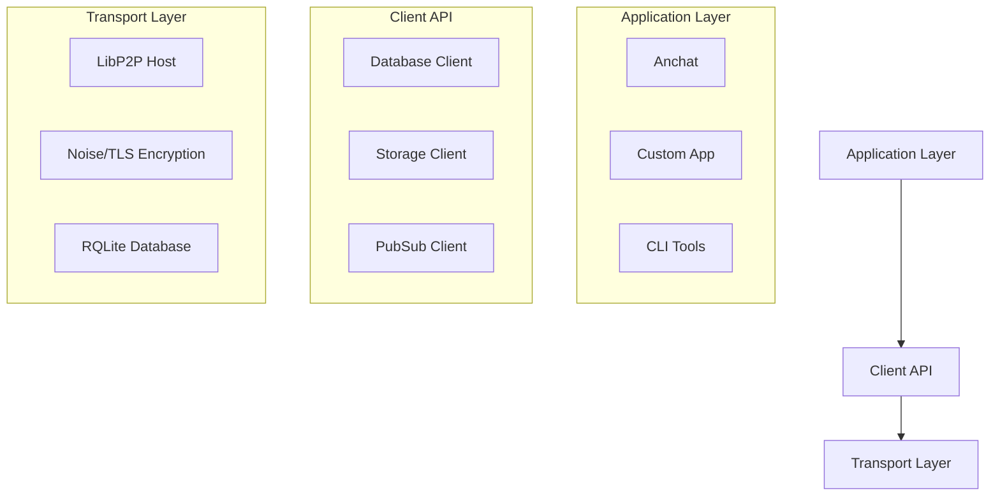
Sources: [AI_CONTEXT.md:22-38](), [README.md:27-38]()

### Node vs Client Roles

The DeBros Network defines clear roles for nodes and clients:

*   **Node:** A full P2P participant that runs core services, manages peer discovery, and provides distributed database, storage, and pub/sub functionalities.
*   **Client:** A lightweight component that connects to bootstrap peers to consume services. Clients do not participate in peer discovery.
Sources: [AI_CONTEXT.md:40-43](), [README.md:39-42]()

## Key Features

The DeBros Network offers several key features for distributed applications:

*   **Distributed SQL Database:** Utilizes RQLite, providing Raft-consensus, ACID transactions, and automatic failover.
*   **Key-Value Storage:** Offers namespaced, replicated, and CRUD operations with support for prefix queries.
*   **Pub/Sub Messaging:** Provides topic-based, real-time, and namespaced messaging with automatic cleanup.
*   **Peer Discovery & Management:** Includes mechanisms for nodes to discover peers, bootstrap support, and health monitoring.
*   **Application Isolation:** Achieved through namespace-based multi-tenancy, allowing per-application configuration.
*   **Secure by Default:** Incorporates Noise/TLS transport encryption, peer identity, and systemd hardening.
*   **Simple Client API:** A lightweight Go client is available for building applications and CLI tools.
Sources: [README.md:20-25]()

## System Requirements

To set up and run the DeBros Network, specific software and hardware prerequisites are necessary, along with defined network ports for communication.
Sources: [README.md:44]()

### Software Requirements

| Requirement | Version/Description |
| :---------- | :------------------ |
| Go          | 1.21+ (recommended) |
| RQLite      | 8.x (distributed SQLite) |
| Git         | For source management |
| Make        | For build automation (recommended) |
Sources: [AI_CONTEXT.md:47-50](), [README.md:46-49](), [CONTRIBUTING.md:6-8]()

### Hardware Requirements

| Requirement | Minimum             | Recommended             |
| :---------- | :------------------ | :---------------------- |
| CPU         | 2 cores             | 4+ cores                |
| RAM         | 4GB                 | 8GB+                    |
| Disk        | 10GB                | 50GB+ SSD               |
| Network     | Stable internet     | Low-latency network     |
Sources: [README.md:51-54]()

### Network Ports

| Port | Purpose                     |
| :--- | :-------------------------- |
| 4001 | LibP2P P2P communication    |
| 5001 | RQLite HTTP API             |
| 7001 | RQLite Raft consensus       |
Sources: [README.md:56-59]()

## Build and Development

The project provides `Makefile` targets for building, testing, and linting the executables.
Sources: [CONTRIBUTING.md:20-22](), [README.md:64]()

### Build Commands

```bash
make build        # Build all executables
make test         # Run tests
make run-node     # Start node (auto-detects bootstrap vs regular)
make run-gateway  # Start HTTP gateway (env overrides supported)
make fmt vet      # Format/Vet code (also available as make lint)
```
Sources: [AI_CONTEXT.md:126-129](), [CONTRIBUTING.md:20-21](), [cmd/node/main.go:107-109]()

### Project Structure

The project repository is organized into several key directories:

```
network/
├── cmd/             # Command-line executables (node, cli, gateway)
├── pkg/             # Go packages (client, node, database, storage, pubsub, config, discovery, auth, anyoneproxy, logging)
├── scripts/         # Install, test scripts
├── configs/         # YAML configurations
├── bin/             # Built executables
├── examples/        # Example usage code
├── openapi/         # OpenAPI specification for the gateway
├── CONTRIBUTING.md  # Contribution guidelines
├── README.md        # Project overview
├── AI_CONTEXT.md    # AI context documentation
├── CODE_OF_CONDUCT.md # Code of Conduct
```
Sources: [README.md:154-162](), [AI_CONTEXT.md:10-11](), [CONTRIBUTING.md:1-2](), [cmd/node/main.go:1-12](), [cmd/cli/main.go:1-12](), [examples/basic_usage.go:1-12](), [openapi/gateway.yaml:1-12]()

## Client API

The DeBros Network provides a Go client library (`pkg/client`) for interacting with the distributed system. This client allows applications to perform database operations, key-value storage, pub/sub messaging, and retrieve network information.
Sources: [AI_CONTEXT.md:132](), [examples/basic_usage.go:10-12]()

### Client Creation

A client is initialized with a configuration, including bootstrap peers.

```go
import "git.debros.io/DeBros/network/pkg/client"

config := client.DefaultClientConfig("my-app")
config.BootstrapPeers = []string{"/ip4/127.0.0.1/tcp/4001/p2p/{PEER_ID}"}
client, err := client.NewClient(config)
err = client.Connect()
defer client.Disconnect()
```
Sources: [AI_CONTEXT.md:133-139](), [examples/basic_usage.go:14-25]()

### Database Operations

The client's `Database()` interface allows for SQL operations.

```go
result, err := client.Database().Query(ctx, "SELECT * FROM users")
err := client.Database().CreateTable(ctx, "CREATE TABLE ...")
```
Sources: [AI_CONTEXT.md:141-142](), [examples/basic_usage.go:34-58]()

### Storage Operations

The `Storage()` interface supports key-value operations.

```go
err := client.Storage().Put(ctx, "key", []byte("value"))
data, err := client.Storage().Get(ctx, "key")
```
Sources: [AI_CONTEXT.md:144-145](), [examples/basic_usage.go:60-88]()

### PubSub Operations

The `PubSub()` interface enables topic-based messaging.

```go
err := client.PubSub().Subscribe(ctx, "topic", handler)
err := client.PubSub().Publish(ctx, "topic", []byte("msg"))
```
Sources: [AI_CONTEXT.md:147-148](), [examples/basic_usage.go:90-117]()

### Network Information

The `Network()` interface provides access to status and peer information.

```go
status, err := client.Network().GetStatus(ctx)
peers, err := client.Network().GetPeers(ctx)
```
Sources: [AI_CONTEXT.md:150-151](), [examples/basic_usage.go:119-127]()

## HTTP Gateway

The DeBros Network includes an HTTP/WebSocket gateway that exposes a REST API and WebSocket interface over the P2P network. This gateway features an enhanced authentication system with multi-wallet support.
Sources: [README.md:144-146]()

### Gateway Endpoints

The gateway provides various endpoints for interacting with the network's services:

| Service    | Method | Path                           | Description                               | Request Body (Example) | Response Body (Example) |
| :--------- | :----- | :----------------------------- | :---------------------------------------- | :--------------------- | :---------------------- |
| **Auth**   | POST   | `/v1/auth/challenge`           | Get authentication challenge              |                        | `{ "nonce": "..." }`    |
|            | POST   | `/v1/auth/verify`              | Verify wallet signature                   | `{ "wallet": "0x...", "nonce": "...", "signature": "0x..." }` | `{ "token": "...", "expires_at": "..." }` |
|            | POST   | `/v1/auth/refresh`             | Refresh JWT token                         |                        | `{ "token": "...", "expires_at": "..." }` |
|            | POST   | `/v1/auth/api-key`             | Generate API key                          |                        | `{ "key": "...", "namespace": "..." }` |
| **Storage**| POST   | `/v1/storage/put`              | Store data by key                         | `{ "key": "user:123", "value": "base64encodedvalue" }` | `{ "status": "ok" }`    |
|            | POST   | `/v1/storage/get`              | Retrieve data by key                      | `{ "key": "user:123" }` | `{ "value": "base64encodedvalue" }` |
|            | GET    | `/v1/storage/exists`           | Check if key exists                       |                        | `{ "exists": true }`    |
|            | GET    | `/v1/storage/list`             | List keys with optional prefix            |                        | `{ "keys": ["key1", "key2"] }` |
| **Database**| POST   | `/v1/db/create-table`          | Create table with SQL DDL                 | `{ "schema": "CREATE TABLE users (id INTEGER PRIMARY KEY)" }` | `{ "status": "ok" }`    |
|            | POST   | `/v1/db/query`                 | Execute single SQL query                  | `{ "sql": "SELECT * FROM users", "args": [] }` | `{ "columns": ["id", "name"], "rows": [[1, "Alice"]], "count": 1 }` |
|            | POST   | `/v1/db/transaction`           | Apply multiple statements atomically      | `{ "statements": ["INSERT ...", "UPDATE ..."] }` | `{ "status": "ok" }`    |
| **PubSub** | GET    | `/v1/pubsub/ws?topic=<topic>`  | WebSocket connection for real-time messaging |                        | (Binary frames)         |
|            | POST   | `/v1/pubsub/publish`           | Publish message to topic                  | `{ "topic": "chat", "data_base64": "base64encodedmessage" }` | `{ "status": "ok" }`    |
Sources: [AI_CONTEXT.md:200-264](), [README.md:120-137](), [openapi/gateway.yaml:1-100]()

### Authentication System

The gateway's authentication system supports wallet-based authentication (Ethereum EIP-191) and API keys. It handles automatic authentication, multi-wallet management, and persistent sessions.
Sources: [README.md:147-152](), [AI_CONTEXT.md:270-272]()

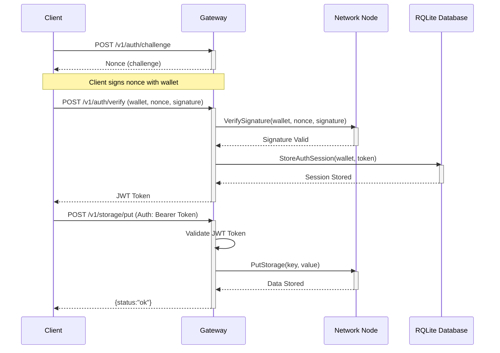
Sources: [AI_CONTEXT.md:273-286](), [README.md:104-118]()

## Troubleshooting

The project documentation provides common issues and their solutions, along with debugging and health check commands.
Sources: [AI_CONTEXT.md:154](), [README.md:164]()

### Common Issues and Solutions

| Symptom                       | Possible Cause                                 | Solution                                                                |
| :---------------------------- | :--------------------------------------------- | :---------------------------------------------------------------------- |
| Bootstrap Connection Failed   | Node not running, firewall, invalid peer ID    | Check node status, firewall settings, peer ID validity.                 |
| Database Operations Timeout   | RQLite issues, leader election, join config    | Ensure RQLite ports open, leader election complete, correct join config.|
| Message Delivery Failures     | Incorrect topic, no active subscriptions       | Verify topic names, active subscriptions, network connectivity.         |
| High Memory Usage             | Unsubscribed topics, connection pool size      | Unsubscribe when done, monitor connection pool, review message retention.|
| Authentication Failed         | Invalid signature, expired token, wallet issues| Check signature format, nonce, wallet address case, refresh token.      |
| Gateway Connection Refused    | Gateway not running, CORS, authentication headers| Verify gateway status, CORS config, proper authentication headers.      |
| Database Migration Issues     | SQL syntax, version conflicts, transaction rollbacks| Check SQL syntax, migration file naming, review migration logs.         |
Sources: [AI_CONTEXT.md:155-177](), [README.md:166-187]()

### Debugging & Health Checks

CLI and curl commands are available for diagnostics.

```bash
export LOG_LEVEL=debug
./bin/network-cli health
./bin/network-cli peers
./bin/network-cli query "SELECT 1"
./bin/network-cli pubsub publish test "hello"
./bin/network-cli pubsub subscribe test 10s

# Test authentication flow
./bin/network-cli storage put test-key test-value

# Gateway health checks
curl http://localhost:8080/health
curl http://localhost:8080/v1/status
```
Sources: [AI_CONTEXT.md:179-191](), [README.md:189-200](), [cmd/cli/main.go:107-124]()

## Conclusion

The DeBros Network Cluster provides a comprehensive and decentralized solution for distributed data management and communication. Its modular architecture, clear node/client roles, and robust feature set for SQL database, key-value storage, and pub/sub messaging make it suitable for resilient applications. The project emphasizes security, ease of use through its client API and HTTP gateway, and provides detailed documentation for setup, development, and troubleshooting.
Sources: [AI_CONTEXT.md:9-13](), [README.md:14-16](), [AI_CONTEXT.md:291-294]()

---

<a id='system-requirements'></a>

## System Requirements

### Related Pages

Related topics: [Quick Start Guide](#quick-start)

<details>
<summary>Relevant source files</summary>

- [CONTRIBUTING.md](https://git.debros.io/DeBros/network/src/main/CONTRIBUTING.md)
- [README.md](https://git.debros.io/DeBros/network/src/main/README.md)
- [AI_CONTEXT.md](https://git.debros.io/DeBros/network/src/main/AI_CONTEXT.md)
- [cmd/node/main.go](https://git.debros.io/DeBros/network/src/main/cmd/node/main.go)
- [examples/basic_usage.go](https://git.debros.io/DeBros/network/src/main/examples/basic_usage.go)
- [cmd/cli/main.go](https://git.debros.io/DeBros/network/src/main/cmd/cli/main.go)
</details>

# System Requirements

This document outlines the essential software and hardware prerequisites, along with network configurations, necessary for the successful deployment and operation of the DeBros Network Cluster. Adhering to these requirements ensures optimal performance, stability, and security for both full network nodes and lightweight clients. The DeBros Network is designed as a robust, decentralized peer-to-peer (P2P) system providing distributed database operations, key-value storage, and pub/sub messaging. Sources: [AI_CONTEXT.md:19-22]()

## Software Requirements

The DeBros Network requires specific software versions to build and run correctly. These include programming language runtimes, database systems, and build automation tools.

### Go Language
The project is built in Go and requires a specific version for compilation and execution.
Sources: [CONTRIBUTING.md:7](), [README.md:31](), [AI_CONTEXT.md:197]()

| Requirement | Minimum Version | Recommended Version |
|-------------|-----------------|---------------------|
| Go          | 1.21+           | 1.22+ (1.23 recommended) |
Sources: [CONTRIBUTING.md:7](), [README.md:31]()

### RQLite Database
RQLite is used as the distributed SQLite database within the network.
Sources: [README.md:32](), [AI_CONTEXT.md:198]()

| Requirement | Version | Notes |
|-------------|---------|-------|
| RQLite      | 8.x     | Distributed SQLite |
Sources: [README.md:32]()

### Other Tools
Additional tools are recommended for source management and build automation.
Sources: [README.md:33-34]()

| Requirement | Purpose             | Notes             |
|-------------|---------------------|-------------------|
| Git         | Source management   | Required for cloning the repository |
| Make        | Build automation    | Recommended       |
Sources: [README.md:33-34]()

## Hardware Requirements

Hardware specifications are provided for both minimum operational capacity and recommended performance.

### Minimum Hardware
Sources: [README.md:38]()

| Component | Specification |
|-----------|---------------|
| CPU Cores | 2             |
| RAM       | 4GB           |
| Disk      | 10GB          |
| Network   | Stable internet |
Sources: [README.md:38]()

### Recommended Hardware
Sources: [README.md:39]()

| Component | Specification |
|-----------|---------------|
| CPU Cores | 4+            |
| RAM       | 8GB+          |
| Disk      | 50GB+ SSD     |
| Network   | Low-latency   |
Sources: [README.md:39]()

## Network Port Requirements

The DeBros Network utilizes specific ports for peer-to-peer communication, database API access, and consensus mechanisms. These ports must be open and accessible for proper network function.
Sources: [README.md:42-44]()

| Port | Protocol | Purpose                     | Default Value |
|------|----------|-----------------------------|---------------|
| 4001 | TCP      | LibP2P P2P communication    | 4001          |
| 5001 | TCP      | RQLite HTTP API             | 5001          |
| 7001 | TCP      | RQLite Raft consensus       | 7001          |
Sources: [README.md:42-44](), [cmd/node/main.go:60-61]()

A visual representation of the network ports and their functions:
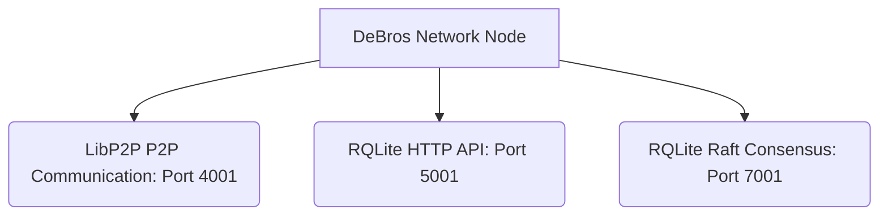
Sources: [README.md:42-44]()

## Configuration Considerations

The system can be configured using YAML files, command-line flags, and environment variables. These configurations can influence the network's behavior, including port assignments and data directories.
Sources: [README.md:144-147](), [cmd/node/main.go:56-66]()

### Node Configuration
Example configuration for a node, showing listen addresses, data directories, and RQLite ports.
Sources: [README.md:120-141]()

```yaml
node:
  listen_addresses:
    - "/ip4/0.0.0.0/tcp/4001" # Configurable P2P port
  data_dir: "./data/bootstrap"
database:
  rqlite_port: 5001 # Configurable RQLite HTTP API port
  rqlite_raft_port: 7001 # Configurable RQLite Raft port
```
Sources: [README.md:120-141]()

### Configuration Precedence
Settings are applied based on a specific precedence order:
1.  Command-line Flags
2.  Environment Variables
3.  YAML Configuration Files
4.  Default Values
Sources: [README.md:144-147]()

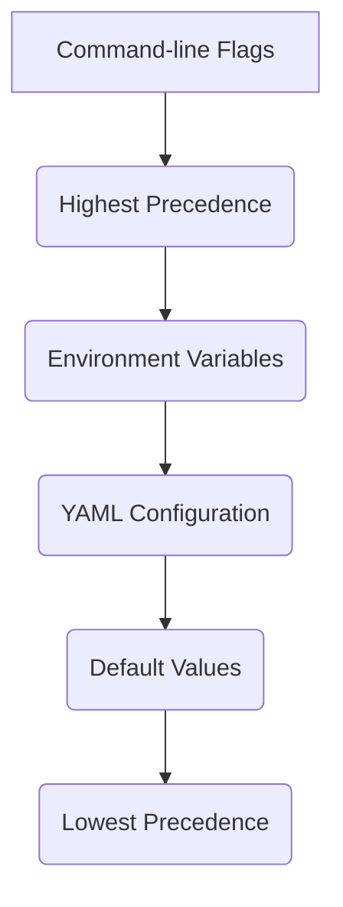
Sources: [README.md:144-147]()

## Installation and Deployment

The project provides an automated installation script for production environments, which handles dependency installation, directory setup, and service configuration.
Sources: [README.md:67-97]()

### Automated Production Install
The `install-debros-network.sh` script automates the setup process.
Sources: [README.md:67-68]()

```bash
curl -sSL https://git.debros.io/DeBros/network/raw/branch/main/scripts/install-debros-network.sh | sudo bash
```
Sources: [README.md:67-68]()

This script performs several actions:
- Detects OS, installs Go, RQLite, and other dependencies.
- Creates a `debros` system user and a secure directory structure.
- Generates LibP2P identity keys.
- Clones the source code and builds binaries.
- Sets up a systemd service (`debros-node`).
- Configures firewall (UFW) for required ports.
- Generates YAML config in `/opt/debros/configs/node.yaml`.
Sources: [README.md:70-79]()

The typical directory structure after installation is:
Sources: [README.md:81-88]()

```
/opt/debros/
├── bin/           # Binaries
├── configs/       # YAML configs
├── keys/          # Identity keys
├── data/          # RQLite DB, storage
├── logs/          # Node logs
├── src/           # Source code
```
Sources: [README.md:81-88]()

## Conclusion

Meeting the specified system requirements for software, hardware, and network configuration is crucial for deploying and operating the DeBros Network Cluster effectively. These requirements ensure the underlying infrastructure can support the distributed database, key-value storage, and pub/sub messaging features, facilitating a stable and performant decentralized environment.

---

<a id='quick-start'></a>

## Quick Start Guide

### Related Pages

Related topics: [CLI Overview](#cli-overview), [Deployment & Installation](#installation)

Timeout while calling OpenRouter API (120s). The service may be slow or unreachable.

---

<a id='installation'></a>

## Deployment & Installation

### Related Pages

Related topics: [Quick Start Guide](#quick-start)

<details>
<summary>Relevant source files</summary>

- [README.md](https://git.debros.io/DeBros/network/src/main/README.md)
- [AI_CONTEXT.md](https://git.debros.io/DeBros/network/src/main/AI_CONTEXT.md)
- [CONTRIBUTING.md](https://git.debros.io/DeBros/network/src/main/CONTRIBUTING.md)
- [cmd/node/main.go](https://git.debros.io/DeBros/network/src/main/cmd/node/main.go)
- [cmd/cli/main.go](https://git.debros.io/DeBros/network/src/main/cmd/cli/main.go)
- [e2e/client_e2e_test.go](https://git.debros.io/DeBros/network/src/main/e2e/client_e2e_test.go)
- [examples/basic_usage.go](https://git.debros.io/DeBros/network/src/main/examples/basic_usage.go)
- [openapi/gateway.yaml](https://git.debros.io/DeBros/network/src/main/openapi/gateway.yaml)
</details>

# Deployment & Installation

The DeBros Network is a decentralized peer-to-peer (P2P) system designed for resilient, distributed data management and communication. This document outlines the procedures and considerations for deploying and installing the DeBros Network components, including full network nodes and the HTTP Gateway. The installation process covers prerequisites, automated and manual setup, and directory structures. Sources: [README.md:1-2](), [AI_CONTEXT.md:1-2]()

## System Requirements

Successful deployment of the DeBros Network requires specific software and hardware configurations, along with open network ports for communication. Sources: [README.md:65-65](), [AI_CONTEXT.md:29-29]()

### Software Requirements

The following software components are necessary for building and running the DeBros Network:

*   **Go:** Version 1.21+ (1.23 recommended for development). Sources: [README.md:68](), [AI_CONTEXT.md:30](), [CONTRIBUTING.md:7]()
*   **RQLite:** Version 8.x (distributed SQLite). Sources: [README.md:69]()
*   **Git:** For source code management. Sources: [README.md:70]()
*   **Make:** For build automation (recommended). Sources: [README.md:71](), [CONTRIBUTING.md:8]()

### Hardware Requirements

Hardware recommendations vary based on the intended role and load:

*   **Minimum:** 2 CPU cores, 4GB RAM, 10GB disk, stable internet connection. Sources: [README.md:74]()
*   **Recommended:** 4+ CPU cores, 8GB+ RAM, 50GB+ SSD, low-latency network. Sources: [README.md:75]()

### Network Ports

The DeBros Network components utilize specific ports for inter-node communication and API access:

*   **4001:** LibP2P P2P communication (default). Sources: [README.md:78](), [cmd/node/main.go:133]()
*   **5001:** RQLite HTTP API (default). Sources: [README.md:79](), [cmd/node/main.go:134]()
*   **7001:** RQLite Raft consensus (default). Sources: [README.md:80](), [cmd/node/main.go:135]()

These ports can be overridden via command-line flags or configuration files. Sources: [cmd/node/main.go:133-135]()

## Automated Production Installation

For a secure and production-ready setup, an automated installation script is provided. This script handles all necessary steps from OS detection to service setup. Sources: [README.md:105-105]()

```bash
curl -sSL https://git.debros.io/DeBros/network/raw/branch/main/scripts/install-debros-network.sh | sudo bash
```
Sources: [README.md:107-107]()

The installation script performs the following actions:
*   Detects the operating system and installs Go, RQLite, and other dependencies. Sources: [README.md:110]()
*   Creates a `debros` system user and establishes a secure directory structure under `/opt/debros/`. Sources: [README.md:111]()
*   Generates LibP2P identity keys for the node. Sources: [README.md:112]()
*   Clones the source code and builds the necessary binaries. Sources: [README.md:113]()
*   Sets up a systemd service named `debros-node` for automatic startup and management. Sources: [README.md:114]()
*   Configures the Uncomplicated Firewall (UFW) to open required ports. Sources: [README.md:115]()
*   Generates a YAML configuration file at `/opt/debros/configs/node.yaml`. Sources: [README.md:116]()

### Installed Directory Structure

The automated installation creates a standardized directory structure for the DeBros Network components:

```
/opt/debros/
├── bin/           # Binaries
├── configs/       # YAML configs
├── keys/          # Identity keys
├── data/          # RQLite DB, storage
├── logs/          # Node logs
└── src/           # Source code
```
Sources: [README.md:119-125]()

### Service Management

The `debros-node` systemd service can be managed using standard `systemctl` commands:

*   `sudo systemctl status debros-node`: Check the service status. Sources: [README.md:128]()
*   `sudo systemctl start debros-node`: Start the service. Sources: [README.md:129]()
*   `sudo systemctl stop debros-node`: Stop the service. Sources: [README.md:130]()
*   `sudo systemctl restart debros-node`: Restart the service. Sources: [README.md:131]()
*   `sudo journalctl -u debros-node.service -f`: View real-time logs for the node service. Sources: [README.md:132]()

## Manual Quick Start

For development or manual deployment, the DeBros Network can be set up by cloning the repository, building executables, and starting nodes. Sources: [README.md:83-83]()

### 1. Clone and Setup

```bash
git clone https://git.debros.io/DeBros/network.git
cd network
```
Sources: [README.md:86-87]()

### 2. Build All Executables

The `make build` command compiles all necessary binaries. Sources: [README.md:90]()

```bash
make build
```
Sources: [README.md:90]()

### 3. Start a Bootstrap Node

A bootstrap node is essential for peer discovery and network initialization. It can be started using `make run-node` or manually. Sources: [README.md:93-94]()

```bash
make run-node
# Or manually:
go run ./cmd/node --config configs/bootstrap.yaml
```
Sources: [README.md:94-96]()

The `cmd/node/main.go` file is responsible for parsing command-line flags, loading configurations, and starting the node. It saves the peer ID and multiaddress to a `peer.info` file in the node's data directory. Sources: [cmd/node/main.go:167-174]()

```go
// cmd/node/main.go
func startNode(ctx context.Context, cfg *config.Config, port int) error {
	// ... (node creation and start) ...

	// Save the peer ID to a file for CLI access (especially useful for bootstrap)
	peerID := n.GetPeerID()
	peerInfoFile := filepath.Join(cfg.Node.DataDir, "peer.info")
	peerMultiaddr := fmt.Sprintf("/ip4/0.0.0.0/tcp/%d/p2p/%s", port, peerID)

	if err := os.WriteFile(peerInfoFile, []byte(peerMultiaddr), 0644); err != nil {
		logger.Error("Failed to save peer info: %v", zap.Error(err))
	} else {
		logger.Info("Peer info saved to: %s", zap.String("path", peerInfoFile))
		logger.Info("Bootstrap multiaddr: %s", zap.String("path", peerMultiaddr))
	}
	// ...
	return n.Stop()
}
```
Sources: [cmd/node/main.go:167-183]()

### 4. Start Additional Nodes

Additional nodes can be started, typically configured to join an existing bootstrap node. Sources: [README.md:99]()

```bash
make run-node2
# Or manually:
go run ./cmd/node --config configs/node.yaml
```
Sources: [README.md:99-101]()

The `configs/node.yaml` specifies the `rqlite_join_address` and `bootstrap_peers` to connect to the network. Sources: [README.md:167-168](), [README.md:172-174]()

### Node Startup Flow

The `cmd/node/main.go` entry point defines the node's startup process:

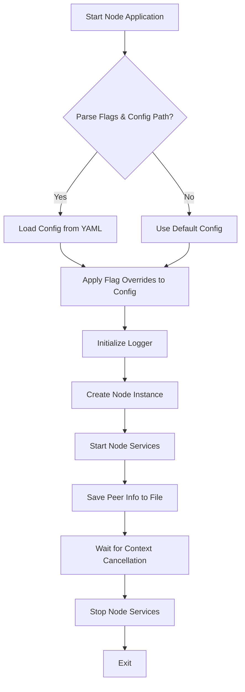
Sources: [cmd/node/main.go:42-230]()

## Configuration

The DeBros Network components are highly configurable through YAML files, command-line flags, and environment variables. Sources: [README.md:143-143]()

### Configuration Precedence

Configuration values are applied in a specific order of precedence:

1.  **Flags:** Command-line flags override all other settings.
2.  **Environment Variables:** Environment variables override YAML configurations.
3.  **YAML:** Configuration loaded from YAML files.
4.  **Defaults:** Built-in default values.
Sources: [README.md:183-186]()

This precedence allows for flexible and dynamic configuration management. The `load_args_into_config` function in `cmd/node/main.go` demonstrates how command-line arguments override configuration values. Sources: [cmd/node/main.go:186-218]()

```go
// cmd/node/main.go
func load_args_into_config(cfg *config.Config, p2pPort, rqlHTTP, rqlRaft *int, rqlJoinAddr *string, advAddr *string, dataDir *string) {
	logger := setup_logger(logging.ComponentNode)

	if *rqlHTTP != 5001 {
		cfg.Database.RQLitePort = *rqlHTTP
		logger.ComponentInfo(logging.ComponentNode, "Overriding RQLite HTTP port", zap.Int("port", *rqlHTTP))
	}
	// ... similar overrides for RQLite Raft port, P2P port, RQLite join address, advertise address, and data directory
}
```
Sources: [cmd/node/main.go:186-218]()

### Example Configuration Files

The project provides example YAML configuration files for different node roles.

#### `configs/bootstrap.yaml`

This configuration is for a bootstrap node, which typically does not join another RQLite cluster and acts as an initial peer for others. Sources: [README.md:149-164]()

```yaml
node:
  id: ""
  listen_addresses:
    - "/ip4/0.0.0.0/tcp/4001"
  data_dir: "./data/bootstrap"
  max_connections: 100
  disable_anonrc: true

database:
  data_dir: "./data/db"
  replication_factor: 3
  shard_count: 16
  max_database_size: 1073741824
  backup_interval: 24h
  rqlite_port: 5001
  rqlite_raft_port: 7001
  rqlite_join_address: "" # Bootstrap node does not join

discovery:
  bootstrap_peers: []
  discovery_interval: 15s
  bootstrap_port: 4001
  http_adv_address: "127.0.0.1"
  raft_adv_address: ""

security:
  enable_tls: false
  private_key_file: ""
  certificate_file: ""

logging:
  level: "info"
  format: "console"
  output_file: ""
```
Sources: [README.md:150-181]()

#### `configs/node.yaml`

This configuration is for a regular network node, designed to join an existing RQLite cluster and connect to bootstrap peers. Sources: [README.md:166-181]()

```yaml
node:
  id: "node2"
  listen_addresses:
    - "/ip4/0.0.0.0/tcp/4002"
  data_dir: "./data/node2"
  max_connections: 50
  disable_anonrc: true

database:
  data_dir: "./data/db"
  replication_factor: 3
  shard_count: 16
  max_database_size: 1073741824
  backup_interval: 24h
  rqlite_port: 5002
  rqlite_raft_port: 7002
  rqlite_join_address: "http://127.0.0.1:5001"

discovery:
  bootstrap_peers:
    - "/ip4/127.0.0.1/tcp/4001/p2p/<YOUR_BOOTSTRAP_PEER_ID>"
  discovery_interval: 15s
  bootstrap_port: 4002
  http_adv_address: "127.0.0.1"
  raft_adv_address: ""

security:
  enable_tls: false
  private_key_file: ""
  certificate_file: ""

logging:
  level: "info"
  format: "console"
  output_file: ""
```
Sources: [README.md:167-198]()

## HTTP Gateway Deployment

The DeBros Network includes an HTTP/WebSocket gateway that provides a modern REST API and WebSocket interface over the P2P network. This gateway features an enhanced authentication system with multi-wallet support. Sources: [README.md:465-465]()

### Quick Start Gateway

The gateway can be started using `make run-gateway` or manually. Sources: [README.md:468-469]()

```bash
make run-gateway
# Or manually:
go run ./cmd/gateway
```
Sources: [README.md:468-470]()

### Gateway Configuration

The gateway's behavior can be configured via environment variables:

| Environment Variable          | Description                                                      | Example Value                                       |
| :---------------------------- | :--------------------------------------------------------------- | :-------------------------------------------------- |
| `GATEWAY_ADDR`                | Address and port for the gateway to listen on.                   | `0.0.0.0:8080`                                      |
| `GATEWAY_NAMESPACE`           | Namespace for the gateway operations.                            | `my-app`                                            |
| `GATEWAY_BOOTSTRAP_PEERS`     | Comma-separated list of bootstrap peers for the gateway to connect to. | `/ip4/127.0.0.1/tcp/4001/p2p/YOUR_PEER_ID`          |
| `GATEWAY_REQUIRE_AUTH`        | Boolean to enable/disable authentication for gateway endpoints.  | `true`                                              |
| `GATEWAY_API_KEYS`            | Comma-separated list of API keys and their associated namespaces. | `key1:namespace1,key2:namespace2`                   |
Sources: [README.md:473-477]()

## Client SDK Usage

The `pkg/client` module provides a Go client library for interacting with the DeBros Network. This client can be used to perform database, storage, and pub/sub operations. Sources: [AI_CONTEXT.md:120-120](), [examples/basic_usage.go:11-11]()

### Client Creation

A client is initialized with a configuration, which can include bootstrap peers and an API key. Sources: [AI_CONTEXT.md:121-125]()

```go
import "git.debros.io/DeBros/network/pkg/client"

config := client.DefaultClientConfig("my-app")
config.BootstrapPeers = []string{"/ip4/127.0.0.1/tcp/4001/p2p/{PEER_ID}"}
client, err := client.NewClient(config)
err = client.Connect()
defer client.Disconnect()
```
Sources: [AI_CONTEXT.md:121-126]()

The `e2e/client_e2e_test.go` also demonstrates client configuration, including setting an API key and bootstrap peers from environment variables. Sources: [e2e/client_e2e_test.go:30-47]()

### Client Connection Flow

The client connection process involves creating a client instance and then connecting to the network:

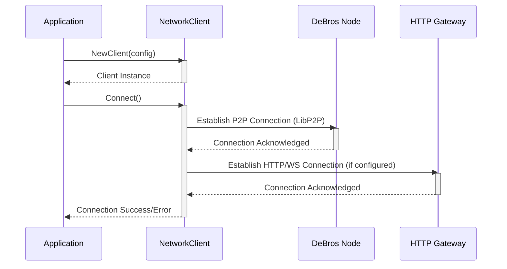
Sources: [examples/basic_usage.go:18-21](), [e2e/client_e2e_test.go:50-51]()

## Conclusion

The DeBros Network offers flexible deployment options, ranging from a single-command automated production setup to manual configuration for development and testing. Key components like the node and HTTP gateway are configurable via YAML, flags, and environment variables, providing fine-grained control over their operation. The provided client SDK facilitates application integration, ensuring robust interaction with the distributed network services.

---

<a id='architecture-overview'></a>

## Architecture Overview

### Related Pages

Related topics: [Project Structure](#project-structure), [Node vs. Client Roles](#node-vs-client)

<details>
<summary>Relevant source files</summary>

- [README.md](https://git.debros.io/DeBros/network/src/main/README.md)
- [AI_CONTEXT.md](https://git.debros.io/DeBros/network/src/main/AI_CONTEXT.md)
- [cmd/node/main.go](https://git.debros.io/DeBros/network/src/main/cmd/node/main.go)
- [examples/basic_usage.go](https://git.debros.io/DeBros/network/src/main/examples/basic_usage.go)
- [examples/sdk-typescript/src/client.ts](https://git.debros.io/DeBros/network/src/main/examples/sdk-typescript/src/client.ts)
- [e2e/gateway_e2e_test.go](https://git.debros.io/DeBros/network/src/main/e2e/gateway_e2e_test.go)
- [CONTRIBUTING.md](https://git.debros.io/DeBros/network/src/main/CONTRIBUTING.md)
</details>

# Architecture Overview

The DeBros Network Cluster is a decentralized peer-to-peer (P2P) system developed in Go, designed for distributed database operations, key-value storage, pub/sub messaging, and peer management. It aims to provide resilient, distributed data management and communication by distinguishing between full network nodes and lightweight clients. The architecture emphasizes modularity and robustness, supporting both full nodes that run core services and participate in discovery, and lightweight clients that connect via bootstrap peers.
Sources: [AI_CONTEXT.md:8-11](), [README.md:1-4]()

## Core Components

The DeBros Network Cluster comprises several key components that work together to provide its distributed functionalities. These include the Node, Client API, LibP2P Host, Noise/TLS Encryption, and RQLite Database.
Sources: [README.md:36-49]()

### Component Diagram

The following diagram illustrates the high-level architecture and interaction between the main components of the DeBros Network Cluster.
Sources: [README.md:36-49](), [AI_CONTEXT.md:16-30]()

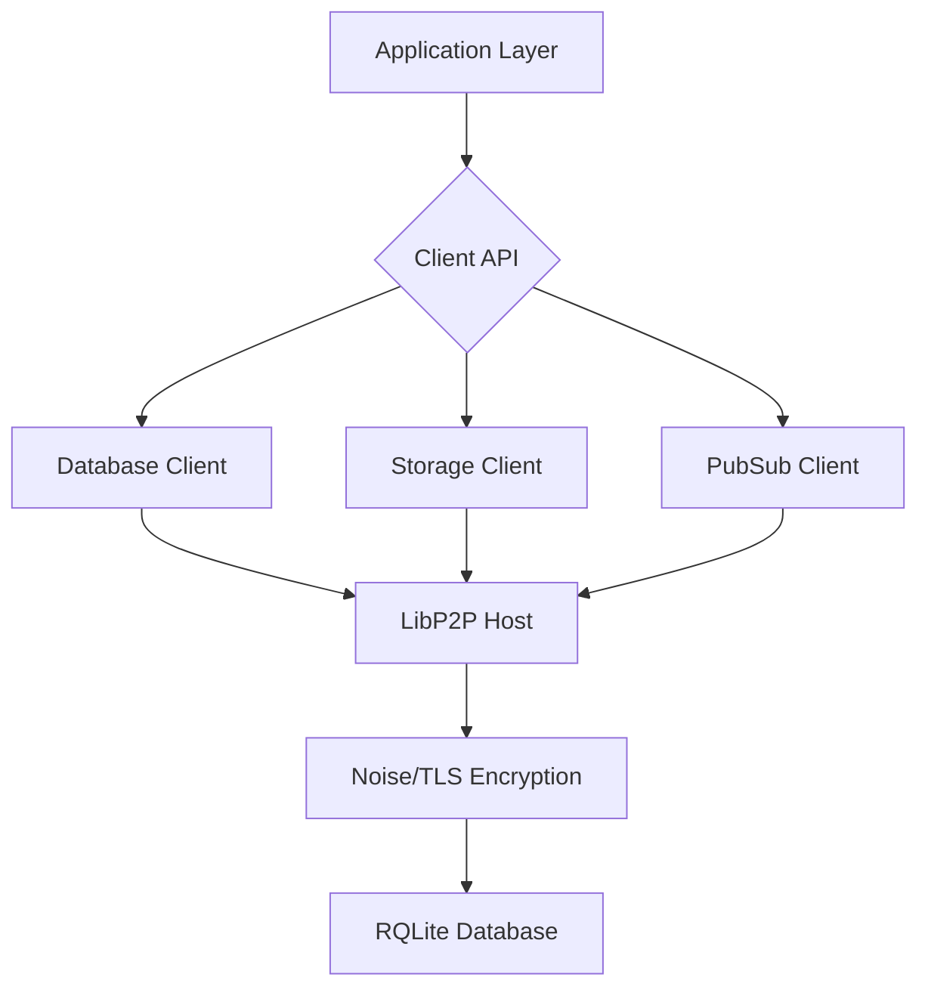
Sources: [README.md:36-49](), [AI_CONTEXT.md:16-30]()

### Node vs. Client Roles

The system differentiates between two primary roles:

*   **Node:** A full P2P participant that runs core services, handles peer discovery, and provides distributed database, storage, and pub/sub functionalities. Nodes are active members of the network.
*   **Client:** A lightweight component that connects to the network via bootstrap peers. Clients consume services provided by nodes but do not participate in peer discovery or run core network services themselves.
Sources: [AI_CONTEXT.md:46-48](), [README.md:51-54]()

### Key Services

The DeBros Network provides several core services:

*   **Distributed SQL Database:** Utilizes RQLite for a distributed SQLite database with Raft consensus, ACID transactions, and automatic failover.
*   **Key-Value Storage:** Offers namespaced, replicated key-value storage with CRUD operations and prefix queries.
*   **Pub/Sub Messaging:** Provides topic-based, real-time, namespaced messaging with automatic cleanup.
*   **Peer Discovery & Management:** Enables nodes to discover peers, supports bootstrapping, and includes health monitoring.
*   **Application Isolation:** Achieves multi-tenancy through namespace-based isolation and per-application configuration.
*   **Security:** Defaults to Noise/TLS transport encryption, peer identity, and systemd hardening.
*   **Client API:** Offers a lightweight Go client for application integration and CLI tools.
Sources: [README.md:19-30](), [AI_CONTEXT.md:8-11]()

## Network Protocol and Data Flow

The network relies on LibP2P for its underlying P2P communication, enhanced with Noise/TLS encryption for secure transport. Data flows between clients and nodes, and among nodes, through a structured set of APIs.

### Client-Node Interaction Flow

Clients interact with the network services (Database, Storage, PubSub) through a unified client API. This API abstracts the underlying P2P communication.
Sources: [examples/basic_usage.go:19-24](), [AI_CONTEXT.md:16-30]()

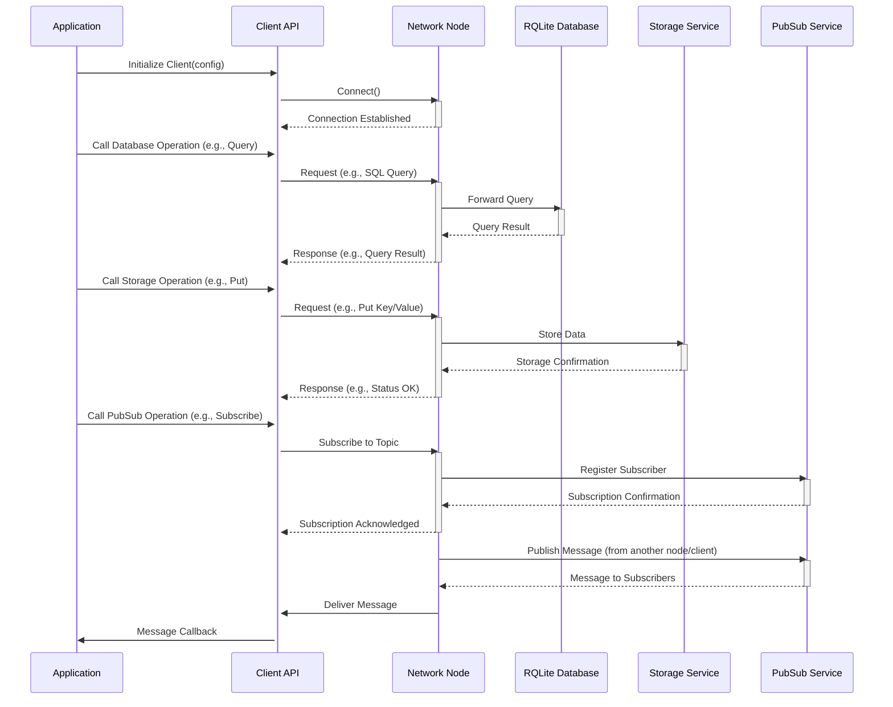
Sources: [examples/basic_usage.go:19-24](), [AI_CONTEXT.md:16-30](), [examples/sdk-typescript/src/client.ts:90-94]()

### Network Ports

The DeBros Network utilizes specific ports for its operations:

| Port | Purpose                     |
| :--- | :-------------------------- |
| 4001 | LibP2P P2P communication    |
| 5001 | RQLite HTTP API             |
| 7001 | RQLite Raft consensus       |
Sources: [README.md:63-66]()

## Configuration System

The system uses a flexible configuration approach, allowing settings to be defined via YAML files, command-line flags, and environment variables.
Sources: [AI_CONTEXT.md:58-60](), [cmd/node/main.go:41-43]()

### Configuration Precedence

Settings are applied in a specific order of precedence:
1.  Command-line Flags (highest)
2.  Environment Variables
3.  YAML Configuration File
4.  Default Values (lowest)
Sources: [AI_CONTEXT.md:126]()

### Example Configuration

Node configurations typically define network addresses, data directories, RQLite settings, and discovery parameters.
Sources: [AI_CONTEXT.md:74-124]()

```yaml
node:
  id: "node2"
  listen_addresses:
    - "/ip4/0.0.0.0/tcp/4002"
  data_dir: "./data/node2"
  max_connections: 50
  disable_anonrc: true

database:
  data_dir: "./data/db"
  replication_factor: 3
  shard_count: 16
  max_database_size: 1073741824
  backup_interval: 24h
  rqlite_port: 5002
  rqlite_raft_port: 7002
  rqlite_join_address: "http://127.0.0.1:5001"

discovery:
  bootstrap_peers:
    - "/ip4/127.0.0.1/tcp/4001/p2p/<YOUR_BOOTSTRAP_PEER_ID>"
  discovery_interval: 15s
  bootstrap_port: 4002
  http_adv_address: "127.0.0.1"
  raft_adv_address: ""

security:
  enable_tls: false
  private_key_file: ""
  certificate_file: ""

logging:
  level: "info"
  format: "console"
  output_file: ""
```
Sources: [AI_CONTEXT.md:99-124]()

## Gateway Service

The HTTP Gateway acts as a centralized access point for clients to interact with the DeBros Network services (Storage, Database, PubSub) over standard HTTP/WebSocket protocols. It enforces namespace ownership and provides an enhanced authentication system.
Sources: [AI_CONTEXT.md:247-249](), [AI_CONTEXT.md:251-255]()

### Gateway Endpoints

The gateway exposes various REST and WebSocket endpoints:

#### Health/Version
*   `GET /health`
*   `GET /v1/health`
*   `GET /v1/status`
*   `GET /v1/version`
Sources: [AI_CONTEXT.md:268-271]()

#### Authentication (Enhanced Multi-Wallet System)
*   `POST /v1/auth/challenge`
*   `POST /v1/auth/verify`
*   `POST /v1/auth/register`
*   `POST /v1/auth/refresh`
*   `POST /v1/auth/logout`
*   `GET /v1/auth/whoami`
*   `POST /v1/auth/api-key`
Sources: [AI_CONTEXT.md:278-284]()

#### Storage Operations
*   `POST /v1/storage/get`
*   `POST /v1/storage/put`
*   `POST /v1/storage/delete`
*   `GET /v1/storage/list?prefix=...`
*   `GET /v1/storage/exists?key=...`
Sources: [AI_CONTEXT.md:286-290]()

#### Database Operations
*   `POST /v1/db/create-table`
*   `POST /v1/db/drop-table`
*   `POST /v1/db/query`
*   `POST /v1/db/transaction`
*   `GET /v1/db/schema`
Sources: [AI_CONTEXT.md:309-313]()

### Gateway Interaction Flow

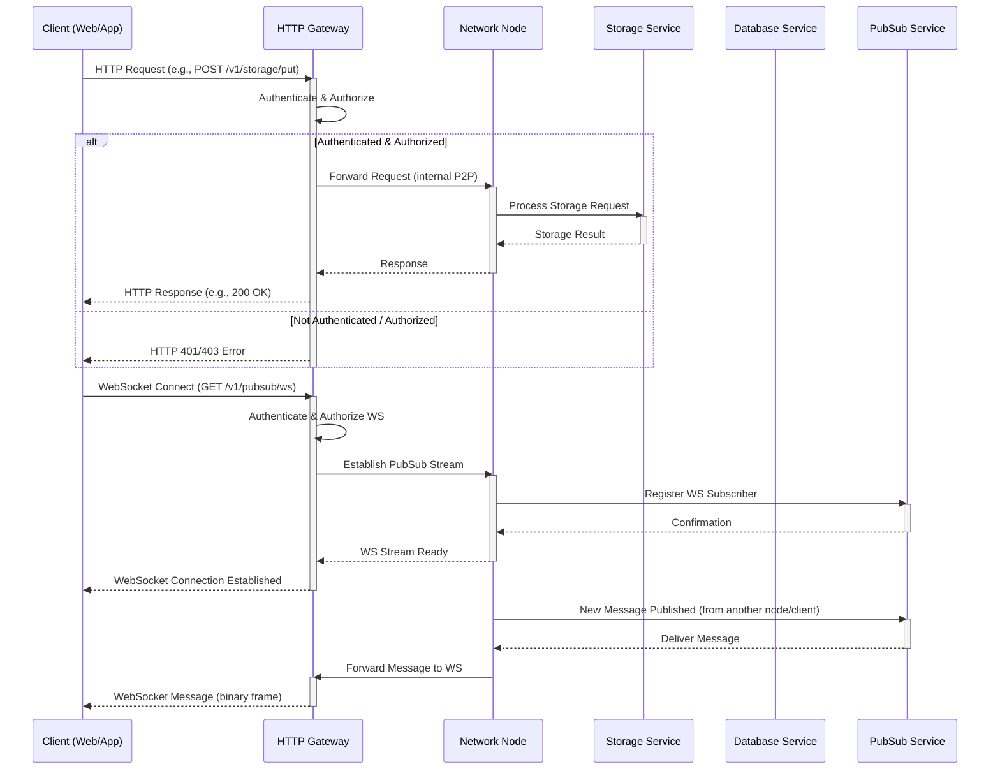
Sources: [AI_CONTEXT.md:247-255](), [AI_CONTEXT.md:309-313](), [AI_CONTEXT.md:292-294]()

## Database Migration System

The DeBros Network includes a robust database migration system designed to manage schema changes reliably. It ensures that database updates are applied consistently and safely across the cluster.
Sources: [AI_CONTEXT.md:144-147]()

### Key Features

*   **Atomicity:** Each migration runs within a transaction.
*   **Version Control:** Tracks migration versions to prevent duplicate execution.
*   **Error Recovery:** Provides comprehensive error handling and logging.
*   **SQL File Support:** Processes standard `.sql` migration files.
Sources: [AI_CONTEXT.md:148-154]()

### Migration File Structure

Migrations are organized sequentially in a `migrations/` directory.
Sources: [AI_CONTEXT.md:156-161]()

```
migrations/
├── 001_initial_schema.sql
├── 002_add_auth_tables.sql
├── 003_add_indexes.sql
└── ...
```
Sources: [AI_CONTEXT.md:156-161]()

### Migration Process

Migrations are automatically processed during gateway startup. For programmatic migrations, SQL DDL statements can be sent via the `/v1/db/transaction` endpoint.
Sources: [AI_CONTEXT.md:163-164](), [AI_CONTEXT.md:316]()

```go
// Example: Database migration via HTTP transaction (from e2e test)
// This demonstrates changing a column type using the recreate pattern
// Sources: [e2e/gateway_e2e_test.go:198-208]()
txBody := fmt.Sprintf(`{"statements":["CREATE TABLE %s_new (id INTEGER PRIMARY KEY, name TEXT, age INTEGER)", "INSERT INTO %s_new (id, name, age) SELECT id, name, age FROM %s", "DROP TABLE %s", "ALTER TABLE %s_new RENAME TO %s"]}`, users, users, users, users, users, users)
req, _ = http.NewRequest(http.MethodPost, base+"/v1/db/transaction", strings.NewReader(txBody))
req.Header = authHeader(key)
resp, err = httpClient().Do(req)
if err != nil { t.Fatalf("mig tx do: %v", err) }
resp.Body.Close()
if resp.StatusCode != http.StatusOK { t.Fatalf("mig tx status: %d", resp.StatusCode) }
```
Sources: [e2e/gateway_e2e_test.go:198-208]()

## Conclusion

The DeBros Network Cluster provides a robust, decentralized platform for distributed data management and communication. Its modular architecture, clear separation of node and client roles, and comprehensive API design facilitate resilient and scalable applications. The system's emphasis on secure communication, flexible configuration, and a reliable database migration system underpins its utility for building decentralized applications.

---

<a id='project-structure'></a>

## Project Structure

### Related Pages

Related topics: [Architecture Overview](#architecture-overview)

<details>
<summary>Relevant source files</summary>

- [README.md](https://git.debros.io/DeBros/network/src/main/README.md)
- [AI_CONTEXT.md](https://git.debros.io/DeBros/network/src/main/AI_CONTEXT.md)
- [CONTRIBUTING.md](https://git.debros.io/DeBros/network/src/main/CONTRIBUTING.md)
- [cmd/node/main.go](https://git.debros.io/DeBros/network/src/main/cmd/node/main.go)
- [cmd/cli/main.go](https://git.debros.io/DeBros/network/src/main/cmd/cli/main.go)
- [examples/basic_usage.go](https://git.debros.io/DeBros/network/src/main/examples/basic_usage.go)
</details>

# Project Structure

The DeBros Network Cluster is a decentralized peer-to-peer (P2P) system built in Go, designed for resilient, distributed data management and communication. Its project structure is modular, separating core functionalities into distinct packages and organizing executables for nodes and command-line interfaces. This organization facilitates development, testing, and deployment, ensuring a clear separation of concerns between different components of the network. The architecture supports both full network nodes and lightweight clients, enabling various application types to interact with the network.
Sources: [AI_CONTEXT.md:16-17](), [README.md:13-14]()

## Top-Level Directories

The project's root directory contains several key folders that organize its source code, build artifacts, configurations, and scripts. This structure supports a streamlined development workflow from building to deployment.
Sources: [AI_CONTEXT.md:275-283](), [README.md:120-128]()

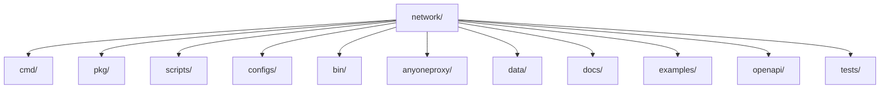
Sources: [AI_CONTEXT.md:275-283]()

### `cmd/`
This directory holds the main executable applications of the project. Each subdirectory within `cmd/` represents a distinct application.
Sources: [AI_CONTEXT.md:276](), [README.md:121]()

- **`node/`**: Contains the source code for the DeBros Network node executable. This is the core P2P participant that runs all network services.
  Sources: [AI_CONTEXT.md:277](), [README.md:122]()
- **`cli/`**: Contains the source code for the command-line interface tool, `network-cli`, used to interact with the network.
  Sources: [AI_CONTEXT.md:278](), [README.md:123]()

### `pkg/`
The `pkg/` directory contains the reusable Go packages that encapsulate the core logic and services of the DeBros Network. This modular design promotes code reusability and maintainability.
Sources: [AI_CONTEXT.md:279](), [README.md:124]()

- **`client/`**: Provides the lightweight P2P client library for applications and CLI tools to connect to the network. It offers interfaces for database, storage, pub/sub, and network information operations.
  Sources: [AI_CONTEXT.md:290-293](), [README.md:52]()
- **`node/`**: Implements the full P2P node functionality, including peer discovery, service registration, connection monitoring, and data replication.
  Sources: [AI_CONTEXT.md:295-298]()
- **`database/`**: Handles the integration with RQLite, providing distributed SQLite capabilities, including SQL queries, transactions, schema management, and a robust migration system.
  Sources: [AI_CONTEXT.md:304-308]()
- **`storage/`**: Implements the distributed key-value storage system, supporting namespace-isolated CRUD operations and prefix queries.
  Sources: [AI_CONTEXT.md:310]()
- **`pubsub/`**: Manages the topic-based, real-time messaging system with automatic subscription management and namespace isolation.
  Sources: [AI_CONTEXT.md:312]()
- **`config/`**: Centralized package for managing configuration via YAML files, environment variables, and CLI flags.
  Sources: [AI_CONTEXT.md:300-302]()
- **`discovery/`**: Handles peer discovery mechanisms, primarily for full nodes, using peerstore and peer exchange.
  Sources: [AI_CONTEXT.md:314-315]()
- **`anyoneproxy/`**: Optional SOCKS5 proxy support.
  Sources: [AI_CONTEXT.md:275]()
- **`auth/`**: Manages authentication mechanisms, including wallet verification, JWT, and API key support.
  Sources: [AI_CONTEXT.md:144-145]()

### `scripts/`
This directory contains various shell scripts for building, testing, and deploying the network.
Sources: [AI_CONTEXT.md:280](), [README.md:125]()

- **`install-debros-network.sh`**: An automated script for production installation, handling OS detection, dependency installation, system user creation, binary building, systemd service setup, and firewall configuration.
  Sources: [README.md:80-92]()
- **`test-multinode.sh`**: Script for local multi-node testing.
  Sources: [README.md:139]()

### `configs/`
This directory stores YAML configuration files for different network components, such as `node.yaml` and `bootstrap.yaml`. These files define settings for nodes, databases, discovery, and security.
Sources: [AI_CONTEXT.md:281](), [README.md:126]()

### `bin/`
This directory is where the compiled executable binaries are placed after a build operation.
Sources: [AI_CONTEXT.md:282](), [README.md:127]()

### `data/`
This directory is used for runtime data, including identity keys, RQLite database files, and logs.
Sources: [AI_CONTEXT.md:283](), [README.md:96]()

### `examples/`
Contains example applications demonstrating how to use the DeBros Network client, such as `basic_usage.go` and the `anchat/` decentralized chat app.
Sources: [AI_CONTEXT.md:261](), [examples/basic_usage.go:1-6]()

### `openapi/`
This directory contains the OpenAPI specification for the gateway's REST endpoints, enabling machine-readable contract definitions for Storage, Database, and PubSub services.
Sources: [AI_CONTEXT.md:175-176]()

## Core Components and Their Interactions

The DeBros Network is composed of several interconnected core components that work together to provide distributed data and messaging services.

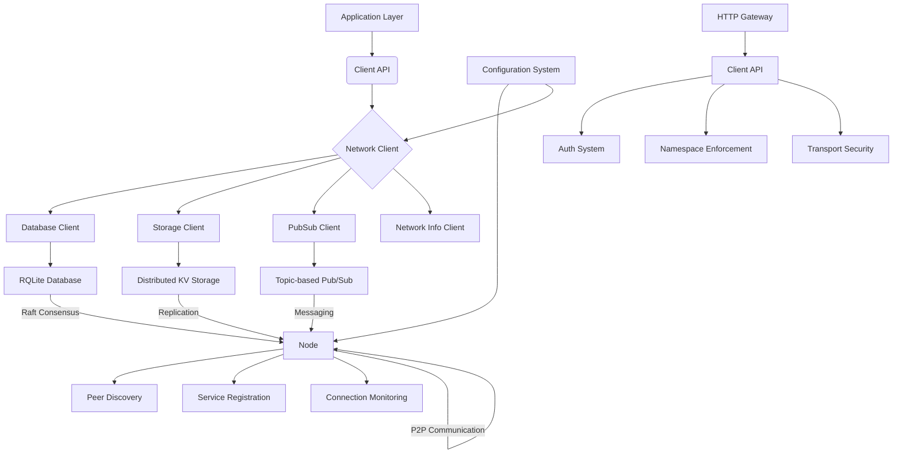
Sources: [AI_CONTEXT.md:24-34](), [README.md:27-37](), [AI_CONTEXT.md:288-315](), [AI_CONTEXT.md:317-327]()

### Node vs. Client Roles

The system distinguishes between full network nodes and lightweight clients, each with specific responsibilities and capabilities.
Sources: [AI_CONTEXT.md:18](), [AI_CONTEXT.md:330-331]()

#### Node (`pkg/node/`)
A full P2P participant that runs core services like RQLite, storage, and pub/sub. Nodes are responsible for peer discovery and network management.
Sources: [AI_CONTEXT.md:295-298](), [AI_CONTEXT.md:333-335]()

#### Client (`pkg/client/`)
A lightweight P2P participant primarily for applications and CLI tools. Clients connect only to bootstrap peers and do not participate in peer discovery. They consume services provided by the network.
Sources: [AI_CONTEXT.md:290-293](), [AI_CONTEXT.md:337-339]()

### Configuration System (`pkg/config/`)
The configuration system is centralized, primarily using YAML files (`configs/node.yaml`). Settings can be overridden by CLI flags and environment variables, following a specific precedence: CLI flags > Environment variables > YAML > Code defaults.
Sources: [AI_CONTEXT.md:300-302](), [AI_CONTEXT.md:317-327](), [README.md:182-184]()

An example of configuration parameters:

| Parameter             | Description                                                                  | Source File                 |
| :-------------------- | :--------------------------------------------------------------------------- | :-------------------------- |
| `data_dir`            | Directory for node data (identity, database, logs).                          | [AI_CONTEXT.md:322]()       |
| `listen_addresses`    | LibP2P listen addresses for the node.                                        | [README.md:156]()           |
| `rqlite_port`         | HTTP API port for RQLite.                                                    | [README.md:162]()           |
| `rqlite_raft_port`    | Raft consensus port for RQLite.                                              | [README.md:163]()           |
| `rqlite_join_address` | RQLite address to join an existing cluster.                                  | [README.md:164]()           |
| `bootstrap_peers`     | List of multiaddresses for bootstrap peers.                                  | [README.md:167]()           |
| `logging.level`       | Log level (e.g., "info", "debug").                                           | [README.md:173]()           |
Sources: [AI_CONTEXT.md:322-327](), [README.md:156-174]()

### HTTP Gateway
The HTTP Gateway provides a RESTful interface for interacting with the DeBros Network. It acts as a bridge, offering an API for Storage, Database, and PubSub operations over the network client with strict namespace enforcement. It includes an enhanced authentication system supporting multi-wallet, JWT, and API keys.
Sources: [AI_CONTEXT.md:118-125]()

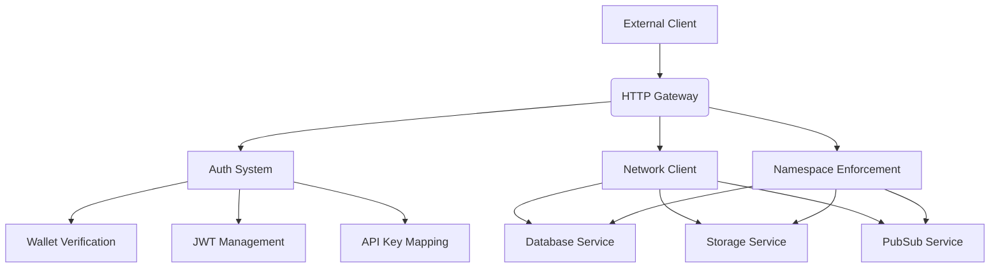
Sources: [AI_CONTEXT.md:118-125]()

Key HTTP endpoints provided by the gateway:

| Category      | Endpoint                          | Description                                            | Method | Source File             |
| :------------ | :-------------------------------- | :----------------------------------------------------- | :----- | :---------------------- |
| Health/Version | `/health`, `/v1/health`           | Returns gateway health status.                         | GET    | [AI_CONTEXT.md:195]()   |
|               | `/v1/status`                      | Returns network status.                                | GET    | [AI_CONTEXT.md:196]()   |
|               | `/v1/version`                     | Returns version, commit, build time, uptime.           | GET    | [AI_CONTEXT.md:197]()   |
| Auth          | `/v1/auth/challenge`              | Generates a wallet challenge (nonce).                  | POST   | [AI_CONTEXT.md:202]()   |
|               | `/v1/auth/verify`                 | Verifies wallet signature.                             | POST   | [AI_CONTEXT.md:203]()   |
|               | `/v1/auth/api-key`                | Generates API keys for authenticated users.            | POST   | [AI_CONTEXT.md:207]()   |
| Storage       | `/v1/storage/put`                 | Stores data by key.                                    | POST   | [AI_CONTEXT.md:209]()   |
|               | `/v1/storage/get`                 | Retrieves data by key.                                 | POST   | [AI_CONTEXT.md:209]()   |
|               | `/v1/storage/list`                | Lists keys with an optional prefix.                    | GET    | [AI_CONTEXT.md:210]()   |
| Database      | `/v1/db/create-table`             | Creates a table with SQL DDL.                          | POST   | [AI_CONTEXT.md:164]()   |
|               | `/v1/db/query`                    | Executes a single SQL query.                           | POST   | [AI_CONTEXT.md:166]()   |
|               | `/v1/db/transaction`              | Applies multiple SQL statements atomically.            | POST   | [AI_CONTEXT.md:167]()   |
| PubSub        | `/v1/pubsub/ws`                   | WebSocket connection for real-time messaging.          | GET    | [AI_CONTEXT.md:216]()   |
|               | `/v1/pubsub/publish`              | Publishes a message to a topic.                        | POST   | [AI_CONTEXT.md:218]()   |
Sources: [AI_CONTEXT.md:164-173](), [AI_CONTEXT.md:194-220]()

## Build and Development Workflow

The project provides a straightforward build and development workflow using `make` commands.
Sources: [CONTRIBUTING.md:21-22](), [AI_CONTEXT.md:88-91]()

```bash
make build        # Build all executables
make test         # Run tests
make run-node     # Start node (auto-detects bootstrap vs regular)
make run-gateway  # Start HTTP gateway (env overrides supported)
```
Sources: [AI_CONTEXT.md:89-92]()

For local development, `make run-node` can be used. Node settings are configured via YAML files, and the CLI tool is used for network operations and testing.
Sources: [AI_CONTEXT.md:94-96]()

## Conclusion

The DeBros Network project structure is designed for clarity, modularity, and scalability. By separating concerns into distinct `cmd/` for executables and `pkg/` for reusable libraries, it promotes efficient development and maintenance. The clear distinction between node and client roles, coupled with a robust configuration system and an HTTP Gateway, provides a comprehensive framework for building decentralized applications.
Sources: [AI_CONTEXT.md:16-18](), [AI_CONTEXT.md:275-283]()

---

<a id='node-vs-client'></a>

## Node vs. Client Roles

### Related Pages

Related topics: [Network Client](#network-client), [Node Component](#node-component)

<details>
<summary>Relevant source files</summary>

- [README.md](https://git.debros.io/DeBros/network/src/main/README.md)
- [AI_CONTEXT.md](https://git.debros.io/DeBros/network/src/main/AI_CONTEXT.md)
- [cmd/node/main.go](https://git.debros.io/DeBros/network/src/main/cmd/node/main.go)
- [cmd/cli/main.go](https://git.debros.io/DeBros/network/src/main/cmd/cli/main.go)
- [examples/basic_usage.go](https://git.debros.io/DeBros/network/src/main/examples/basic_usage.go)
- [CONTRIBUTING.md](https://git.debros.io/DeBros/network/src/main/CONTRIBUTING.md)
</details>

# Node vs. Client Roles

The DeBros Network Cluster is a decentralized peer-to-peer (P2P) system designed for resilient, distributed data management and communication. Within this architecture, a clear distinction is made between full network nodes and lightweight clients, each serving specific roles and interacting with the network in different capacities. This separation allows for both robust network participation and efficient application integration. Sources: [AI_CONTEXT.md:16-19](), [README.md:12-14]()

## Core Architectural Distinction

The DeBros Network employs a modular and robust architecture that differentiates between full nodes and lightweight clients. Full nodes run core services and participate in network discovery, while lightweight clients connect to the network via bootstrap peers to consume services. Sources: [AI_CONTEXT.md:23-25](), [AI_CONTEXT.md:155-156]()

### Node Role

A **Node** is a full participant in the DeBros Network. It runs the complete suite of network services, including the distributed SQL database (RQLite), key-value storage, and Pub/Sub messaging. Nodes are responsible for peer discovery, managing network topology, participating in consensus and data replication, and overseeing service lifecycle and monitoring. Sources: [AI_CONTEXT.md:158-163](), [AI_CONTEXT.md:104-107]()

Key characteristics and responsibilities of a Node:
*   **Runs full network services:** This includes RQLite, storage, and Pub/Sub. Sources: [AI_CONTEXT.md:159]()
*   **Handles peer discovery and network topology:** Nodes actively discover and manage connections with other peers in the network. Sources: [AI_CONTEXT.md:106](), [AI_CONTEXT.md:160]()
*   **Participates in consensus and replication:** Essential for maintaining data consistency and availability across the distributed database and storage systems. Sources: [AI_CONTEXT.md:161]()
*   **Manages service lifecycle and monitoring:** Ensures the proper operation and health of its integrated services. Sources: [AI_CONTEXT.md:162]()
*   **Configuration:** Node configuration is primarily managed via YAML files (`configs/node.yaml`), with overrides possible via CLI flags and environment variables. Sources: [AI_CONTEXT.md:139-140]()

#### Node Startup Process

The `cmd/node/main.go` file outlines the startup sequence for a DeBros Network node. It involves parsing command-line flags, loading configuration, setting up logging, and initializing the node instance.

```mermaid
graph TD
    A[main()] --> B{Parse Command-Line Flags};
    B --> C{Load Configuration};
    C --> D{Apply Overrides};
    D --> E{Initialize Logger};
    E --> F[Create Node Context];
    F --> G[Create NewNode(cfg)];
    G --> H{Start Node};
    H --> I[Save Peer ID to File];
    I --> J[Wait for Context Cancellation];
    J --> K[Stop Node];
```
Sources: [cmd/node/main.go:41-117](), [cmd/node/main.go:197-234]()

The `startNode` function in `cmd/node/main.go` creates and starts the node, also saving its peer ID to a file for external access. Sources: [cmd/node/main.go:167-194]()

### Client Role

A **Client** is a lightweight participant in the DeBros Network. Unlike nodes, clients do not run full network services, nor do they participate in peer discovery or DHT. Instead, clients connect only to known bootstrap peers and consume network services (Database, Storage, Pub/Sub, NetworkInfo) via a dedicated API. Sources: [AI_CONTEXT.md:165-170](), [AI_CONTEXT.md:99-102]()

Key characteristics and responsibilities of a Client:
*   **Lightweight participant:** Does not run its own services. Sources: [AI_CONTEXT.md:166]()
*   **Connects only to known bootstrap peers:** Relies on pre-configured bootstrap nodes to access the network. Sources: [AI_CONTEXT.md:167]()
*   **No peer discovery or DHT:** Does not actively discover other peers or maintain a distributed hash table. Sources: [AI_CONTEXT.md:168]()
*   **Consumes network services via API:** Provides interfaces for Database, Storage, Pub/Sub, and NetworkInfo operations. Sources: [AI_CONTEXT.md:169]()
*   **Used by CLI and application integrations:** The `pkg/client/` package provides the necessary API for applications and command-line tools to interact with the network. Sources: [AI_CONTEXT.md:170](), [AI_CONTEXT.md:99]()

#### Client Usage Example

The `examples/basic_usage.go` file demonstrates how an application client interacts with the DeBros Network.

```go
package main

import (
	"context"
	"log"
	"time"

	"git.debros.io/DeBros/network/pkg/client"
)

func main() {
	// Create client configuration
	config := client.DefaultClientConfig("example_app")
	config.BootstrapPeers = []string{
		"/ip4/127.0.0.1/tcp/4001/p2p/QmBootstrap1",
	}

	// Create network client
	networkClient, err := client.NewClient(config)
	if err != nil {
		log.Fatalf("Failed to create network client: %v", err)
	}

	// Connect to network
	if err := networkClient.Connect(); err != nil {
		log.Fatalf("Failed to connect to network: %v", err)
	}
	defer networkClient.Disconnect()

	log.Printf("Connected to network successfully!")

	// Example: Database operations
	demonstrateDatabase(networkClient)

	// Example: Storage operations
	demonstrateStorage(networkClient)

	// Example: Pub/Sub messaging
	demonstratePubSub(networkClient)

	// Example: Network information
	demonstrateNetworkInfo(networkClient)

	log.Printf("Example completed successfully!")
}
```
Sources: [examples/basic_usage.go:5-64]()

### Comparison of Node and Client Roles

The following table summarizes the key differences between Nodes and Clients in the DeBros Network Cluster:

| Feature                   | Node (`pkg/node/`)                                  | Client (`pkg/client/`)                                  |
| :------------------------ | :-------------------------------------------------- | :------------------------------------------------------ |
| **Role**                  | Full P2P participant                                | Lightweight P2P participant                             |
| **Services Run**          | RQLite, Storage, Pub/Sub                            | None                                                    |
| **Peer Discovery**        | Yes (via peerstore and peer exchange)               | No (connects only to bootstrap peers)                   |
| **Network Management**    | Handles network topology, consensus, replication    | Consumes services via API                               |
| **Data Replication**      | Yes                                                 | No                                                      |
| **Use Case**              | Core network infrastructure, service provision      | Application integration, CLI tools                      |
| **Configuration Source**  | `configs/node.yaml` (YAML, CLI flags, Env vars)     | `ClientConfig` (explicit, Env vars, Library defaults)   |

Sources: [AI_CONTEXT.md:99-107](), [AI_CONTEXT.md:158-170](), [AI_CONTEXT.md:139-148]()

## Network Interaction and Data Flow

Both nodes and clients interact with the network, but their mechanisms and responsibilities differ significantly.

### Node Network Interaction

Nodes establish connections, discover peers, and register their services. They participate in the core data flow for database operations (via Raft consensus), storage replication, and Pub/Sub message routing. Sources: [AI_CONTEXT.md:175-185]()

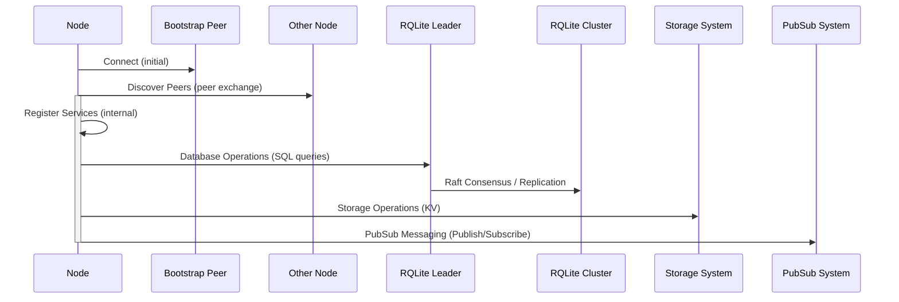
Sources: [AI_CONTEXT.md:175-185]()

### Client Network Interaction

Clients connect to bootstrap peers and then use the provided API interfaces to perform operations. They do not directly participate in the underlying consensus or replication mechanisms; instead, they send requests to the nodes which then handle the distributed logic. Sources: [AI_CONTEXT.md:176](), [AI_CONTEXT.md:181-185]()

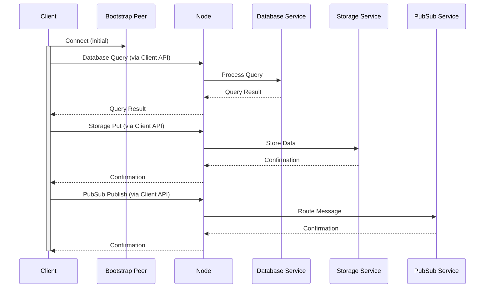
Sources: [AI_CONTEXT.md:181-185](), [examples/basic_usage.go:66-180]()

## Conclusion

The distinction between Nodes and Clients is fundamental to the DeBros Network's design, enabling a flexible and scalable distributed system. Nodes form the backbone, providing core services and ensuring data integrity and availability through distributed protocols. Clients, on the other hand, offer a lightweight interface for applications and users to interact with the network's capabilities without the overhead of running full services. This architectural separation optimizes resource utilization and simplifies application development on the DeBros Network. Sources: [AI_CONTEXT.md:16-19](), [AI_CONTEXT.md:23-25]()

---

<a id='network-protocol-data-flow'></a>

## Network Protocol & Data Flow

### Related Pages

Related topics: [Architecture Overview](#architecture-overview)

<details>
<summary>Relevant source files</summary>

- [AI_CONTEXT.md](https://git.debros.io/DeBros/network/src/main/AI_CONTEXT.md)
- [README.md](https://git.debros.io/DeBros/network/src/main/README.md)
- [CONTRIBUTING.md](https://git.debros.io/DeBros/network/src/main/CONTRIBUTING.md)
- [cmd/node/main.go](https://git.debros.io/DeBros/network/src/main/cmd/node/main.go)
- [cmd/cli/main.go](https://git.debros.io/DeBros/network/src/main/cmd/cli/main.go)
- [examples/basic_usage.go](https://git.debros.io/DeBros/network/src/main/examples/basic_usage.go)
</details>

# Network Protocol & Data Flow

The DeBros Network Cluster is a decentralized peer-to-peer (P2P) system designed for resilient, distributed data management and communication. Its core functionality revolves around a robust network protocol and efficient data flow mechanisms, enabling distributed database operations, key-value storage, and pub/sub messaging. The system distinguishes between full network nodes and lightweight clients, each interacting with the network in a defined manner to ensure scalability and performance.
Sources: [AI_CONTEXT.md:43-46](), [AI_CONTEXT.md:53-56]()

## Architecture Overview

The DeBros Network Cluster employs a modular architecture that supports both full nodes and lightweight clients. Full nodes run core services and participate in peer discovery, while clients connect to the network via bootstrap peers without running their own services.
Sources: [AI_CONTEXT.md:53-56](), [AI_CONTEXT.md:167-170]()

The overall architecture can be visualized as follows:

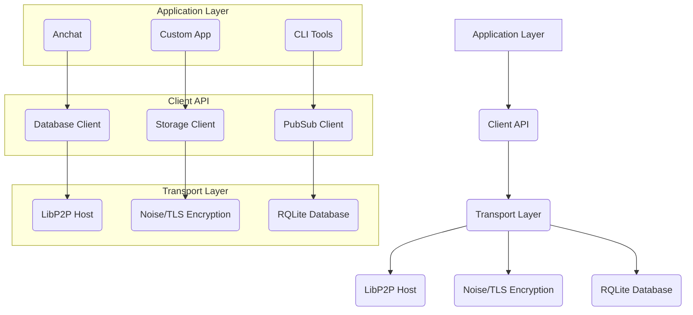
Sources: [AI_CONTEXT.md:60-75](), [README.md:52-67]()

## Node vs Client Roles

The DeBros Network defines distinct roles for nodes and clients, impacting their network participation and data flow.
Sources: [AI_CONTEXT.md:165]()

### Node Role

A full node runs all core network services. It actively participates in peer discovery, consensus, and data replication. Nodes manage the lifecycle of services like RQLite, storage, and pub/sub.
Sources: [AI_CONTEXT.md:167-170]()

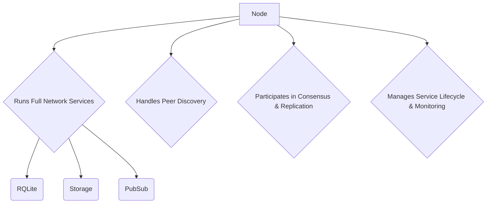
Sources: [AI_CONTEXT.md:167-170]()

### Client Role

A client is a lightweight participant that does not run core network services. Instead, it connects to known bootstrap peers and consumes network services via APIs for database, storage, pub/sub, and network information. Clients do not perform peer discovery or participate in DHT.
Sources: [AI_CONTEXT.md:172-176]()

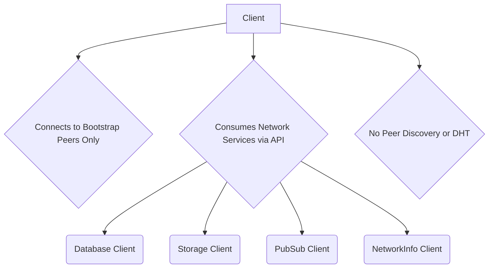
Sources: [AI_CONTEXT.md:172-176]()

## Connection Establishment

The process of establishing connections differs between nodes and clients.

### Node Connection

Nodes connect to bootstrap peers, discover additional peers, and register their services.
Sources: [AI_CONTEXT.md:180]()

### Client Connection

Clients connect exclusively to bootstrap peers.
Sources: [AI_CONTEXT.md:181]()

The `examples/basic_usage.go` file demonstrates client connection:
```go
// examples/basic_usage.go:14-22
func main() {
	// Create client configuration
	config := client.DefaultClientConfig("example_app")
	config.BootstrapPeers = []string{
		"/ip4/127.0.0.1/tcp/4001/p2p/QmBootstrap1",
	}

	// Create network client
	networkClient, err := client.NewClient(config)
	if err != nil {
		log.Fatalf("Failed to create network client: %v", err)
	}

	// Connect to network
	if err := networkClient.Connect(); err != nil {
		log.Fatalf("Failed to connect to network: %v", err)
	}
	defer networkClient.Disconnect()

	log.Printf("Connected to network successfully!")
}
```

## Message Types

The network protocol handles various message types to facilitate distributed operations.
Sources: [AI_CONTEXT.md:183]()

| Message Type | Description |
|--------------|-------------|
| **Control**  | Node status, heartbeats, topology updates |
| **Database** | SQL queries, transactions, schema operations |
| **Storage**  | Key-value operations, replication |
| **PubSub**   | Topic subscriptions, published messages |
Sources: [AI_CONTEXT.md:184-187]()

## Security Model

The DeBros Network incorporates several security features to ensure secure communication and data integrity.
Sources: [AI_CONTEXT.md:189]()

*   **Transport:** Noise/TLS encryption for all connections.
*   **Authentication:** Peer identity verification.
*   **Isolation:** Namespace-based access control.
Sources: [AI_CONTEXT.md:190-192]()

## Data Flow

Data flows through the network differently based on the type of operation.

### Database Data Flow

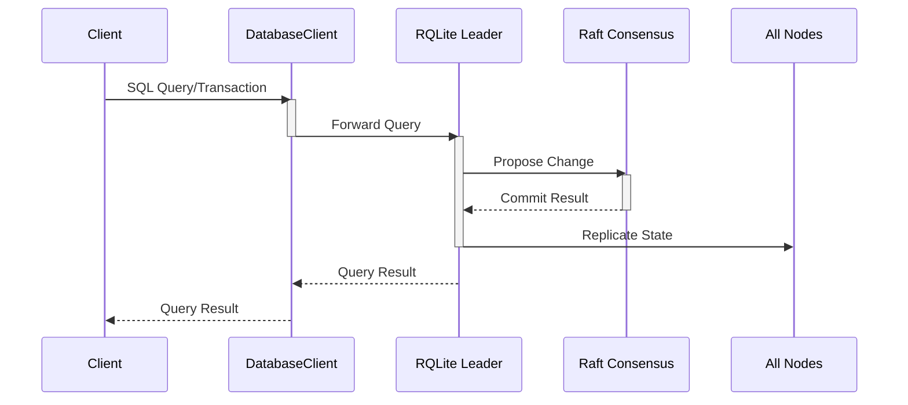
Sources: [AI_CONTEXT.md:194]()

### Storage Data Flow

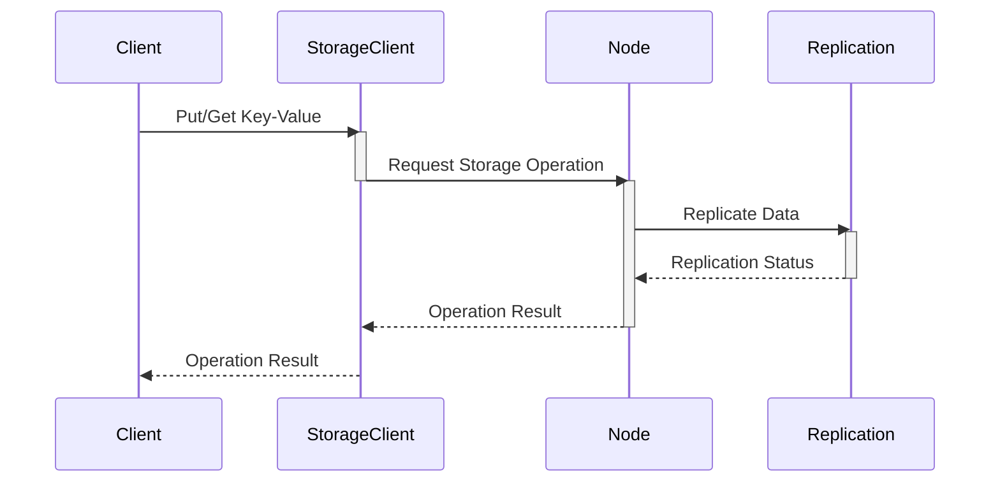
Sources: [AI_CONTEXT.md:195]()

### Pub/Sub Data Flow

```mermaid
sequenceDiagram
    participant Client
    participant PubSubClient
    participant Node
    participant TopicRouter
    participant Subscribers

    Client->>PubSubClient: Publish Message
    activate PubSubClient
    PubSubClient->>Node: Forward Message
    deactivate PubSubClient
    activate Node
    Node->>TopicRouter: Route Message to Topic
    activate TopicRouter
    TopicRouter->>Subscribers: Deliver Message
    deactivate TopicRouter
    Node-->>PubSubClient: Publish Acknowledgment
    deactivate Node
    PubSubClient-->>Client: Publish Acknowledgment
```
Sources: [AI_CONTEXT.md:196]()

## Network Ports

The DeBros Network utilizes specific network ports for its various components:

| Port | Protocol | Description | Source |
|------|----------|-------------|--------|
| 4001 | TCP      | LibP2P P2P communication | [AI_CONTEXT.md:92](), [README.md:83]() |
| 5001 | TCP      | RQLite HTTP API | [AI_CONTEXT.md:93](), [README.md:84]() |
| 7001 | TCP      | RQLite Raft consensus | [AI_CONTEXT.md:94](), [README.md:85]() |

These ports are configurable, and can be overridden via command-line flags or environment variables. For instance, the `cmd/node/main.go` file shows that `p2p-port`, `rqlite-http-port`, and `rqlite-raft-port` flags can be used.
Sources: [cmd/node/main.go:50-52](), [AI_CONTEXT.md:155-156]()

## Conclusion

The network protocol and data flow mechanisms are fundamental to the DeBros Network Cluster's operation, enabling its distributed capabilities. The clear distinction between node and client roles, coupled with robust connection establishment, varied message types, and a strong security model, ensures a resilient and scalable P2P system. The use of LibP2P for communication and RQLite for distributed database operations forms the backbone of its distributed data management and communication capabilities.
Sources: [AI_CONTEXT.md:43-46](), [AI_CONTEXT.md:53-56](), [AI_CONTEXT.md:167-176]()

---

<a id='network-client'></a>

## Network Client

### Related Pages

Related topics: [Node vs. Client Roles](#node-vs-client), [CLI Overview](#cli-overview)


Error with OpenRouter API: argument of type 'NoneType' is not iterable

Please check that you have set the OPENROUTER_API_KEY environment variable with a valid API key.

---

<a id='node-component'></a>

## Node Component

### Related Pages

Related topics: [Node vs. Client Roles](#node-vs-client), [Discovery Component](#discovery-component)

<details>
<summary>Relevant source files</summary>

- [cmd/node/main.go:1-252]()
- [pkg/gateway/auth_handlers.go:1-124]()
- [examples/basic_usage.go:1-137]()
- [examples/sdk-typescript/src/client.ts:1-73]()
- [README.md:1-400]()
- [AI_CONTEXT.md:1-248]()
- [CONTRIBUTING.md:1-35]()
</details>

# Node Component

The Node component in the DeBros Network is a full peer-to-peer (P2P) participant responsible for running core services such as the distributed SQL database (RQLite), key-value storage, and pub/sub messaging. It handles peer discovery, service registration, connection monitoring, and data replication. Nodes are designed to be robust and decentralized, forming the backbone of the DeBros Network Cluster. Unlike clients, nodes participate in peer discovery and contribute to the network's distributed nature.
Sources: [README.md:163](), [AI_CONTEXT.md:20-22](), [AI_CONTEXT.md:120-123]()

## Node Architecture and Core Responsibilities

A DeBros Network node integrates several key services to provide its distributed functionalities. These include the transport layer (LibP2P, Noise/TLS encryption), the RQLite Database, and various application-level services like storage and pub/sub. The node's primary responsibilities encompass maintaining network connectivity, managing data persistence and replication, and facilitating real-time communication across the P2P network.
Sources: [README.md:154-160](), [AI_CONTEXT.md:120-123]()

### Key Components of a Node

The Node component is composed of several modules working in concert:
*   **LibP2P Host:** Manages P2P communication and peer connections.
*   **Noise/TLS Encryption:** Ensures secure transport layer communication.
*   **RQLite Database:** Provides distributed SQL database capabilities with Raft consensus.
*   **Storage Service:** Offers distributed key-value storage.
*   **Pub/Sub Service:** Enables real-time topic-based messaging.
*   **Discovery:** Manages peer discovery and network topology.
Sources: [README.md:154-160](), [AI_CONTEXT.md:120-123](), [AI_CONTEXT.md:125-149]()

The interaction between these components can be visualized as follows:

```mermaid
graph TD
    subgraph DeBros Network Node
        A[LibP2P Host] --> B(Noise/TLS Encryption)
        B --> C[RQLite Database]
        B --> D[Storage Service]
        B --> E[Pub/Sub Service]
        A --> F[Discovery]
        F --> A
        C --> G[Data Replication]
        D --> G
        E --> G
    end
```
Sources: [README.md:154-160](), [AI_CONTEXT.md:125-149]()

## Node Configuration

Nodes are configured primarily through YAML files, with command-line flags and environment variables providing overrides. This layered approach allows for flexible deployment and management.
Sources: [README.md:255-256](), [AI_CONTEXT.md:151-152]()

### Configuration Precedence

The order of precedence for configuration values is:
1.  Command-line flags
2.  Environment variables
3.  YAML configuration files
4.  Code defaults
Sources: [README.md:255-256](), [AI_CONTEXT.md:151-152]()

### Example Configuration Parameters

The `configs/node.yaml` file defines various parameters for a network node.
Sources: [README.md:275-307]()

| Parameter             | Type      | Description                                                                 | Default (Flags) | Source                                |
| :-------------------- | :-------- | :-------------------------------------------------------------------------- | :-------------- | :------------------------------------ |
| `node.id`             | `string`  | Unique identifier for the node.                                             | `""`            | [README.md:277]()                     |
| `node.listen_addresses` | `[]string` | Multiaddrs for P2P listening (e.g., `/ip4/0.0.0.0/tcp/4002`).             | `/ip4/0.0.0.0/tcp/4001` | [README.md:278](), [cmd/node/main.go:90]() |
| `node.data_dir`       | `string`  | Directory for node-specific data (e.g., LibP2P keys, RQLite DB).            | `./data/node`   | [README.md:280](), [cmd/node/main.go:182]() |
| `database.rqlite_port` | `int`     | HTTP API port for RQLite.                                                   | `5001`          | [README.md:288](), [cmd/node/main.go:91]() |
| `database.rqlite_raft_port` | `int` | Raft consensus port for RQLite.                                             | `7001`          | [README.md:289](), [cmd/node/main.go:92]() |
| `database.rqlite_join_address` | `string` | Address of an existing RQLite node to join the cluster.                  | `""`            | [README.md:290]()                     |
| `discovery.bootstrap_peers` | `[]string` | List of multiaddrs for bootstrap peers to connect to.                   | `[]`            | [README.md:293]()                     |
| `security.enable_tls` | `bool`    | Enables TLS encryption for communications.                                  | `false`         | [README.md:299]()                     |
| `logging.level`       | `string`  | Logging verbosity level (e.g., "info", "debug").                            | `"info"`        | [README.md:303]()                     |

### Loading and Applying Configuration

The `cmd/node/main.go` file illustrates how configuration is loaded and applied.
Sources: [cmd/node/main.go:76-105](), [cmd/node/main.go:167-183]()

```go
// cmd/node/main.go
func parse_and_return_network_flags() (configPath *string, dataDir, nodeID *string, p2pPort, rqlHTTP, rqlRaft *int, disableAnon *bool, rqlJoinAddr *string, advAddr *string, help *bool) {
	// ... flag parsing ...
	flag.Parse()

	if *configPath != "" {
		cfg, err := LoadConfigFromYAML(*configPath) // [cmd/node/main.go:82]()
		// ... error handling ...
		// Instead of returning flag values, return config values
		// ... port parsing from ListenAddresses ...
		return configPath,
			&cfg.Node.DataDir,
			&cfg.Node.ID,
			&p2pPortVal, // Derived from config
			&cfg.Database.RQLitePort,
			&cfg.Database.RQLiteRaftPort,
			&cfg.Node.DisableAnonRC,
			&cfg.Database.RQLiteJoinAddress,
			&cfg.Discovery.HttpAdvAddress,
			help
	}
	return
}

// load_args_into_config applies command line argument overrides to the config
func load_args_into_config(cfg *config.Config, p2pPort, rqlHTTP, rqlRaft *int, rqlJoinAddr *string, advAddr *string, dataDir *string) {
	// Apply RQLite HTTP port override
	if *rqlHTTP != 5001 { // [cmd/node/main.go:169]()
		cfg.Database.RQLitePort = *rqlHTTP
	}
	// ... similar logic for other overrides ...
	if *dataDir != "" { // [cmd/node/main.go:181]()
		cfg.Node.DataDir = *dataDir
	}
}
```
Sources: [cmd/node/main.go:76-105](), [cmd/node/main.go:167-183]()

## Node Lifecycle and Operation

The node's lifecycle involves initialization, starting services, handling graceful shutdowns, and persisting peer information.
Sources: [cmd/node/main.go:122-159]()

### Starting a Node

A node is initialized with a configuration and then started. During startup, it creates and starts its internal services (LibP2P host, RQLite, etc.). The node's Peer ID and multiaddr are saved to a `peer.info` file for external access, particularly useful for bootstrap nodes.
Sources: [cmd/node/main.go:122-159]()

```mermaid
sequenceDiagram
    participant Main as cmd/node/main.go
    participant Node as pkg/node/Node
    participant Config as pkg/config/Config

    Main->>Main: parse_and_return_network_flags()
    Main->>Config: DefaultConfig()
    Main->>Main: load_args_into_config(cfg, ...)
    Main->>Node: NewNode(cfg)
    activate Node
    Node-->>Main: n, err
    deactivate Node
    Main->>Node: Start(ctx)
    activate Node
    Node->>Node: Initialize internal services
    Node->>Node: Start LibP2P Host
    Node->>Node: Start RQLite Database
    Node->>Node: Start Storage Service
    Node->>Node: Start Pub/Sub Service
    Node-->>Main: err
    deactivate Node
    Main->>Main: GetPeerID()
    Main->>Main: Save peer.info file
    Main->>Main: Wait for context cancellation
    Main->>Node: Stop()
    activate Node
    Node->>Node: Shut down services
    Node-->>Main: err
    deactivate Node
```
Sources: [cmd/node/main.go:122-159]()

### Data Directory Structure

When a node runs, it creates a structured data directory to store various runtime artifacts.
Sources: [README.md:363-368]()

```
/opt/debros/
├── bin/           # Binaries
├── configs/       # YAML configs
├── keys/          # Identity keys
├── data/          # RQLite DB, storage
├── logs/          # Node logs
├── src/           # Source code (if installed via script)
```
Sources: [README.md:363-368]()

### Graceful Shutdown

Nodes are designed to shut down gracefully upon receiving termination signals (e.g., `SIGINT`, `SIGTERM`). This ensures that all running services are properly closed and any persistent data is saved.
Sources: [cmd/node/main.go:207-217]()

## Node vs. Client Roles

It is crucial to distinguish between a full Node and a lightweight Client in the DeBros Network.
Sources: [README.md:162-165](), [AI_CONTEXT.md:161-168]()

### Node (`pkg/node/`)
*   **Role:** Full P2P participant.
*   **Services:** Runs core services (RQLite, storage, pubsub).
*   **Discovery:** Handles peer discovery, service registration, and connection monitoring.
*   **Data:** Persists data, participates in replication and consensus.
Sources: [README.md:163](), [AI_CONTEXT.md:161-164]()

### Client (`pkg/client/`)
*   **Role:** Lightweight P2P participant for applications and CLI tools.
*   **Services:** Consumes services provided by nodes.
*   **Discovery:** Connects only to bootstrap peers; does not perform peer discovery.
*   **Data:** Does not persist core network data; consumes data from nodes.
Sources: [README.md:164](), [AI_CONTEXT.md:165-168]()

An example of a client connecting to a network node:

```go
// examples/basic_usage.go
func main() {
	// Create client configuration
	config := client.DefaultClientConfig("example_app") // [examples/basic_usage.go:14]()
	config.BootstrapPeers = []string{
		"/ip4/127.0.0.1/tcp/4001/p2p/QmBootstrap1", // [examples/basic_usage.go:16]()
	}

	// Create network client
	networkClient, err := client.NewClient(config) // [examples/basic_usage.go:19]()
	if err != nil {
		log.Fatalf("Failed to create network client: %v", err)
	}

	// Connect to network
	if err := networkClient.Connect(); err != nil { // [examples/basic_usage.go:25]()
		log.Fatalf("Failed to connect to network: %v", err)
	}
	defer networkClient.Disconnect() // [examples/basic_usage.go:28]()

	log.Printf("Connected to network successfully!")
	// ... further operations ...
}
```
Sources: [examples/basic_usage.go:11-31]()

## Conclusion

The Node component is fundamental to the DeBros Network, embodying its decentralized and distributed nature. By hosting core services and participating in peer management, nodes enable the network's capabilities for distributed SQL databases, key-value storage, and pub/sub messaging. Proper configuration and understanding of the node's lifecycle are essential for deploying and managing a robust DeBros Network Cluster.
Sources: [README.md:163](), [AI_CONTEXT.md:20-22]()

---

<a id='configuration-system'></a>

## Configuration System

### Related Pages

Related topics: [Quick Start Guide](#quick-start), [Gateway Configuration](#gateway-configuration)

<details>
<summary>Relevant source files</summary>

The following files were used as context for generating this wiki page:

- [README.md](https://git.debros.io/DeBros/network/src/main/README.md)
- [AI_CONTEXT.md](https://git.debros.io/DeBros/network/src/main/AI_CONTEXT.md)
- [configs/bootstrap.yaml](https://git.debros.io/DeBros/network/src/main/configs/bootstrap.yaml)
- [configs/node.yaml](https://git.debros.io/DeBros/network/src/main/configs/node.yaml)
- [cmd/node/main.go](https://git.debros.io/DeBros/network/src/main/cmd/node/main.go)
- [cmd/gateway/config.go](https://git.debros.io/DeBros/network/src/main/cmd/gateway/config.go)
- [examples/basic_usage.go](https://git.debros.io/DeBros/network/src/main/examples/basic_usage.go)
</details>

# Configuration System

The DeBros Network Cluster utilizes a flexible and hierarchical configuration system to manage the operational parameters of its nodes and services. This system allows for defining settings through YAML files, environment variables, and command-line flags, with a clear precedence order ensuring that runtime parameters can override static configurations. This approach facilitates easy deployment, testing, and customization for various network roles, such as bootstrap nodes or regular peer nodes.
Sources: [README.md:37-38](), [AI_CONTEXT.md:21-22]()

## Configuration Sources and Precedence

The DeBros Network configuration can be defined from multiple sources, which are applied in a specific order of precedence. This hierarchy ensures that more dynamic or specific settings can override broader or default ones.
Sources: [README.md:95-97](), [AI_CONTEXT.md:35-37]()

The order of precedence, from highest to lowest, is:
1.  **Command-line Flags:** These provide the highest level of override, allowing specific parameters to be set directly when the application is launched.
2.  **Environment Variables:** Environment variables can override values specified in configuration files.
3.  **YAML Configuration Files:** These files serve as the primary source for defining the majority of the application's settings.
4.  **Default Values:** Hardcoded default values are used if no other configuration source provides a specific parameter.
Sources: [README.md:95-97](), [AI_CONTEXT.md:35-37]()

```mermaid
graph TD
    A[Command-line Flags] --> B[Environment Variables]
    B --> C[YAML Config Files]
    C --> D[Default Values]
    style A fill:#f9f,stroke:#333,stroke-width:2px
    style D fill:#ccc,stroke:#333,stroke-width:1px
    classDef highest fill:#f0f,stroke:#333,stroke-width:2px;
    classDef lowest fill:#ccc,stroke:#333,stroke-width:1px;
    class A highest;
    class D lowest;
```
Sources: [README.md:95-97](), [AI_CONTEXT.md:35-37]()

### YAML Configuration Files

YAML files are the recommended method for structuring and managing complex configurations. The project provides example YAML files for different node roles, such as `bootstrap.yaml` and `node.yaml`.
Sources: [README.md:58-59](), [AI_CONTEXT.md:27-28]()

#### `configs/bootstrap.yaml`
This configuration is tailored for a bootstrap node, which typically has a fixed identity and does not join another RQLite cluster.
Sources: [configs/bootstrap.yaml:1-2]()

```yaml
node:
  id: ""
  listen_addresses:
    - "/ip4/0.0.0.0/tcp/4001"
  data_dir: "./data/bootstrap"
  max_connections: 100
  disable_anonrc: true

database:
  data_dir: "./data/db"
  replication_factor: 3
  shard_count: 16
  max_database_size: 1073741824
  backup_interval: 24h
  rqlite_port: 5001
  rqlite_raft_port: 7001
  rqlite_join_address: "" # Bootstrap node does not join

discovery:
  bootstrap_peers: []
  discovery_interval: 15s
  bootstrap_port: 4001
  http_adv_address: "127.0.0.1"
  raft_adv_address: ""

security:
  enable_tls: false
  private_key_file: ""
  certificate_file: ""

logging:
  level: "info"
  format: "console"
  output_file: ""
```
Sources: [configs/bootstrap.yaml:3-40]()

#### `configs/node.yaml`
This configuration is for a regular network node that joins an existing RQLite cluster, typically via a bootstrap node.
Sources: [configs/node.yaml:1-2]()

```yaml
node:
  id: "node2"
  listen_addresses:
    - "/ip4/0.0.0.0/tcp/4002"
  data_dir: "./data/node2"
  max_connections: 50
  disable_anonrc: true

database:
  data_dir: "./data/db"
  replication_factor: 3
  shard_count: 16
  max_database_size: 1073741824
  backup_interval: 24h
  rqlite_port: 5002
  rqlite_raft_port: 7002
  rqlite_join_address: "http://127.0.0.1:5001"

discovery:
  bootstrap_peers:
    - "/ip4/127.0.0.1/tcp/4001/p2p/<YOUR_BOOTSTRAP_PEER_ID>"
  discovery_interval: 15s
  bootstrap_port: 4002
  http_adv_address: "127.0.0.1"
  raft_adv_address: ""

security:
  enable_tls: false
  private_key_file: ""
  certificate_file: ""

logging:
  level: "info"
  format: "console"
  output_file: ""
```
Sources: [configs/node.yaml:3-40]()

### Node Configuration Parameters

The primary node configuration parameters are structured under `node`, `database`, `discovery`, `security`, and `logging` sections.
Sources: [configs/bootstrap.yaml:3-40](), [configs/node.yaml:3-40]()

| Section    | Parameter           | Description                                                               | Default Value (Bootstrap) | Default Value (Node) | Source File                                    |
| :--------- | :------------------ | :------------------------------------------------------------------------ | :------------------------ | :------------------- | :--------------------------------------------- |
| `node`     | `id`                | Unique identifier for the node.                                           | `""`                      | `"node2"`            | [configs/bootstrap.yaml:4](), [configs/node.yaml:4]() |
|            | `listen_addresses`  | Multiaddrs for LibP2P to listen on.                                       | `["/ip4/0.0.0.0/tcp/4001"]` | `["/ip4/0.0.0.0/tcp/4002"]` | [configs/bootstrap.yaml:5-6](), [configs/node.yaml:5-6]() |
|            | `data_dir`          | Directory for node-specific data.                                         | `"./data/bootstrap"`      | `"./data/node2"`     | [configs/bootstrap.yaml:7](), [configs/node.yaml:7]() |
|            | `max_connections`   | Maximum number of P2P connections.                                        | `100`                     | `50`                 | [configs/bootstrap.yaml:8](), [configs/node.yaml:8]() |
|            | `disable_anonrc`    | Disables Anyone proxy routing.                                            | `true`                    | `true`               | [configs/bootstrap.yaml:9](), [configs/node.yaml:9]() |
| `database` | `data_dir`          | Directory for RQLite database files.                                      | `"./data/db"`             | `"./data/db"`        | [configs/bootstrap.yaml:12](), [configs/node.yaml:12]() |
|            | `replication_factor`| Number of replicas for database shards.                                   | `3`                       | `3`                  | [configs/bootstrap.yaml:13](), [configs/node.yaml:13]() |
|            | `shard_count`       | Number of database shards.                                                | `16`                      | `16`                 | [configs/bootstrap.yaml:14](), [configs/node.yaml:14]() |
|            | `max_database_size` | Maximum database size in bytes.                                           | `1GB`                     | `1GB`                | [configs/bootstrap.yaml:15](), [configs/node.yaml:15]() |
|            | `backup_interval`   | Interval for database backups.                                            | `24h`                     | `24h`                | [configs/bootstrap.yaml:16](), [configs/node.yaml:16]() |
|            | `rqlite_port`       | RQLite HTTP API port.                                                     | `5001`                    | `5002`               | [configs/bootstrap.yaml:17](), [configs/node.yaml:17]() |
|            | `rqlite_raft_port`  | RQLite Raft consensus port.                                               | `7001`                    | `7002`               | [configs/bootstrap.yaml:18](), [configs/node.yaml:18]() |
|            | `rqlite_join_address`| Address of an RQLite node to join.                                        | `""`                      | `"http://127.0.0.1:5001"` | [configs/bootstrap.yaml:19](), [configs/node.yaml:19]() |
| `discovery`| `bootstrap_peers`   | List of multiaddrs for bootstrap peers.                                   | `[]`                      | `["/ip4/127.0.0.1/tcp/4001/p2p/<YOUR_BOOTSTRAP_PEER_ID>"]` | [configs/bootstrap.yaml:22](), [configs/node.yaml:22-23]() |
|            | `discovery_interval`| Interval for peer discovery.                                              | `15s`                     | `15s`                | [configs/bootstrap.yaml:23](), [configs/node.yaml:24]() |
|            | `bootstrap_port`    | Bootstrap port for discovery.                                             | `4001`                    | `4002`               | [configs/bootstrap.yaml:24](), [configs/node.yaml:25]() |
|            | `http_adv_address`  | Advertised HTTP address.                                                  | `"127.0.0.1"`             | `"127.0.0.1"`        | [configs/bootstrap.yaml:25](), [configs/node.yaml:26]() |
|            | `raft_adv_address`  | Advertised Raft address.                                                  | `""`                      | `""`                 | [configs/bootstrap.yaml:26](), [configs/node.yaml:27]() |
| `security` | `enable_tls`        | Enables TLS for communication.                                            | `false`                   | `false`              | [configs/bootstrap.yaml:29](), [configs/node.yaml:30]() |
|            | `private_key_file`  | Path to TLS private key file.                                             | `""`                      | `""`                 | [configs/bootstrap.yaml:30](), [configs/node.yaml:31]() |
|            | `certificate_file`  | Path to TLS certificate file.                                             | `""`                      | `""`                 | [configs/bootstrap.yaml:31](), [configs/node.yaml:32]() |
| `logging`  | `level`             | Logging level (e.g., "info", "debug").                                    | `"info"`                  | `"info"`             | [configs/bootstrap.yaml:34](), [configs/node.yaml:35]() |
|            | `format`            | Logging output format (e.g., "console", "json").                          | `"console"`               | `"console"`          | [configs/bootstrap.yaml:35](), [configs/node.yaml:36]() |
|            | `output_file`       | Path to log output file.                                                  | `""`                      | `""`                 | [configs/bootstrap.yaml:36](), [configs/node.yaml:37]() |

## Node Configuration Loading and Overrides

The `cmd/node/main.go` file handles the loading of configuration, applying overrides from command-line flags.
Sources: [cmd/node/main.go:37-128]()

```mermaid
sequenceDiagram
    participant Main
    participant Logger
    participant FlagParser
    participant ConfigLoader
    participant Config
    participant Node

    Main->>Logger: setup_logger(ComponentNode)
    Main->>FlagParser: parse_and_return_network_flags()
    activate FlagParser
    FlagParser->>FlagParser: Parse CLI flags
    alt configPath is provided
        FlagParser->>ConfigLoader: LoadConfigFromYAML(configPath)
        activate ConfigLoader
        ConfigLoader-->>FlagParser: cfg
        deactivate ConfigLoader
        FlagParser-->>Main: cfg values
    else no configPath
        FlagParser-->>Main: flag values
    end
    deactivate FlagParser

    Main->>Main: disable_anon_proxy(disableAnon)
    Main->>Main: check_if_should_open_help(help)
    Main->>Main: select_data_dir(dataDir, nodeID)

    Main->>Config: DefaultConfig()
    Main->>Main: load_args_into_config(cfg, ...)
    activate Main
    Main->>Config: Apply overrides (p2pPort, rqlHTTP, rqlRaft, rqlJoinAddr, advAddr, dataDir)
    deactivate Main

    Main->>Node: NewNode(cfg)
    activate Node
    Node-->>Main: n
    deactivate Node
    Main->>Node: Start(ctx)
    activate Node
    Node-->>Main: err (if any)
    deactivate Node
    Main->>Main: Handle graceful shutdown (<-ctx.Done())
    Main->>Node: Stop()
```
Sources: [cmd/node/main.go:37-128]()

The `LoadConfigFromYAML` function reads and unmarshals the YAML content into a `config.Config` struct.
Sources: [cmd/node/main.go:107-117]()

```go
// LoadConfigFromYAML loads a config from a YAML file
func LoadConfigFromYAML(path string) (*config.Config, error) {
	data, err := ioutil.ReadFile(path)
	if err != nil {
		return nil, fmt.Errorf("failed to read config file: %w", err)
	}
	var cfg config.Config
	if err := yaml.Unmarshal(data, &cfg); err != nil {
		return nil, fmt.Errorf("failed to unmarshal YAML: %w", err)
	}
	return &cfg, nil
}
```
Sources: [cmd/node/main.go:109-117]()

Command-line arguments are parsed and then explicitly loaded into the `config.Config` struct, overriding any values from the YAML file or defaults. For example, the P2P listen address is constructed using the `--p2p-port` flag.
Sources: [cmd/node/main.go:203-236]()

```go
// load_args_into_config applies command line argument overrides to the config
func load_args_into_config(cfg *config.Config, p2pPort, rqlHTTP, rqlRaft *int, rqlJoinAddr *string, advAddr *string, dataDir *string) {
	logger := setup_logger(logging.ComponentNode)

	// Apply RQLite HTTP port override
	if *rqlHTTP != 5001 {
		cfg.Database.RQLitePort = *rqlHTTP
		logger.ComponentInfo(logging.ComponentNode, "Overriding RQLite HTTP port", zap.Int("port", *rqlHTTP))
	}

	// Apply RQLite Raft port override
	if *rqlRaft != 7001 {
		cfg.Database.RQLiteRaftPort = *rqlRaft
		logger.ComponentInfo(logging.ComponentNode, "Overriding RQLite Raft port", zap.Int("port", *rqlRaft))
	}

	// Apply P2P port override
	if *p2pPort != 4001 {
		cfg.Node.ListenAddresses = []string{
			fmt.Sprintf("/ip4/0.0.0.0/tcp/%d", *p2pPort),
		}
		logger.ComponentInfo(logging.ComponentNode, "Overriding P2P port", zap.Int("port", *p2pPort))
	}

	// Apply RQLite join address
	if *rqlJoinAddr != "" {
		cfg.Database.RQLiteJoinAddress = *rqlJoinAddr
		logger.ComponentInfo(logging.ComponentNode, "Setting RQLite join address", zap.String("address", *rqlJoinAddr))
	}

	if *advAddr != "" {
		cfg.Discovery.HttpAdvAddress = fmt.Sprintf("%s:%d", *advAddr, *rqlHTTP)
		cfg.Discovery.RaftAdvAddress = fmt.Sprintf("%s:%d", *advAddr, *rqlRaft)
	}

	if *dataDir != "" {
		cfg.Node.DataDir = *dataDir
	}
}
```
Sources: [cmd/node/main.go:203-236]()

## Gateway Configuration

The HTTP Gateway component also has its own configuration, primarily handling its listen address, client namespace, and bootstrap peers. This configuration prioritizes command-line flags over environment variables, then defaults.
Sources: [cmd/gateway/config.go:1-2]()

```go
// parseGatewayConfig parses flags and environment variables into GatewayConfig.
// Priority: flags > env > defaults.
func parseGatewayConfig(logger *logging.ColoredLogger) *gateway.Config {
	addr := flag.String("addr", getEnvDefault("GATEWAY_ADDR", ":8080"), "HTTP listen address (e.g., :8080)")
	ns := flag.String("namespace", getEnvDefault("GATEWAY_NAMESPACE", "default"), "Client namespace for scoping resources")
	peers := flag.String("bootstrap-peers", getEnvDefault("GATEWAY_BOOTSTRAP_PEERS", ""), "Comma-separated bootstrap peers for network client")

	// Do not call flag.Parse() elsewhere to avoid double-parsing
	flag.Parse()

	var bootstrap []string
	if p := strings.TrimSpace(*peers); p != "" {
		parts := strings.Split(p, ",")
		for _, part := range parts {
			val := strings.TrimSpace(part)
			if val != "" {
				bootstrap = append(bootstrap, val)
			}
		}
	}

	logger.ComponentInfo(logging.ComponentGeneral, "Loaded gateway configuration",
		zap.String("addr", *addr),
		zap.String("namespace", *ns),
		zap.Int("bootstrap_peer_count", len(bootstrap)),
	)

	return &gateway.Config{
		ListenAddr:      *addr,
		ClientNamespace: *ns,
		BootstrapPeers:  bootstrap,
	}
}
```
Sources: [cmd/gateway/config.go:21-52]()

## Client Configuration

The `pkg/client` package provides a `DefaultClientConfig` function, which sets up a basic configuration for a network client, including a default namespace and a placeholder for bootstrap peers. This configuration can then be customized programmatically.
Sources: [examples/basic_usage.go:12-16]()

```go
// Create client configuration
config := client.DefaultClientConfig("example_app")
config.BootstrapPeers = []string{
	"/ip4/127.0.0.1/tcp/4001/p2p/QmBootstrap1",
}
```
Sources: [examples/basic_usage.go:12-16]()

## Conclusion

The DeBros Network's configuration system is designed for flexibility and ease of management, supporting YAML files for structured definitions, environment variables for deployment-specific adjustments, and command-line flags for immediate overrides. This layered approach ensures that nodes and services can be configured precisely for their roles within the decentralized network, from initial setup to ongoing operations.
Sources: [README.md:95-97](), [AI_CONTEXT.md:35-37]()

---

<a id='database-layer'></a>

## Database Layer

### Related Pages

Related topics: [CLI Database Operations](#cli-database-ops), [Gateway API Endpoints](#gateway-api-endpoints)

<details>
<summary>Relevant source files</summary>

- [README.md](https://git.debros.io/DeBros/network/src/main/README.md)
- [AI_CONTEXT.md](https://git.debros.io/DeBros/network/src/main/AI_CONTEXT.md)
- [CONTRIBUTING.md](https://git.debros.io/DeBros/network/src/main/CONTRIBUTING.md)
- [e2e/client_e2e_test.go](https://git.debros.io/DeBros/network/src/main/e2e/client_e2e_test.go)
- [e2e/gateway_e2e_test.go](https://git.debros.io/DeBros/network/src/main/e2e/gateway_e2e_test.go)
- [cmd/cli/main.go](https://git.debros.io/DeBros/network/src/main/cmd/cli/main.go)
- [cmd/node/main.go](https://git.debros.io/DeBros/network/src/main/cmd/node/main.go)
- [pkg/gateway/storage_handlers.go](https://git.debros.io/DeBros/network/src/main/pkg/gateway/storage_handlers.go)
- [examples/basic_usage.go](https://git.debros.io/DeBros/network/src/main/examples/basic_usage.go)
</details>

# Database Layer

The Database Layer in the DeBros Network Cluster provides distributed SQL database capabilities, primarily backed by RQLite. This layer ensures resilient, scalable, and secure data management through features like Raft consensus, ACID transactions, and automatic failover. It is a core component enabling applications to store and retrieve structured data across the decentralized network. The database functionality is accessible via a client API for direct integration and through an HTTP Gateway for broader accessibility. Sources: [README.md:1-3](), [AI_CONTEXT.md:38-41]()

## Architecture and Components

The DeBros Network's database layer leverages RQLite, which is a distributed SQLite database. RQLite uses the Raft consensus protocol to ensure data consistency and fault tolerance across the network. Each full node in the DeBros Network can host a part of this distributed database, with replication and sharding configured for robustness and scalability. Sources: [README.md:23](), [AI_CONTEXT.md:38-41](), [AI_CONTEXT.md:118-120]()

The key components involved in the database layer include:
*   **RQLite:** The underlying distributed SQLite database.
*   **DeBros Network Node:** Full P2P participants that run RQLite instances and handle peer discovery.
*   **Client API:** A Go client library (`pkg/client`) for direct programmatic interaction.
*   **HTTP Gateway:** Provides RESTful endpoints for database operations, acting as a facade for clients that cannot use the Go API directly.
*   **CLI Tools:** Command-line interface for interacting with the database, primarily for queries.

### Data Flow for Database Operations

Database operations initiated by a client or CLI tool are routed through either the Client API or the HTTP Gateway to the DeBros Network nodes. These nodes then interact with their local RQLite instances, which coordinate using Raft to ensure the operation is applied consistently across the distributed database.

```mermaid
graph TD
    A[Client/CLI] -->|1. Request DB Operation| B{Client API / HTTP Gateway}
    B -->|2. Forward Request| C[DeBros Network Node]
    C -->|3. Execute on RQLite| D[RQLite Instance]
    D -->|4. Raft Consensus| E[Other RQLite Instances]
    E -->|5. Acknowledge/Replicate| D
    D -->|6. Return Result| C
    C -->|7. Return Result| B
    B -->|8. Respond to Client| A
```
Sources: [AI_CONTEXT.md:118-120](), [pkg/gateway/storage_handlers.go:11-17]()

## Database Operations via Client API

The `pkg/client` package provides a Go interface for interacting with the distributed database. This API allows applications to perform standard SQL operations like creating tables, executing queries, and running transactions. Sources: [AI_CONTEXT.md:67-70](), [examples/basic_usage.go:50-78]()

### Key Functions

| Function Name      | Description                                                                 | Source File                               |
| :----------------- | :-------------------------------------------------------------------------- | :---------------------------------------- |
| `Query(ctx, sql, args...)` | Executes a SQL query or DML statement and returns results.                  | [AI_CONTEXT.md:67](), [examples/basic_usage.go:66]() |
| `CreateTable(ctx, schema)` | Creates a new table using a SQL DDL schema.                                 | [AI_CONTEXT.md:68](), [examples/basic_usage.go:58]() |
| `Transaction(ctx, statements)` | Executes multiple SQL statements atomically within a transaction.           | [AI_CONTEXT.md:223](), [e2e/client_e2e_test.go:61]() |
| `GetSchema(ctx)`   | Retrieves the schema of the database.                                       | [pkg/gateway/storage_handlers.go:42]() |
| `DropTable(ctx, table)` | Drops an existing table.                                                    | [AI_CONTEXT.md:220]() |
Sources: [AI_CONTEXT.md:67-70](), [AI_CONTEXT.md:220-223](), [examples/basic_usage.go:50-78](), [pkg/gateway/storage_handlers.go:42]()

### Example Go Client Usage

```go
// examples/basic_usage.go
func demonstrateDatabase(client client.NetworkClient) {
	ctx := context.Background()
	db := client.Database()

	log.Printf("=== Database Operations ===")

	// Create a table
	schema := `
		CREATE TABLE IF NOT EXISTS messages (
			id INTEGER PRIMARY KEY,
			content TEXT NOT NULL,
			timestamp DATETIME DEFAULT CURRENT_TIMESTAMP
		)
	`
	if err := db.CreateTable(ctx, schema); err != nil {
		log.Printf("Error creating table: %v", err)
		return
	}
	log.Printf("Table created successfully")

	// Insert some data
	insertSQL := "INSERT INTO messages (content) VALUES (?)"
	result, err := db.Query(ctx, insertSQL, "Hello, distributed world!")
	if err != nil {
		log.Printf("Error inserting data: %v", err)
		return
	}
	log.Printf("Data inserted, result: %+v", result)

	// Query data
	selectSQL := "SELECT * FROM messages"
	result, err = db.Query(ctx, selectSQL)
	if err != nil {
		log.Printf("Error querying data: %v", err)
		return
	}
	log.Printf("Query result: %+v", result)
}
```
Sources: [examples/basic_usage.go:50-78]()

## HTTP Gateway Database Endpoints

The HTTP Gateway provides RESTful endpoints for database operations, allowing clients in various languages to interact with the DeBros Network's database layer. All endpoints are versioned under `/v1/db/` and enforce authentication and namespace ownership. Sources: [AI_CONTEXT.md:219-232](), [README.md:104-111]()

### HTTP Endpoints Summary

| Method | Path                        | Description                                     | Request Body (JSON)             | Response Body (JSON)             | Source File                      |
| :----- | :-------------------------- | :---------------------------------------------- | :------------------------------ | :------------------------------- | :------------------------------- |
| `POST` | `/v1/db/create-table`       | Creates a table with SQL DDL.                   | `{"schema":"CREATE TABLE ..."}` | `{"status":"ok"}`                | [AI_CONTEXT.md:220](), [pkg/gateway/storage_handlers.go:52]() |
| `POST` | `/v1/db/drop-table`         | Drops a table.                                  | `{"table":"table_name"}`        | `{"status":"ok"}`                | [AI_CONTEXT.md:221]() |
| `POST` | `/v1/db/query`              | Executes a single SQL query.                    | `{"sql":"SELECT...", "args":[]}` | `{"columns":[], "rows":[], "count":0}` | [AI_CONTEXT.md:222](), [pkg/gateway/storage_handlers.go:14]() |
| `POST` | `/v1/db/transaction`        | Applies multiple statements atomically.         | `{"statements":["stmt1", "stmt2"]}` | `{"status":"ok"}`                | [AI_CONTEXT.md:223](), [pkg/gateway/storage_handlers.go:27]() |
| `GET`  | `/v1/db/schema`             | Returns the database schema.                    | None                            | Schema JSON                      | [AI_CONTEXT.md:224](), [pkg/gateway/storage_handlers.go:45]() |
Sources: [AI_CONTEXT.md:219-224](), [README.md:104-111](), [pkg/gateway/storage_handlers.go:11-54]()

### Gateway Request Handling Flow for Queries

```mermaid
sequenceDiagram
    participant C as Client
    participant GW as HTTP Gateway
    participant NC as NetworkClient
    participant DB as DatabaseService
    participant RQL as RQLite

    C->>GW: POST /v1/db/query {sql, args}
    activate GW
    GW->>GW: Decode Request Body
    alt Client not initialized
        GW--x C: 503 Service Unavailable
    end
    GW->>NC: Query(ctx, sql, args)
    activate NC
    NC->>DB: Query(ctx, sql, args)
    activate DB
    DB->>RQL: Execute SQL
    activate RQL
    RQL-->>DB: Query Result
    deactivate RQL
    DB-->>NC: Query Result
    deactivate DB
    NC-->>GW: Query Result
    deactivate NC
    GW->>GW: Encode Response
    GW-->>C: 200 OK {columns, rows, count}
    deactivate GW
```
Sources: [pkg/gateway/storage_handlers.go:11-20]()

## Database Migrations

Database migrations are managed by applying SQL DDL statements to the distributed database. The system supports standard SQL migration files (e.g., `.sql` extension in a `migrations/` directory). Each migration runs in a transaction to ensure atomicity and data integrity. Sources: [AI_CONTEXT.md:44-53](), [AI_CONTEXT.md:228-229](), [README.md:113-116]()

### Migration File Structure

```
migrations/
├── 001_initial_schema.sql     # Initial database setup
├── 002_add_auth_tables.sql    # Authentication tables
├── 003_add_indexes.sql        # Performance indexes
└── ...                        # Additional migrations
```
Sources: [AI_CONTEXT.md:55-60]()

### Performing Migrations

Migrations are typically performed by sending a `POST` request to the `/v1/db/transaction` endpoint with an array of SQL statements. This ensures that all changes for a migration are applied atomically. Sources: [AI_CONTEXT.md:223](), [AI_CONTEXT.md:228-229](), [README.md:116]()

```go
// e2e/gateway_e2e_test.go
// Example of a migration transaction
stmts := []string{
    fmt.Sprintf("ALTER TABLE %s ADD COLUMN age INTEGER", users),
    fmt.Sprintf("UPDATE %s SET age = 0 WHERE age IS NULL", users),
}
migBody := fmt.Sprintf(`{"statements":%s}`, toJSON(stmts))
req, _ = http.NewRequest(http.MethodPost, base+"/v1/db/transaction", strings.NewReader(migBody))
req.Header = authHeader(key)
resp, err = httpClient().Do(req)
```
Sources: [e2e/gateway_e2e_test.go:25-33]()

### Troubleshooting Migrations

Common issues include SQL syntax errors, improper statement termination, and version conflicts. Debugging involves checking SQL syntax, ensuring sequential order of migration files, and reviewing migration logs. Sources: [AI_CONTEXT.md:104-108](), [README.md:175-178]()

## Configuration

The database layer's behavior can be configured via YAML files, flags, or environment variables. Key configuration parameters include data directories, replication factor, sharding, and RQLite specific ports. Sources: [AI_CONTEXT.md:139-140](), [README.md:226-240]()

### Example Configuration (`configs/bootstrap.yaml`)

```yaml
database:
  data_dir: "./data/db"
  replication_factor: 3
  shard_count: 16
  max_database_size: 1073741824
  backup_interval: 24h
  rqlite_port: 5001
  rqlite_raft_port: 7001
  rqlite_join_address: "" # Bootstrap node does not join
```
Sources: [README.md:231-240]()

| Parameter           | Type     | Description                                                     | Default Value | Source File                 |
| :------------------ | :------- | :-------------------------------------------------------------- | :------------ | :-------------------------- |
| `data_dir`          | `string` | Directory for RQLite database files.                            | `./data/db`   | [README.md:232]()           |
| `replication_factor`| `int`    | Number of copies of data maintained across nodes.               | `3`           | [README.md:233]()           |
| `shard_count`       | `int`    | Number of database shards.                                      | `16`          | [README.md:234]()           |
| `max_database_size` | `int`    | Maximum size of the database in bytes.                          | `1GB`         | [README.md:235]()           |
| `backup_interval`   | `string` | Interval for automatic database backups.                        | `24h`         | [README.md:236]()           |
| `rqlite_port`       | `int`    | HTTP API port for RQLite.                                       | `5001`        | [README.md:237]()           |
| `rqlite_raft_port`  | `int`    | Raft consensus port for RQLite.                                 | `7001`        | [README.md:238]()           |
| `rqlite_join_address`| `string` | Address of an existing RQLite node to join the cluster.         | `""`          | [README.md:239]()           |
Sources: [README.md:231-240]()

## Conclusion

The Database Layer of the DeBros Network, powered by RQLite and Raft consensus, forms the backbone for distributed data storage. It offers robust SQL capabilities through both a native Go client API and a flexible HTTP Gateway, catering to diverse application needs. The system's design emphasizes atomicity, data integrity, and ease of use, with built-in mechanisms for migrations and comprehensive configuration options to support scalable and resilient decentralized applications.

---

<a id='storage-system'></a>

## Storage System

### Related Pages

Related topics: [CLI Storage Operations](#cli-storage-ops), [Gateway API Endpoints](#gateway-api-endpoints)

<details>
<summary>Relevant source files</summary>

- [README.md](https://git.debros.io/DeBros/network/src/main/README.md)
- [AI_CONTEXT.md](https://git.debros.io/DeBros/network/src/main/AI_CONTEXT.md)
- [cmd/cli/main.go](https://git.debros.io/DeBros/network/src/main/cmd/cli/main.go)
- [examples/basic_usage.go](https://git.debros.io/DeBros/network/src/main/examples/basic_usage.go)
- [examples/sdk-typescript/src/client.ts](https://git.debros.io/DeBros/network/src/main/examples/sdk-typescript/src/client.ts)
- [CONTRIBUTING.md](https://git.debros.io/DeBros/network/src/main/CONTRIBUTING.md)
</details>

# Storage System

The DeBros Network's Storage System provides a decentralized, key-value store designed for resilient and scalable data management. It offers basic CRUD (Create, Read, Update, Delete) operations, along with prefix-based listing and existence checks. The storage is namespaced, ensuring application isolation and multi-tenancy. This system is a core component of the DeBros Network Cluster, enabling distributed data persistence alongside the distributed SQL database and Pub/Sub messaging. Sources: [README.md:22-23](), [AI_CONTEXT.md:20-21]()

## Architecture and Components

The Storage System is implemented as a service within the DeBros Network's full nodes. Clients interact with this service through a dedicated API, either directly via the Go client library or indirectly via the HTTP Gateway. The underlying storage mechanism is replicated and ensures data availability across the network. Namespace enforcement is a key aspect, automatically prefixing operations to isolate data per application. Sources: [AI_CONTEXT.md:124-125](), [README.md:22-23]()

### Data Flow for Storage Operations

The following diagram illustrates the typical data flow for a storage operation, such as putting a key-value pair.

```mermaid
graph TD
    A[Client Application] -->|1. Call Storage API (e.g., Put)| B[DeBros Network Client Library];
    B -->|2. Network Request| C[DeBros Network Node/Gateway];
    C -->|3. Authenticate & Authorize| D{Authentication/Authorization Middleware};
    D -->|4. Enforce Namespace| E[Storage Service];
    E -->|5. Store Data (Replicated)| F[Underlying Distributed Storage];
    F -->|6. Acknowledge Storage| E;
    E -->|7. Return Success| C;
    C -->|8. Respond to Client| B;
    B -->|9. Return Result| A;
```
Sources: [AI_CONTEXT.md:124-125](), [README.md:22-23]()

## Key-Value Operations

The Storage System supports standard key-value operations, including `Put`, `Get`, `Delete`, `List`, and `Exists`. These operations are accessible via the client API and the HTTP Gateway. Sources: [README.md:23]()

### API Endpoints (HTTP Gateway)

The HTTP Gateway exposes RESTful endpoints for interacting with the Storage System. All operations are under the `/v1/storage` path. Sources: [AI_CONTEXT.md:166-169](), [README.md:104-108]()

| Endpoint | Method | Description | Request Body/Query | Response | Source |
| :------- | :----- | :---------- | :----------------- | :------- | :----- |
| `/v1/storage/put` | `POST` | Stores data associated with a key. | `body: raw bytes` (key in query param `?key=<k>`) or `{"key":"<key>", "value":"<base64_encoded_value>"}` | `{status:"ok"}` | [AI_CONTEXT.md:166](), [README.md:104]() |
| `/v1/storage/get` | `GET` | Retrieves data for a given key. | `query: ?key=<k>` | `raw bytes` (may be base64-encoded by some backends) | [AI_CONTEXT.md:167](), [README.md:105]() |
| `/v1/storage/delete` | `POST` | Deletes data for a given key. | `{"key":"<key>"}` | `{status:"ok"}` | [AI_CONTEXT.md:168](), [README.md:108]() |
| `/v1/storage/list` | `GET` | Lists keys matching an optional prefix. | `query: ?prefix=<p>` | `{"keys":["<key1>", "..."]}` | [AI_CONTEXT.md:169](), [README.md:107]() |
| `/v1/storage/exists` | `GET` | Checks if a key exists. | `query: ?key=<k>` | `{"exists":boolean}` | [AI_CONTEXT.md:169](), [README.md:106]() |

### Client Library Usage (Go)

The `pkg/client` package provides a Go client for programmatic interaction with the Storage System. Sources: [examples/basic_usage.go:19-21]()

```go
func demonstrateStorage(client client.NetworkClient) {
	ctx := context.Background()
	storage := client.Storage()

	log.Printf("=== Storage Operations ===")

	// Store some data
	key := "user:123"
	value := []byte(`{"name": "Alice", "age": 30}`)

	if err := storage.Put(ctx, key, value); err != nil {
		log.Printf("Error storing data: %v", err)
		return
	}
	log.Printf("Data stored successfully")

	// Retrieve data
	retrieved, err := storage.Get(ctx, key)
	if err != nil {
		log.Printf("Error retrieving data: %v", err)
		return
	}
	log.Printf("Retrieved data: %s", string(retrieved))

	// Check if key exists
	exists, err := storage.Exists(ctx, key)
	if err != nil {
		log.Printf("Error checking existence: %v", err)
		return
	}
	log.Printf("Key exists: %v", exists)

	// List keys
	keys, err := storage.List(ctx, "user:", 10) // The 'limit' parameter (10) is not reflected in the docs
	if err != nil {
		log.Printf("Error listing keys: %v", err)
		return
	}
	log.Printf("Keys: %v", keys)
}
```
Sources: [examples/basic_usage.go:70-109]()

### Client Library Usage (TypeScript SDK)

A TypeScript SDK client is available for web and Node.js applications, mirroring the Go client's functionality. Sources: [examples/sdk-typescript/src/client.ts:25-63]()

```typescript
// Storage
async put(key: string, value: Uint8Array | string): Promise<void> {
  const body = typeof value === 'string' ? new TextEncoder().encode(value) : value;
  const r = await this.http(`${this.baseUrl}/v1/storage/put?key=${encodeURIComponent(key)}`, {
    method: 'POST', headers: { 'X-API-Key': this.apiKey }, body
  });
  if (!r.ok) throw new Error(`put failed: ${r.status}`);
}

async get(key: string): Promise<Uint8Array> {
  const r = await this.http(`${this.baseUrl}/v1/storage/get?key=${encodeURIComponent(key)}`, {
    headers: { 'X-API-Key': this.apiKey }
  });
  if (!r.ok) throw new Error(`get failed: ${r.status}`);
  const buf = new Uint8Array(await r.arrayBuffer());
  return buf;
}

async exists(key: string): Promise<boolean> {
  const r = await this.http(`${this.baseUrl}/v1/storage/exists?key=${encodeURIComponent(key)}`, {
    headers: this.headers(false)
  });
  if (!r.ok) throw new Error(`exists failed: ${r.status}`);
  const j = await r.json();
  return !!j.exists;
}

async list(prefix = ""): Promise<string[]> {
  const r = await this.http(`${this.baseUrl}/v1/storage/list?prefix=${encodeURIComponent(prefix)}`, {
    headers: this.headers(false)
  });
  if (!r.ok) throw new Error(`list failed: ${r.status}`);
  const j = await r.json();
  return j.keys || [];
}

async delete(key: string): Promise<void> {
  const r = await this.http(`${this.baseUrl}/v1/storage/delete`, {
    method: 'POST', headers: this.headers(), body: JSON.stringify({ key })
  });
  if (!r.ok) throw new Error(`delete failed: ${r.status}`);
}
```
Sources: [examples/sdk-typescript/src/client.ts:25-63]()

### CLI Usage

The `network-cli` tool provides command-line access to storage operations. Sources: [cmd/cli/main.go:60-61]()

```bash
# Store data
network-cli storage put test-key "Hello Network"
# Retrieve data
network-cli storage get test-key
```
Sources: [README.md:65-66]()

## Security and Isolation

The Storage System incorporates several security features:

*   **Namespace Enforcement:** All operations are automatically prefixed with a namespace, ensuring data isolation between different applications or tenants. This is enforced by middleware for specific routes. Sources: [README.md:139-140](), [AI_CONTEXT.md:124-125]()
*   **Authentication Middleware:** Flexible authentication mechanisms, including JWT and API keys, are used to secure access to storage endpoints. Sources: [README.md:142]()
*   **Transport Security:** All network communications leverage Noise/TLS encryption for secure data transfer. Sources: [README.md:141]()

## Conclusion

The DeBros Network's Storage System offers a robust, decentralized, and secure key-value store. Its namespaced design, comprehensive API, and integration with the network's security features make it suitable for distributed applications requiring resilient data persistence and isolation.

---

<a id='pubsub-system'></a>

## Pub/Sub System

### Related Pages

Related topics: [CLI Pub/Sub Operations](#cli-pubsub-ops), [Gateway API Endpoints](#gateway-api-endpoints)

<details>
<summary>Relevant source files</summary>

- [AI_CONTEXT.md](https://git.debros.io/DeBros/network/src/main/AI_CONTEXT.md)
- [README.md](https://git.debros.io/DeBros/network/src/main/README.md)
- [examples/basic_usage.go](https://git.debros.io/DeBros/network/src/main/examples/basic_usage.go)
- [pkg/gateway/pubsub_handlers.go](https://git.debros.io/DeBros/network/src/main/pkg/gateway/pubsub_handlers.go)
- [e2e/gateway_e2e_test.go](https://git.debros.io/DeBros/network/src/main/e2e/gateway_e2e_test.go)
- [examples/sdk-typescript/src/client.ts](https://git.debros.io/DeBros/network/src/main/examples/sdk-typescript/src/client.ts)
</details>

# Pub/Sub System

The DeBros Network Cluster incorporates a robust Pub/Sub (Publish/Subscribe) messaging system designed for real-time, topic-based communication. This system enables different components or applications within the network to exchange messages asynchronously without direct coupling, facilitating resilient and scalable data flow. It supports both WebSocket and REST interfaces for publishing and subscribing to topics. The Pub/Sub system is namespaced, ensuring application isolation and preventing topic name collisions.
Sources: [README.md:15-16](), [AI_CONTEXT.md:88-89]()

## Architecture and Components

The Pub/Sub system is an integral part of the DeBros Network's client API, allowing applications to interact with it through a lightweight Go client or an HTTP Gateway. Messages are delivered over the underlying LibP2P network.
Sources: [README.md:46-55](), [AI_CONTEXT.md:57-66]()

```mermaid
graph TD
    A[Application] -->|Client API| B(DeBros Network Client)
    B --> C[PubSub Service]
    C --> D[LibP2P Host]
    D --> E[Noise/TLS Encryption]
    E --> F[Network Peers]
    F --> G[Other Applications]
    G -->|Client API| H(DeBros Network Client)
    H --> I[PubSub Service]
    I --> J[LibP2P Host]
    J --> K[Noise/TLS Encryption]
```
Sources: [README.md:46-55]()

### Key Features

The Pub/Sub system offers several key features:
Sources: [README.md:15-16]()

| Feature                  | Description                                                                                             |
| :----------------------- | :------------------------------------------------------------------------------------------------------ |
| Topic-based              | Messages are categorized and delivered based on specific topics.                                         |
| Real-time                | Designed for low-latency message delivery.                                                              |
| Namespaced               | Topics are prefixed internally with a namespace (`ns::<namespace>::...`) for multi-tenancy and isolation. |
| Automatic Cleanup        | Implies management of subscriptions and topics.                                                         |
| WebSocket Support        | Provides a persistent connection for real-time message streaming.                                        |
| REST Interface           | Allows publishing messages and listing topics via HTTP endpoints.                                       |
Sources: [README.md:15-16](), [AI_CONTEXT.md:176-177](), [AI_CONTEXT.md:195-197](), [AI_CONTEXT.md:214-216](), [AI_CONTEXT.md:220-222]()

## Data Flow and Operations

The Pub/Sub system supports both publishing messages to topics and subscribing to receive messages from topics. These operations can be performed via the Go client library or through the HTTP Gateway.
Sources: [AI_CONTEXT.md:176-177](), [AI_CONTEXT.md:195-197](), [AI_CONTEXT.md:214-216](), [AI_CONTEXT.md:220-222]()

### Publishing Messages

Messages can be published using either the Go client or the HTTP Gateway's REST endpoint.

#### Go Client Publishing

Applications using the Go client can publish messages by calling the `Publish` method on the `PubSub` client.
Sources: [examples/basic_usage.go:134-137]()

```go
err := client.PubSub().Publish(ctx, "topic", []byte("msg"))
```
Sources: [AI_CONTEXT.md:27]()

#### HTTP Gateway REST Publishing

The Gateway provides a `POST /v1/pubsub/publish` endpoint for publishing messages. The message data must be base64 encoded.
Sources: [AI_CONTEXT.md:195-197](), [pkg/gateway/pubsub_handlers.go:61-64]()

```http
POST /v1/pubsub/publish → body {topic, data_base64} → {status:"ok"}
```
Sources: [AI_CONTEXT.md:195-197]()

```mermaid
sequenceDiagram
    participant App as Application
    participant GW as HTTP Gateway
    participant PS as PubSub Service
    participant Net as DeBros Network

    App->>GW: POST /v1/pubsub/publish {topic, data_base64}
    activate GW
    GW->>PS: PubSub().Publish(ctx, topic, data)
    activate PS
    PS->>Net: Send message to network
    deactivate PS
    GW-->>App: HTTP 200 OK {status:"ok"}
    deactivate GW
```
Sources: [pkg/gateway/pubsub_handlers.go:61-91]()

### Subscribing to Messages

Subscriptions are primarily handled via the Go client or through a WebSocket connection to the HTTP Gateway.

#### Go Client Subscription

The Go client allows applications to subscribe to topics by providing a handler function that processes incoming messages.
Sources: [examples/basic_usage.go:125-132]()

```go
handler := func(topic string, data []byte) error {
    log.Printf("Received message on topic '%s': %s", topic, string(data))
    return nil
}
if err := pubsub.Subscribe(ctx, topic, handler); err != nil {
    log.Printf("Error subscribing: %v", err)
    return
}
```
Sources: [examples/basic_usage.go:125-132]()

#### HTTP Gateway WebSocket Subscription

The Gateway offers a WebSocket endpoint `GET /v1/pubsub/ws?topic=<topic>` for real-time message reception. Clients connect to this endpoint, and the server sends messages as binary frames. Client text/binary frames sent over the WebSocket are published to the same namespaced topic.
Sources: [AI_CONTEXT.md:191-193](), [pkg/gateway/pubsub_handlers.go:15-32](), [examples/sdk-typescript/src/client.ts:83-87]()

```http
GET /v1/pubsub/ws?topic=<topic>
```
Sources: [AI_CONTEXT.md:191-193]()

```mermaid
sequenceDiagram
    participant Client as WebSocket Client
    participant GW as HTTP Gateway
    participant PS as PubSub Service
    participant Net as DeBros Network

    Client->>GW: GET /v1/pubsub/ws?topic=<topic>
    activate GW
    GW->>PS: PubSub().Subscribe(ctx, topic, handler)
    activate PS
    PS->>Net: Register subscription
    deactivate PS
    GW-->>Client: WebSocket connection established
    loop Message Flow
        Net->>PS: Message received for topic
        activate PS
        PS->>GW: Forward message to handler
        deactivate PS
        GW-->>Client: WebSocket binary frame (message)
    end
    Client->>GW: WebSocket text/binary frame (publish)
    activate GW
    GW->>PS: PubSub().Publish(ctx, topic, data)
    activate PS
    PS->>Net: Send message to network
    deactivate PS
```
Sources: [pkg/gateway/pubsub_handlers.go:15-32]()

### Listing Topics

Both the Go client and the HTTP Gateway provide functionality to list active topics. The Gateway's `GET /v1/pubsub/topics` endpoint returns topics trimmed to the caller's namespace.
Sources: [AI_CONTEXT.md:198-199](), [pkg/gateway/pubsub_handlers.go:94-110]()

```http
GET /v1/pubsub/topics → {topics:["<topic>", ...]}
```
Sources: [AI_CONTEXT.md:198-199]()

## Namespace Enforcement

The Pub/Sub system strictly enforces namespaces. All topics are internally prefixed with `ns::<namespace>::...` to ensure isolation between different applications or tenants. This means that a client operating within a specific namespace will only interact with topics belonging to that namespace. The `resolveNamespaceFromRequest` function extracts the namespace from the request context, typically set by an authentication middleware.
Sources: [AI_CONTEXT.md:176-177](), [pkg/gateway/pubsub_handlers.go:112-124]()

```go
func namespacePrefix(ns string) string {
	return "ns::" + ns + "::"
}

func namespacedTopic(ns, topic string) string {
	return namespacePrefix(ns) + topic
}
```
Sources: [pkg/gateway/pubsub_handlers.go:126-133]()

## Troubleshooting Pub/Sub

Common issues related to message delivery failures include incorrect topic names, inactive subscriptions, or general network connectivity problems.
Sources: [AI_CONTEXT.md:38-39](), [AI_CONTEXT.md:209-210]()

| Symptom                     | Solution                                                                      |
| :-------------------------- | :---------------------------------------------------------------------------- |
| Messages not received       | Verify topic names, active subscriptions, and network connectivity.           |
| High Memory Usage           | Unsubscribe from topics when no longer needed; monitor connection pool size.  |
Sources: [AI_CONTEXT.md:38-39](), [AI_CONTEXT.md:209-210]()

## Conclusion

The DeBros Network's Pub/Sub system provides a fundamental capability for real-time, decentralized communication. Its topic-based, namespaced design, coupled with flexible API access via Go clients and HTTP Gateway endpoints (including WebSockets), makes it suitable for building responsive and isolated distributed applications.
Sources: [README.md:15-16](), [AI_CONTEXT.md:88-89]()

---

<a id='discovery-component'></a>

## Discovery Component

### Related Pages

Related topics: [Node Component](#node-component)


Error with OpenRouter API: argument of type 'NoneType' is not iterable

Please check that you have set the OPENROUTER_API_KEY environment variable with a valid API key.

---

<a id='cli-overview'></a>

## CLI Overview

### Related Pages

Related topics: [Quick Start Guide](#quick-start)

Timeout while calling OpenRouter API (120s). The service may be slow or unreachable.

---

<a id='cli-network-ops'></a>

## CLI Network Operations

### Related Pages

Related topics: [CLI Overview](#cli-overview)

<details>
<summary>Relevant source files</summary>

The following files were used as context for generating this wiki page:

- [README.md](https://git.debros.io/DeBros/network/src/main/README.md)
- [cmd/cli/main.go](https://git.debros.io/DeBros/network/src/main/cmd/cli/main.go)
- [CONTRIBUTING.md](https://git.debros.io/DeBros/network/src/main/CONTRIBUTING.md)
- [examples/basic_usage.go](https://git.debros.io/DeBros/network/src/main/examples/basic_usage.go)
- [AI_CONTEXT.md](https://git.debros.io/DeBros/network/src/main/AI_CONTEXT.md)
</details>

# CLI Network Operations

The Command Line Interface (CLI) for the DeBros Network provides a direct and efficient way to interact with the decentralized P2P system. It allows users to perform various operations, including network health checks, peer management, distributed SQL queries, key-value storage operations, and Pub/Sub messaging. The CLI is designed to be a lightweight client, connecting to bootstrap peers to consume network services without participating in peer discovery or running full node services. It supports automatic wallet authentication for operations requiring credentials, enhancing user experience. Sources: [README.md:23-24](), [cmd/cli/main.go:37-40](), [AI_CONTEXT.md:65-67]()

## Architecture and Components

The CLI is implemented as a standalone executable (`network-cli`) that communicates with the DeBros Network. It leverages the `pkg/client` library to establish connections and interact with the network's core services. Global flags allow for configuration of bootstrap peers, output format, operation timeouts, and the disabling of anonymous routing. Sources: [cmd/cli/main.go:37-40](), [cmd/cli/main.go:46-51](), [cmd/cli/main.go:94-107]()

The CLI's operational flow involves parsing commands and arguments, creating a network client instance, executing the requested operation, and then formatting and printing the results.

```mermaid
graph TD
    A[User] --> B[Execute network-cli command]
    B --> C{Parse Command & Global Flags}
    C --> D[Initialize Client Configuration]
    D --> E[Create Network Client]
    E --> F{Connect to Network}
    F -- On Success --> G{Perform Requested Operation}
    G -- Query/Storage/PubSub --> H[Interact with Network Services]
    H -- On Success --> I[Process & Print Results]
    F -- On Failure --> J[Handle Error & Exit]
    G -- On Failure --> J
```
Sources: [cmd/cli/main.go:53-91](), [cmd/cli/main.go:94-107]()

## Key Features and Commands

The `network-cli` supports a range of commands for interacting with the DeBros Network.

### General Commands

| Command    | Description                                                                                                                                                                                            |
| :--------- | :----------------------------------------------------------------------------------------------------------------------------------------------------------------------------------------------------- |
| `version`  | Displays the CLI version, commit hash, and build date.                                                                                                                                                 |
| `health`   | Checks the overall health status of the connected network.                                                                                                                                             |
| `peers`    | Lists the peers currently connected to the network.                                                                                                                                                    |
| `status`   | Retrieves detailed status information about the network.                                                                                                                                               |
| `connect`  | Attempts to connect to a specific peer address.                                                                                                                                                        |
| `peer-id`  | Displays the local peer ID.                                                                                                                                                                            |
| `help`     | Shows the command-line help message, listing available commands and global flags.                                                                                                                      |
Sources: [cmd/cli/main.go:61-91]()

### Database Operations

The CLI allows direct interaction with the distributed SQL database, backed by RQLite.
The `query` command is used to execute SQL statements. Operations requiring authentication, such as `query`, will trigger an automatic authentication flow if not already authenticated. Sources: [README.md:46-47](), [cmd/cli/main.go:179-199]()

```bash
./bin/network-cli query "CREATE TABLE users (id INTEGER)"
./bin/network-cli query "SELECT name FROM users WHERE id = ?"
```
Sources: [README.md:46-47](), [AI_CONTEXT.md:364]()

### Storage Operations

Key-value storage operations are supported for managing data within the network.
The `storage` command provides sub-commands for `put`, `get`, and `list` operations.
Sources: [cmd/cli/main.go:201-204]()

| Operation | Usage                                          | Description                                    |
| :-------- | :--------------------------------------------- | :--------------------------------------------- |
| `put`     | `network-cli storage put <key> <value>`        | Stores a key-value pair.                       |
| `get`     | `network-cli storage get <key>`                | Retrieves the value associated with a key.     |
| `list`    | `network-cli storage list [prefix] [limit]`    | Lists keys, optionally filtered by a prefix.   |
Sources: [cmd/cli/main.go:201-204]()

Example:
```bash
./bin/network-cli storage put test-key "Hello Network"
./bin/network-cli storage get test-key
```
Sources: [README.md:48-49]()

### Pub/Sub Messaging

The CLI facilitates real-time messaging through Pub/Sub functionality.
The `pubsub` command supports `publish`, `subscribe`, and `topics` operations.
Sources: [cmd/cli/main.go:206-209]()

| Operation   | Usage                                          | Description                                         |
| :---------- | :--------------------------------------------- | :-------------------------------------------------- |
| `publish`   | `network-cli pubsub publish <topic> <message>` | Publishes a message to a specified topic.           |
| `subscribe` | `network-cli pubsub subscribe <topic> [duration]` | Subscribes to a topic to receive messages.          |
| `topics`    | `network-cli pubsub topics`                    | Lists all currently active Pub/Sub topics.          |
Sources: [cmd/cli/main.go:206-209]()

Example:
```bash
./bin/network-cli pubsub publish notifications "Hello World"
./bin/network-cli pubsub subscribe notifications 10s
```
Sources: [README.md:50-51]()

## CLI Options

Global flags can be used to modify the behavior of CLI commands. These flags are parsed early in the execution flow.

| Flag                  | Description                                                                                                                                                                                                                                                                                                                                                                                                                                                                                                                                                                                                                                                                                                                                                                                                                                                                                                                                                                                                                                                                                                                                                                                                                                                                                                                                                                                                                                                                                                                                                                                                                                                                                                                                                                                                                                                                                                                                                                                                                                                                                                                                                                                                                                                                                                                                                                                                                                                                                                                                                                                                                                                                                                                                                                                                                                                                                                                                                                                                                                                                                                                                                                                                                                                                                                                                                                                                                                                                                                                                                                                                                                                                                                                                                                                                                                                                                                                                                                                                                                                                                                                                                                                                                                                                                                                                                                                                                                                                                                                                                                                                                                                                                                                                                                                                                                                                                                                                                                                                                                                                                                                                                                                                                                                                                                                                                                                                                                                                                                                                                                                                                                                                                                                                                                                                                                                                                                                                                                                                                                                                                                                                                                                                                                                                                                                                                                                                                                                                                                                                                                                                                                                                                                                                                                                                                                                                                                                                                                                                                                                                                                                                                                                                                                                                                                                                                                                                                                                                                                                                                                                                                                                                                                                                                                                                                                                                                                                                                                                                                                                                                                                                                                                                                                                                                                                                                                                                                                                                                                                                                                                                                                                                                                                                                                                                                                                                                                                                                                                                                                                                                                                                                                                                                                                                                                                                                                                                                                                                                                                                                                                                                                                                                                                                                                                                                                                                                                                                                                                                                                                                                                                                                                                                                                                                                                                                                                                                                                                                                                                                                                                                                                                                                                                                                                                                                                                                                                                                                                                                                                                                                                                                                                                                                                                                                                                                                                                                                                                                                                                                                                                                                                                                                                                                                                                                                                                                                                                                                                                                                                                                                                                                                                                                                                                                                                                                                                                                                                                                                                                                                                                                                                                                                                                                                                                                                                                                                                                                                                                                                                                                                                                                                                                                                                                                                                                                                                                                                                                                                                                                                                                                                                                                                                                                                                                                                                                                                                                                                                                                                                                                                                                                                                                                                                                                                                                                                                                                                                                                                                                                                                                                                                                                                                                                                                                                                                                                                                                                                                                                                                                                                                                                                                                                                                                                                                                                                                                                                                                                                                                                                                                                                                                                                                                                                                                                                                                                                                                                                                                                                                                                                                                                                                                                                                                                                                                                                                                                                                                                                                                                                                                                                                                                                                                                                                                                                                                                                                                                                                                                                                                                                                                                                                                                                                                                                                                                                                                                                                                                                                                                                                                                                                                                                                                                                                                                                                                                                                                                                                                                                                                                                                                                                                                                                                                                                                                                                                                                                                                                                                                                                                                                                                                                                                                                                                                                                                                                                                                                                                                                                                                                                                                                                                                                                                                                                                                                                                                                                                                                                                                                                                                                                                                                                                                                                                                                                                                                                                                                                                                                                                                                                                                                                                                                                                                                                                                                                                                                                                                                                                                                                                                                                                                                                                                                                                                                                                                                                                                                                                                                                                                                                                                                                                                                                                                                                                                                                                                                                                                                                                                                                                                                                                                                                                                                                                                                                                                                                                                                                                                                                                                                                                                                                                                                                                                                                                                                                                                                                                                                                                                                                                                                                                                                                                                                                                                                                                                                                                                                                                                                                                                                                                                                                                                                                                                                                                                                                                                                                                                                                                                                                                                                                                                                                                                                                                                                                                                                                                                                                                                                                                                                                                                                                                                                                                                                                                                                                                                                                                                                                                                                                                                                                                                                                                                                                                                                                                                                                                                                                                                                                                                                                                                                                                                                                                                                                                                                                                                                                                                                                                                                                                                                                                                                                                                                                                                                                                                                                                                                                                                                                                                                                                                                                                                                                                                                                                                                                                                                                                                                                                                                                                                                                                                                                                                                                                                                                                                                                                                                                                                                                                                                                                                                                                                                                                                                                                                                                                                                                                                                                                                                                                                                                                                                                                                                                                                                                                                                                                                                                                                                                                                                                                                                                                                                                                                                                                                                                                                                                                                                                                                                                                                                                                                                                                                                                                                                                                                                                                                                                                                                                                                                                                                                                                                                                                                                                                                                                                                                                                                                                                                                                                                                                                                                                                                                                                                                                                                                                                                                                                                                                                                                                                                                                                                                                                                                                                                                                                                                                                                                                                                                                                                                                                                                                                                                                                                                                                                                                                                                                                                                                                                                                                                                                                                                                                                                                                                                                                                                                                                                                                                                                                                                                                                                                                                                                                                                                                                                                                                                                                                                                                                                                                                                                                                                                                                                                                                                                                                                                                                                                                                                                                                                                                                                                                                                                                                                                                                                                                                                                                                                                                                                                                                                                                                                                                                                                                                                                                                                                                                                                                                                                                                                                                                                                                                                                                                                                                                                                                                                                                                                                                                                                                                                                                                                                                                                                                                                                                                                                                                                                                                                                                                                                                                                                                                                                                                                                                                                                                                                                                                                                                                                                                                                                                                                                                                                                                                                                                                                                                                                                                                                                                                                                                                                                                                                                                                                                                                                                                                                                                                                                                                                                                                                                                                                                                                                                                                                                                                                                                                                                                                                                                                                                                                                                                                                                                                                                                                                                                                                                                                                                                                                                                                                                                                                                                                                                                                                                                                                                                                                                                                                                                                                                                                                                                                                                                                                                                                                                                                                                                                                                                                                                                                                                                                                                                                                                                                                                                                                                                                                                                                                                                                                                                                                                                                                                                                                                                                                                                                                                                                                                                                                                                                                                                                                                                                                                                                                                                                                                                                                                                                                                                                                                                                                                                                                                                                                                                                                                                                                                                                                                                                                                                                                                                                                                                                                                                                                                                                                                                                                                                                                                                                                                                                                                                                                                                                                                                                                                                                                                                                                                                                                                                                                                                                                                                                                                                                                                                                                                                                                                                                                                                                                                                                                                                                                                                                                                                                                                                                                                                                                                                                                                                                                                                                                                                                                                                                                                                                                                                                                                                                                                                                                                                                                                                                                                                                                                                                                                                                                                                                                                                                                                                                                                                                                                                                                                                                                                                                                                                                                                                                                                                                                                                                                                                                                                                                                                                                                                                                                                                                                                                                                                                                                                                                                                                                                                                                                                                                                                                                                                                                                                                                                                                                                                                                                                                                                                                                                                                                                                                                                                                                                                                                                                                                                                                                                                                                                                                                                                                                                                                                                                                                                                                                                                                                                                                                                                                                                                                                                                                                                                                                                                                                                                                                                                                                                                                                                                                                                                                                                                                                                                                                                                                                                                                                                                                                                                                                                                                                                                                                                                                                                                                                                                                                                                                                                                                                                                                                                                                                                                                                                                                                                                                                                                                                                                                                                                                                                                                                                                                                                                                                                                                                                                                                                                                                                                                                                                                                                                                                                                                                                                                                                                                                                                                                                                                                                                                                                                                                                                                                                                                                                                                                                                                                                                                                                                                                                                                                                                                                                                                                                                                                                                                                                                                                                                                                                                                                                                                                                                                                                                                                                                                                                                                                                                                                                                                                                                                                                                                                                                                                                                                                                                                                                                                                                                                                                                                                                                                                                                                                                                                                                                                                                                                                                                                                                                                                                                                                                                                                                                                                                                                                                                                                                                                                                                                                                                                                                                                                                                                                                                                                                                                                                                                                                                                                                                                                                                                                                                                                                                                                                                                                                                                                                                                                                                                                                                                                                                                                                                                                                                                                                                                                                                                                                                                                                                                                                                                                                                                                                                                                                                                                                                                                                                                                                                                                                                                                                                                                                                                                                                                                                                                                                                                                                                                                                                                                                                                                                                                                                                                                                                                                                                                                                                                                                                                                                                                                                                                                                                                                                                                                                                                                                                                                                                                                                                                                                                                                                                                                                                                                                                                                                                                                                                                                                                                                                                                                                                                                                                                                                                                                                                                                                                                                                                                                                                                                                                                                                                                                                                                                                                                                                                                                                                                                                                                                                                                                                                                                                                                                                                                                                                                                                                                                                                                                                                                                                                                                                                                                                                                                                                                                                                                                                                                                                                                                                                                                                                                                                                                                                                                                                                                                                                                                                                                                                                                                                                                                                                                                                                                                                                                                                                                                                                                                                                                                                                                                                                                                                                                                                                                                                                                                                                                                                                                                                                                                                                                                                                                                                                                                                                                                                                                                                                                                                                                                                                                                                                                                                                                                                                                                                                                                                                                                                                                                                                                                                                                                                                                                                                                                                                                                                                                                                                                                                                                                                                                                                                                                                                                                                                                                                                                                                                                                                                                                                                                                                                                                                                                                                                                                                                                                                                                                                                                                                                                                                                                                                                                                                                                                                                                                                                                                                                                                                                                                                                                                                                                                                                                                                                                                                                                                                                                                                                                                                                                                                                                                                                                                                                                                                                                                                                                                                                                                                                                                                                                                                                                                                                                                                                                                                                                                                                                                                                                                                                                                                                                                                                                                                                                                                                                                                                                                                                                                                                                                                                                                                                                                                                                                                                                                                                                                                                                                                                                                                                                                                                                                                                                                                                                                                                                                                                                                                                                                                                                                                                                                                                                                                                                                                                                                                                                                                                                                                                                                                                                                                                                                                                                                                                                                                                                                                                                                                                                                                                                                                                                                                                                                                                                                                                                                                                                                                                                                                                                                                                                                                                                                                                                                                                                                                                                                                                                                                                                                                                                                                                                                                                                                                                                                                                                                                                                                                                                                                                                                                                                                                                                                                                                                                                                                                                                                                                                                                                                                                                                                                                                                                                                                                                                                                                                                                                                                                                                                                                                                                                                                                                                                                                                                                                                                                                                                                                                                                                                                                                                                                                                                                                                                                                                                                                                                                                                                                                                                                                                                                                                                                                                                                                                                                                                                                                                                                                                                                                                                                                                                                                                                                                                                                                                                                                                                                                                                                                                                                                                                                                                                                                                                                                                                                                                                                                                                                                                                                                                                                                                                                                                                                                                                                                                                                                                                                                                                                                                                                                                                                                                                                                                                                                                                                                                                                                                                                                                                                                                                                                                                                                                                                                                                                                                                                                                                                                                                                                                                                                                                                                                                                                                                                                                                                                                                                                                                                                                                                                                                                                                                                                                                                                                                                                                                                                                                                                                                                                                                                                                                                                                                                                                                                                                                                                                                                                                                                                                                                                                                                                                                                                                                                                                                                                                                                                                                                                                                                                                                                                                                                                                                                                                                                                                                                                                                                                                                                                                                                                                                                                                                                                                                                                                                                                                                                                                                                                                                                                                                                                                                                                                                                                                                                                                                                                                                                                                                                                                                                                                                                                                                                                                                                                                                                                                                                                                                                                                                                                                                                                                                                                                                                                                                                                                                                                                                                                                                                                                                                                                                                                                                                                                                                                                                                                                                                                                                                                                                                                                                                                                                                                                                                                                                                                                                                                                                                                                                                                                                                                                                                                                                                                                                                                                                                                                                                                                                                                                                                                                                                                                                                                                                                                                                                                                                                                                                                                                                                                                                                                                                                                                                                                                                                                                                                                                                                                                                                                                                                                                                                                                                                                                                                                                                                                                                                                                                                                                                                                                                                                                                                                                                                                                                                                                                                                                                                                                                                                                                                                                                                                                                                                                                                                                                                                                                                                                                                                                                                                                                                                                                                                                                                                                                                                                                                                                                                                                                                                                                                                                                                                                                                                                                                                                                                                                                                                                                                                                                                                                                                                                                                                                                                                                                                                                                                                                                                                                                                                                                                                                                                                                                                                                                                                                                                                                                                                                                                                                                                                                                                                                                                                                                                                                                                                                                                                                                                                                                                                                                                                                                                                                                                                                                                                                                                                                                                                                                                                                                                                                                                                                                                                                                                                                                                                                                                                                                                                                                                                                                                                                                                                                                                                                                                                                                                                                                                                                                                                                                                                                                                                                                                                                                                                                                                                                                                                                                                                                                                                                                                                                                                                                                                                                                                                                                                                                                                                                                                                                                                                                                                                                                                                                                                                                                                                                                                                                                                                                                                                                                                                                                                                                                                                                                                                                                                                                                                                                                                                                                                                                                                                                                                                                                                                                                                                                                                                                                                                                                                                                                                                                                                                                                                                                                                                                                                                                                                                                                                                                                                                                                                                                                                                                                                                                                                                                                                                                                                                                                                                                                                                                                                                                                                                                                                                                                                                                                                                                                                                                                                                                                                                                                                                                                                                                                                                                                                                                                                                                                                                                                                                                                                                                                                                                                                                                                                                                                                                                                                                                                                                                                                                                                                                                                                                                                                                                                                                                                                                                                                                                                                                                                                                                                                                                                                                                                                                                                                                                                                                                                                                                                                                                                                                                                                                                                                                                                                                                                                                                                                                                                                                                                                                                                                                                                                                                                                                                                                                                                                                                                                                                                                                                                                                                                                                                                                                                                                                                                                                                                                                                                                                                                                                                                                                                                                                                                                                                                                                                                                                                                                                                                                                                                                                                                                                                                                                                                                                                                                                                                                                                                                                                                                                                                                                                                                                                                                                                                                                                                                                                                                                                                                                                                                                                                                                                                                                                                                                                                                                                                                                                                                                                                                                                                                                                                                                                                                                                                                                                                                                                                                                                                                                                                                                                                                                                                                                                                                                                                                                                                                                                                                                                                                                                                                                                                                                                                                                                                                                                                                                                                                                                                                                                                                                                                                                                                                                                                                                                                                                                                                                                                                                                                                                                                                                                                                                                                                                                                                                                                                                                                                                                                                                                                                                                                                                                                                                                                                                                                                                                                                                                                                                                                                                                                                                                                                                                                                                                                                                                                                                                                                                                                                                                                                                                                                                                                                                                                                                                                                                                                                                                                                                                                                                                                                                                                                                                                                                                                                                                                                                                                                                                                                                                                                                                                                                                                                                                                                                                                                                                                                                                                                                                                                                                                                                                                                                                                                                                                                                                                                                                                                                                                                                                                                                                                                                                                                                                                                                                                                                                                                                                                                                                                                                                                                                                                                                                                                                                                                                                                                                                                                                                                                                                                                                                                                                                                                                                                                                                                                                                                                                                                                                                                                                                                                                                                                                                                                                                                                                                                                                                                                                                                                                                                                                                                                                                                                                                                                                                                                                                                                                                                                                                                                                                                                                                                                                                                                                                                                                                                                                                                                                                                                                                                                                                                                                                                                                                                                                                                                                                                                                                                                                                                                                                                                                                                                                                                                                                                                                                                                                                                                                                                                                                                                                                                                                                                                                                                                                                                                                                                                                                                                                                                                                                                                                                                                                                                                                                                                                                                                                                                                                                                                                                                                                                                                                                                                                                                                                                                                                                                                                                                                                                                                                                                                                                                                                                                                                                                                                                                                                                                                                                                                                                                                                                                                                                                                                                                                                                                                                                                                                                                                                                                                                                                                                                                                                                                                                                                                                                                                                                                                                                                                                                                                                                                                                                                                                                                                                                                                                                                                                                                                                                                                                                                                                                                                                                                                                                                                                                                                                                                                                                                                                                                                                                                                                                                                                                                                                                                                                                                                                                                                                                                                                                                                                                                                                                                                                                                                                                                                                                                                                                                                                                                                                                                                                                                                                                                                                                                                                                                                                                                                                                                                                                                                                                                                                                                                                                                                                                                                                                                                                                                                                                                                                                                                                                                                                                                                                                                                                                                                                                                                                                                                                                                                                                                                                                                                                                                                                                                                                                                                                                                                                                                                                                                                                                                                                                                                                                                                                                                                                                                                                                                                                                                                                                                                                                                                                                                                                                                                                                                                                                                                                                                                                                                                                                                                                                                                                                                                                                                                                                                                                                                                                                                                                                                                                                                                                                                                                                                                                                                                                                                                                                                                                                                                                                                                                                                                                                                                                                                                                                                                                                                                                                                                                                                                                                                                                                                                                                                                                                                                                                                                                                                                                                                                                                                                                                                                                                                                                                                                                                                                                                                                                                                                                                                                                                                                                                                                                                                                                                                                                                                                                                                                                                                                                                                                                                                                                                                                                                                                                                                                                                                                                                                                                                                                                                                                                                                                                                                                                                                                                                                                                                                                                                                                                                                                                                                                                                                                                                                                                                                                                                                                                                                                                                                                                                                                                                                                                                                                                                                                                                                                                                                                                                                                                                                                                                                                                                                                                                                                                                                                                                                                                                                                                                                                                                                                                                                                                                                                                                                                                                                                                                                                                                                                                                                                                                                                                                                                                                                                                                                                                                                                                                                                                                                                                                                                                                                                                                                                                                                                                                                                                                                                                                                                                                                                                                                                                                                                                                                                                                                                                                                                                                                                                                                                                                                                                                                                                                                                                                                                                                                                                                                                                                                                                                                                                                                                                                                                                                                                                                                                                                                                                                                                                                                                                                                                                                                                                                                                                                                                                                                                                                                                                        
    A[Client] --> B[Connect to Network]
    B --> C[Establish Connection to Bootstrap Peers]
    C --> D[Query]
    D[Query] -- SQL Query --> E[RQLite Database]
    E[RQLite Database] -- Query Result --> D
    A[Client] --> F[Storage]
    F[Storage] -- Put/Get/List --> G[Key-Value Storage Service]
    G[Key-Value Storage Service] -- Data --> F
    A[Client] --> H[Pub/Sub]
    H[Pub/Sub] -- Publish/Subscribe --> I[Pub/Sub Messaging Service]
    I[Pub/Sub Messaging Service] -- Message --> H
```
Sources: [examples/basic_usage.go:19-24](), [examples/basic_usage.go:34-36](), [examples/basic_usage.go:62-63](), [examples/basic_usage.go:91-92](), [examples/basic_usage.go:127-128]()

## Authentication

The CLI incorporates an enhanced authentication system, particularly for operations requiring user credentials (e.g., storage, database, pubsub). This system features automatic wallet detection, multi-wallet management, and persistent sessions. When an authenticated operation is invoked, the CLI will:
1. Check for existing valid credentials.
2. Prompt for wallet authentication if necessary.
3. Handle signature verification.
4. Persist credentials for future use.
Sources: [README.md:299-315](), [AI_CONTEXT.md:278-294]()

This streamlines the authentication process, making it largely automatic for the user after the initial setup.

```mermaid
sequenceDiagram
    participant U as User
    participant C as CLI
    participant GW as Gateway
    participant W as Wallet

    U->>C: Execute authenticated command (e.g., storage put)
    activate C
    C->>C: Check for existing credentials
    alt No valid credentials
        C->>GW: Request challenge (POST /v1/auth/challenge)
        activate GW
        GW-->>C: Returns {nonce}
        deactivate GW
        C->>W: Prompt to sign nonce with wallet
        activate W
        W-->>C: Returns signature (r||s||v hex)
        deactivate W
        C->>GW: Verify signature (POST /v1/auth/verify)
        activate GW
        GW-->>C: Returns JWT token
        deactivate GW
        C->>C: Save credentials
    end
    C->>GW: Execute requested operation with JWT
    activate GW
    GW-->>C: Operation result
    deactivate GW
    C-->>U: Display result
    deactivate C
```
Sources: [README.md:299-315](), [AI_CONTEXT.md:278-294]()

## Development and Building

To build the `network-cli` executable, the `make build` command can be used, which compiles all executables in the project. The CLI's version information (version, commit, date) is populated at build time using `-ldflags`. Sources: [CONTRIBUTING.md:20](), [cmd/cli/main.go:27-31](), [AI_CONTEXT.md:347]()

```bash
make build
```
Sources: [CONTRIBUTING.md:20]()

## Conclusion

The DeBros Network CLI serves as a crucial interface for users to interact with the decentralized network's core services. Its design emphasizes ease of use through streamlined commands and automatic authentication, while providing comprehensive access to distributed database, storage, and messaging capabilities.

---

<a id='cli-storage-ops'></a>

## CLI Storage Operations

### Related Pages

Related topics: [CLI Overview](#cli-overview), [Storage System](#storage-system)

<details>
<summary>Relevant source files</summary>

- [README.md](https://git.debros.io/DeBros/network/src/main/README.md)
- [cmd/cli/main.go](https://git.debros.io/DeBros/network/src/main/cmd/cli/main.go)
- [examples/basic_usage.go](https://git.debros.io/DeBros/network/src/main/examples/basic_usage.go)
- [AI_CONTEXT.md](https://git.debros.io/DeBros/network/src/main/AI_CONTEXT.md)
- [CONTRIBUTING.md](https://git.debros.io/DeBros/network/src/main/CONTRIBUTING.md)
</details>

# CLI Storage Operations

The DeBros Network provides a command-line interface (CLI) for interacting with its various services, including distributed key-value storage. This wiki page details the CLI commands and underlying mechanisms for performing storage operations such as putting, getting, listing, and deleting data. These operations are essential for managing application-specific data within the decentralized network. The CLI interacts with the network via a client library, abstracting the complexities of peer-to-peer communication and authentication. Sources: [README.md:20-21](), [cmd/cli/main.go:46-52](), [examples/basic_usage.go:12-16]()

## Overview of Storage Commands

The `network-cli storage` command provides subcommands for common key-value storage operations. All storage operations require authentication, which the CLI handles automatically, including wallet-based authentication. Sources: [cmd/cli/main.go:148-150](), [README.md:167-172]()

### Available Storage Commands

| Command | Description | Usage Example | Sources |
| :------ | :---------- | :------------ | :------ |
| `put` | Stores data associated with a key. | `network-cli storage put <key> <value>` | [cmd/cli/main.go:275]() |
| `get` | Retrieves data for a given key. | `network-cli storage get <key>` | [cmd/cli/main.go:284]() |
| `list` | Lists keys, optionally filtered by a prefix. | `network-cli storage list [prefix] [limit]` | [cmd/cli/main.go:293]() |
| `delete` | Deletes data associated with a key. | `network-cli storage delete <key>` | [cmd/cli/main.go:302]()

### Command Structure

```mermaid
graph TD
    A[network-cli] --> B{storage}
    B --> C[put]
    B --> D[get]
    B --> E[list]
    B --> F[delete]
```
Sources: [cmd/cli/main.go:148-150]()

## Data Flow for Storage Operations

CLI storage operations involve the `network-cli` executable, the underlying client library, and the DeBros Network's storage service. The CLI first ensures authentication, then constructs a request using the client library, which communicates with the network. Sources: [cmd/cli/main.go:268-270](), [AI_CONTEXT.md:126-128]()

### `storage put` Operation Flow

When a user executes `network-cli storage put <key> <value>`, the following sequence occurs:

```mermaid
sequenceDiagram
    participant U as User
    participant C as network-cli
    participant A as Authentication System
    participant CL as Client Library
    participant S as DeBros Network Storage Service

    U->>C: `storage put <key> <value>`
    C->>A: `ensureAuthenticated()`
    activate A
    A-->>C: Authentication Status (e.g., JWT)
    deactivate A
    C->>CL: `NewClient(config)`
    activate CL
    CL->>CL: Connect to Network
    C->>CL: `Storage().Put(ctx, key, value)`
    activate CL
    CL->>S: Put Request (key, value)
    activate S
    S-->>CL: Success/Error Response
    deactivate S
    CL-->>C: Result
    deactivate CL
    C->>U: Display Result
```
Sources: [cmd/cli/main.go:268-281](), [examples/basic_usage.go:68-75]()

### `storage get` Operation Flow

```mermaid
sequenceDiagram
    participant U as User
    participant C as network-cli
    participant A as Authentication System
    participant CL as Client Library
    participant S as DeBros Network Storage Service

    U->>C: `storage get <key>`
    C->>A: `ensureAuthenticated()`
    activate A
    A-->>C: Authentication Status
    deactivate A
    C->>CL: `NewClient(config)`
    activate CL
    CL->>CL: Connect to Network
    C->>CL: `Storage().Get(ctx, key)`
    activate CL
    CL->>S: Get Request (key)
    activate S
    S-->>CL: Data/Error Response
    deactivate S
    CL-->>C: Result
    deactivate CL
    C->>U: Display Data
```
Sources: [cmd/cli/main.go:284-291](), [examples/basic_usage.go:77-84]()

## Authentication for CLI Operations

The CLI features an enhanced authentication system that automatically handles wallet detection and multi-wallet support. When an operation requires authentication (such as storage, database, or pub/sub), the CLI will:
1. Check for existing valid credentials.
2. Prompt for wallet authentication if needed.
3. Handle signature verification.
4. Persist credentials for future use. Sources: [README.md:167-172](), [AI_CONTEXT.md:155-160]()

This streamlined process means users do not need to manually execute separate authentication commands. The `ensureAuthenticated()` function is called before executing authenticated commands. Sources: [cmd/cli/main.go:268](), [README.md:175-179]()

## Configuration and Client Initialization

The `network-cli` tool initializes a client connection to the DeBros Network. This involves setting up configuration parameters such as the bootstrap peer address, timeout, and output format. Sources: [cmd/cli/main.go:20-25](), [cmd/cli/main.go:104-109]()

### Global Flags

The CLI supports global flags that can modify its behavior:

| Flag | Description | Default Value | Sources |
| :--- | :---------- | :------------ | :------ |
| `-b`, `--bootstrap` | Specifies the bootstrap peer address. | `/ip4/127.0.0.1/tcp/4001` | [cmd/cli/main.go:20](), [cmd/cli/main.go:116-119]() |
| `-f`, `--format` | Sets the output format (`table` or `json`). | `table` | [cmd/cli/main.go:22](), [cmd/cli/main.go:120-123]() |
| `-t`, `--timeout` | Sets the operation timeout duration. | `30s` | [cmd/cli/main.go:21](), [cmd/cli/main.go:124-128]() |
| `--production` | Enables production mode settings. | `false` | [cmd/cli/main.go:23](), [cmd/cli/main.go:129]() |
| `--disable-anonrc` | Disables Anyone proxy routing. | `false` | [cmd/cli/main.go:24](), [cmd/cli/main.go:130]()

### Client Creation

The `createClient()` function in `cmd/cli/main.go` is responsible for setting up the `client.NetworkClient` instance. This function configures the client with the parsed global flags, including the bootstrap peer and timeout. Sources: [cmd/cli/main.go:204-210]()

```go
// cmd/cli/main.go
func createClient() (client.NetworkClient, error) {
	cfg := client.DefaultClientConfig("cli")
	cfg.BootstrapPeers = []string{bootstrapPeer}
	cfg.Timeout = timeout
	cfg.UseProduction = useProduction
	
	// Set the authentication provider for the client
	cfg.AuthProvider = auth.NewCLIAuthProvider() 

	return client.NewClient(cfg)
}
```
Sources: [cmd/cli/main.go:204-210]()

## Conclusion

The DeBros Network CLI provides a robust and user-friendly interface for interacting with the distributed key-value storage. Through commands like `put`, `get`, `list`, and `delete`, users can manage data efficiently within the decentralized environment. The automatic authentication system simplifies the user experience, while configurable options allow for tailored client behavior. The underlying client library handles the complexities of network communication, ensuring reliable and secure data operations.

---

<a id='cli-database-ops'></a>

## CLI Database Operations

### Related Pages

Related topics: [CLI Overview](#cli-overview), [Database Layer](#database-layer)

<details>
<summary>Relevant source files</summary>

- [README.md](https://git.debros.io/DeBros/network/src/main/README.md)
- [CONTRIBUTING.md](https://git.debros.io/DeBros/network/src/main/CONTRIBUTING.md)
- [cmd/cli/main.go](https://git.debros.io/DeBros/network/src/main/cmd/cli/main.go)
- [examples/basic_usage.go](https://git.debros.io/DeBros/network/src/main/examples/basic_usage.go)
- [e2e/gateway_e2e_test.go](https://git.debros.io/DeBros/network/src/main/e2e/gateway_e2e_test.go)
- [AI_CONTEXT.md](https://git.debros.io/DeBros/network/src/main/AI_CONTEXT.md)
</details>

# CLI Database Operations

The DeBros Network provides a Command Line Interface (CLI) tool, `network-cli`, that allows users to interact with the distributed SQL database functionality of the network. This includes executing SQL queries, managing tables, and performing atomic transactions. The CLI acts as a lightweight client, connecting to bootstrap peers to access the network's services. Sources: [README.md](), [cmd/cli/main.go](), [AI_CONTEXT.md]()

## Overview of Database Interaction

The `network-cli` facilitates direct interaction with the RQLite-backed distributed SQL database. Operations such as `CREATE TABLE`, `INSERT`, `SELECT`, `ALTER TABLE`, and `PRAGMA` can be executed. The CLI handles the underlying network communication and authentication processes, providing a simplified interface for database management and data manipulation. Sources: [README.md:38-44](), [cmd/cli/main.go:142-164](), [examples/basic_usage.go:50-78]()

## Core Commands

The primary command for database interaction via the CLI is `query`. This command allows users to execute arbitrary SQL statements against the distributed database.

### `query` Command

The `network-cli query <sql>` command sends an SQL statement to the network's database. It supports various SQL operations, including Data Definition Language (DDL) and Data Manipulation Language (DML). The CLI automatically handles authentication if required for the operation. Sources: [cmd/cli/main.go:138-164](), [README.md:188]()

#### Usage Example

```bash
./bin/network-cli query "CREATE TABLE users (id INTEGER)"
./bin/network-cli query "INSERT INTO users (id) VALUES (1)"
./bin/network-cli query "SELECT * FROM users"
```
Sources: [README.md:188]()

#### Query Execution Flow

When a `query` command is issued, the CLI performs several steps:
1.  **Authentication Check:** Ensures the user is authenticated. If not, it may prompt for wallet authentication. Sources: [cmd/cli/main.go:143](), [README.md:209-218]()
2.  **Client Creation:** A network client is created to connect to the DeBros Network. Sources: [cmd/cli/main.go:146-151]()
3.  **Context with Timeout:** A context with a defined timeout (default 30 seconds) is established for the operation. Sources: [cmd/cli/main.go:153-154]()
4.  **Database Query:** The SQL statement is passed to the client's `Database().Query()` method. Sources: [cmd/cli/main.go:156]()
5.  **Result Handling:** The result of the query is processed and printed, either in JSON or table format, based on global flags. Sources: [cmd/cli/main.go:158-163]()

```mermaid
sequenceDiagram
    participant User
    participant CLI as network-cli
    participant Client as pkg/client
    participant NetworkNode as DeBros Network Node

    User->>CLI: Execute `network-cli query "SQL_STATEMENT"`
    activate CLI
    CLI->>CLI: Parse global flags (timeout, format)
    CLI->>CLI: Check authentication (ensureAuthenticated)
    activate CLI
    CLI-->>CLI: (Prompts for wallet if needed)
    deactivate CLI
    CLI->>Client: Create new client (NewClient)
    activate Client
    Client->>NetworkNode: Connect to network
    activate NetworkNode
    NetworkNode-->>Client: Connection established
    deactivate NetworkNode
    CLI->>Client: Call `Database().Query(ctx, SQL_STATEMENT)`
    activate Client
    Client->>NetworkNode: Send SQL query
    activate NetworkNode
    NetworkNode-->>Client: Return query result
    deactivate NetworkNode
    Client-->>CLI: Return query result
    deactivate Client
    CLI->>CLI: Format and print result (JSON/Table)
    CLI-->>User: Display query output
    deactivate CLI
```
Sources: [cmd/cli/main.go:142-164](), [pkg/client]() (implied)

## Database Operations via HTTP Gateway

While the `network-cli query` command provides a direct way to execute SQL, the DeBros Network also exposes database operations through its HTTP Gateway. This allows applications and scripts to interact with the database using standard HTTP requests. Sources: [README.md:46-56](), [README.md:195-206](), [e2e/gateway_e2e_test.go:1-40]()

### Key HTTP Endpoints for Database

| Endpoint             | Method | Description                                    | Request Body (JSON)             | Response (JSON)                         | Source           |
| :------------------- | :----- | :--------------------------------------------- | :------------------------------ | :-------------------------------------- | :--------------- |
| `/v1/db/create-table`| `POST` | Creates a new table based on the provided schema. | `{"schema": "CREATE TABLE ..."}` | `{"status":"ok"}`                       | [README.md:40]() |
| `/v1/db/drop-table`  | `POST` | Drops an existing table.                       | `{"table": "table_name"}`       | `{"status":"ok"}`                       | [README.md:41]() |
| `/v1/db/query`       | `POST` | Executes an SQL query.                         | `{"sql": "SELECT ...", "args": [...]?}` | `{"columns", "rows", "count"}`          | [README.md:42]() |
| `/v1/db/transaction` | `POST` | Executes multiple SQL statements atomically.   | `{"statements": ["SQL 1", "SQL 2", ...]}` | `{"status":"ok"}`                       | [README.md:43]() |
| `/v1/db/schema`      | `GET`  | Retrieves the current database schema.         | None                            | Schema JSON                             | [README.md:44]() |
Sources: [README.md:40-44](), [README.md:195-206]()

### Example: Create Table via Gateway

```bash
curl -X POST "$GW/v1/db/create-table" \
  -H "Authorization: Bearer $API_KEY" -H 'Content-Type: application/json' \
  -d '{"schema":"CREATE TABLE IF NOT EXISTS users (id INTEGER PRIMARY KEY, name TEXT)"}'
```
Sources: [README.md:199-201]()

### Example: Atomic Transaction via Gateway

The `/v1/db/transaction` endpoint is crucial for executing multiple SQL statements as a single, atomic operation, ensuring data integrity. Sources: [README.md:43](), [README.md:203-207]()

```bash
curl -X POST "$GW/v1/db/transaction" \
  -H "Authorization: Bearer $API_KEY" -H 'Content-Type: application/json' \
  -d '{"statements":[
        "ALTER TABLE users ADD COLUMN email TEXT",
        "CREATE INDEX IF NOT EXISTS idx_users_email ON users(email)"
      ]}'
```
Sources: [README.md:203-207]()

## Database Migrations

The DeBros Network incorporates a robust migration system, primarily managed by the Gateway service, to handle schema evolution. Migrations are executed automatically during gateway startup. Sources: [AI_CONTEXT.md:11-13]()

### Migration System Features

*   **Version Control:** Tracks migration versions to prevent duplicate execution and ensure proper upgrade paths. Sources: [AI_CONTEXT.md:14]()
*   **Error Recovery:** Comprehensive error handling with detailed logging for debugging. Sources: [AI_CONTEXT.md:15]()
*   **Transaction Safety:** Each migration runs in a transaction to ensure atomicity and data integrity. Sources: [AI_CONTEXT.md:16]()
*   **SQL File Support:** Supports standard SQL migration files with `.sql` extension in the `migrations/` directory. Sources: [AI_CONTEXT.md:17-18]()

### Migration File Structure

Migration files are sequentially named SQL files located in the `migrations/` directory. Sources: [AI_CONTEXT.md:20-24]()

```
migrations/
├── 001_initial_schema.sql
├── 002_add_auth_tables.sql
├── 003_add_indexes.sql
└── ...
```
Sources: [AI_CONTEXT.md:20-24]()

### Common Migration Workflow

A common pattern for migrations, especially for changing column types or adding foreign keys, involves recreating tables. This is typically done as an atomic transaction. Sources: [README.md:46-48]()

```mermaid
graph TD
    A[Start Migration] --> B{Migration System Initiated};
    B --> C{Read Migration Files};
    C --> D{For Each Migration File};
    D --> E{Begin Transaction};
    E --> F[Execute SQL Statements];
    F --> G{Commit Transaction};
    G --> H{Update Migration Version};
    H --> I{Migration Complete};
    D -- No More Files --> I;
    E -- Error --> J{Rollback Transaction};
    J --> K[Log Error];
    K --> I;
```
Sources: [AI_CONTEXT.md:14-16]() (implied flow)

## Troubleshooting Database Operations

Common issues related to database operations include:

*   **Database Operations Timeout:** Symptoms like "Query timeout" or "No RQLite connection available". Solutions involve ensuring RQLite ports are open (5001 HTTP, 7001 Raft), leader election is complete, and cluster join configuration is correct. Sources: [README.md:139-142](), [AI_CONTEXT.md:79-81]()
*   **Database Migration Issues:** Symptoms such as "Migration failed", "SQL syntax error", or "Version conflict". Solutions include checking SQL syntax, ensuring proper statement termination, verifying migration file naming and sequential order, and reviewing migration logs for transaction rollbacks. Sources: [README.md:168-172](), [AI_CONTEXT.md:92-96]()

For debugging, setting `LOG_LEVEL=debug` and checking service logs (`sudo journalctl -u debros-node.service -f`) are recommended. Sources: [README.md:175-176](), [AI_CONTEXT.md:98-99]()

## Conclusion

The `network-cli` provides essential command-line access to the DeBros Network's distributed SQL database, enabling direct query execution and management. Complementing this, the HTTP Gateway offers a RESTful interface for programmatic database interactions, including robust migration capabilities. These tools collectively ensure flexible and reliable management of the network's decentralized data store. Sources: [README.md](), [cmd/cli/main.go](), [AI_CONTEXT.md]()

---

<a id='cli-pubsub-ops'></a>

## CLI Pub/Sub Operations

### Related Pages

Related topics: [CLI Overview](#cli-overview), [Pub/Sub System](#pubsub-system)

<details>
<summary>Relevant source files</summary>

The following files were used as context for generating this wiki page:

- [README.md](https://git.debros.io/DeBros/network/src/main/README.md)
- [cmd/cli/main.go](https://git.debros.io/DeBros/network/src/main/cmd/cli/main.go)
- [AI_CONTEXT.md](https://git.debros.io/DeBros/network/src/main/AI_CONTEXT.md)
- [examples/basic_usage.go](https://git.debros.io/DeBros/network/src/main/examples/basic_usage.go)
- [examples/sdk-typescript/src/client.ts](https://git.debros.io/DeBros/network/src/main/examples/sdk-typescript/src/client.ts)
</details>

# CLI Pub/Sub Operations

The DeBros Network provides a decentralized Pub/Sub messaging system that allows applications and services to publish messages to topics and subscribe to receive messages from those topics. This functionality is exposed via the command-line interface (CLI) tool, `network-cli`, enabling direct interaction with the Pub/Sub system for testing, debugging, and administrative tasks. The CLI Pub/Sub operations are designed to be simple and efficient, allowing users to quickly send and receive messages across the distributed network. Sources: [README.md:1-11](), [AI_CONTEXT.md:1-3](), [cmd/cli/main.go:37-40]()

## Pub/Sub Architecture Overview

The Pub/Sub system in DeBros Network is topic-based and supports real-time messaging. Messages are namespaced, and the system handles automatic cleanup of topics. Clients can subscribe to topics, and publishers can send messages to those topics. This enables many-to-many communication patterns. Sources: [README.md:37-39](), [AI_CONTEXT.md:1-3]()

```mermaid
graph TD
    A[Publisher] -->|Publish Message| B(PubSub Service)
    B -->|Distribute Message| C[Subscriber 1]
    B -->|Distribute Message| D[Subscriber 2]
    C -->|Receive Message| E[Application]
    D -->|Receive Message| F[Application]
```
Sources: [README.md:37-39]()

## CLI Commands for Pub/Sub

The `network-cli` tool provides specific subcommands under `pubsub` to interact with the messaging system. These include `publish` for sending messages and `subscribe` for receiving them. Sources: [cmd/cli/main.go:102-104]()

### Publishing Messages

To publish a message to a topic, the `publish` subcommand is used. This command requires the topic name and the message content. The message content is typically provided as a string. Sources: [cmd/cli/main.go:102-104](), [cmd/cli/main.go:303-314]()

```bash
./bin/network-cli pubsub publish <topic> <message>
```
Sources: [README.md:73](), [AI_CONTEXT.md:71]()

The internal process for publishing involves the CLI client connecting to the network, authenticating if required, and then calling the `Publish` method on the `PubSub` client. The message data is converted to a byte array before being sent. Sources: [cmd/cli/main.go:303-314](), [examples/basic_usage.go:124-128]()

```mermaid
sequenceDiagram
    participant CLI as network-cli
    participant Client as Client Library
    participant Network as DeBros Network
    participant PubSubService as Pub/Sub Service

    CLI->>Client: Call handlePubSub(publish, topic, message)
    activate Client
    Client->>Client: Ensure Authenticated
    Client->>Network: Connect()
    activate Network
    Client->>PubSubService: Publish(ctx, topic, []byte(message))
    activate PubSubService
    PubSubService-->>Network: Message Acknowledged
    deactivate PubSubService
    Network-->>Client: Publish Result
    deactivate Network
    Client-->>CLI: Success/Error
    deactivate Client
```
Sources: [cmd/cli/main.go:303-314](), [cmd/cli/main.go:264-268](), [examples/basic_usage.go:124-128]()

### Subscribing to Topics

Subscribing to a topic allows the CLI to receive messages published to that topic in real-time. The `subscribe` subcommand is used for this purpose, specifying the topic name and an optional duration for how long to listen. Sources: [cmd/cli/main.go:102-104](), [cmd/cli/main.go:316-340]()

```bash
./bin/network-cli pubsub subscribe <topic> [duration]
```
Sources: [README.md:74](), [AI_CONTEXT.md:72]()

When subscribing, the CLI establishes a connection and registers a handler function that processes incoming messages. Messages are received as binary frames over a WebSocket connection when using the HTTP Gateway. Sources: [AI_CONTEXT.md:236-237](), [examples/basic_usage.go:115-121](), [examples/sdk-typescript/src/client.ts:63-66]()

```mermaid
sequenceDiagram
    participant CLI as network-cli
    participant Client as Client Library
    participant Network as DeBros Network
    participant PubSubService as Pub/Sub Service

    CLI->>Client: Call handlePubSub(subscribe, topic, duration)
    activate Client
    Client->>Client: Ensure Authenticated
    Client->>Network: Connect()
    activate Network
    Client->>PubSubService: Subscribe(ctx, topic, handler)
    activate PubSubService
    PubSubService-->>Network: Subscription Confirmed
    deactivate PubSubService
    Network-->>Client: Subscription Result
    deactivate Network
    loop Message Flow
        PubSubService->>PubSubService: Message Published
        PubSubService->>Client: Deliver Message (via handler)
        Client->>CLI: Display Message
    end
    Client->>Network: Disconnect (after duration/interrupt)
    deactivate Network
    Client-->>CLI: Subscription Ended
    deactivate Client
```
Sources: [cmd/cli/main.go:316-340](), [cmd/cli/main.go:264-268](), [examples/basic_usage.go:115-121]()

### Listing Topics

The CLI also supports listing active topics. This is useful for discovering available communication channels within the network. Sources: [AI_CONTEXT.md:240](), [examples/basic_usage.go:133-138]()

```bash
./bin/network-cli pubsub topics
```

The command internally queries the Pub/Sub service to retrieve a list of currently active topics.

## Troubleshooting Pub/Sub Operations

Common issues related to Pub/Sub messaging include message delivery failures. These can often be resolved by verifying topic names, ensuring subscription status, and checking overall network connectivity. High memory usage might occur if subscriptions are not properly managed; users should unsubscribe from topics when they are no longer needed. Sources: [AI_CONTEXT.md:65-67](), [AI_CONTEXT.md:144-146]()

| Symptom                     | Solution                                                                | Source                               |
| :-------------------------- | :---------------------------------------------------------------------- | :----------------------------------- |
| Messages not received       | Verify topic names, active subscriptions, network connectivity.         | [AI_CONTEXT.md:66-67](), [AI_CONTEXT.md:144-146]() |
| High Memory Usage           | Unsubscribe when done, monitor connection pool, review message retention. | [AI_CONTEXT.md:67](), [AI_CONTEXT.md:146]() |

## Conclusion

The `network-cli` provides essential command-line tools for interacting with the DeBros Network's Pub/Sub messaging system. It allows users to easily publish and subscribe to topics, facilitating real-time communication within the decentralized network. These CLI operations are crucial for development, testing, and managing the messaging flow in a DeBros Network deployment. Sources: [README.md:73-74](), [cmd/cli/main.go:102-104]()

---

<a id='cli-authentication'></a>

## CLI Authentication

### Related Pages

Related topics: [Gateway Authentication](#gateway-authentication), [Authentication Troubleshooting](#authentication-troubleshooting)


Error with OpenRouter API: argument of type 'NoneType' is not iterable

Please check that you have set the OPENROUTER_API_KEY environment variable with a valid API key.

---

<a id='gateway-overview'></a>

## HTTP Gateway Overview

### Related Pages

Related topics: [Gateway API Endpoints](#gateway-api-endpoints)

<details>
<summary>Relevant source files</summary>

The following files were used as context for generating this wiki page:

- [README.md](https://git.debros.io/DeBros/network/src/main/README.md)
- [AI_CONTEXT.md](https://git.debros.io/DeBros/network/src/main/AI_CONTEXT.md)
- [cmd/gateway/config.go](https://git.debros.io/DeBros/network/src/main/cmd/gateway/config.go)
- [pkg/gateway/status_handlers.go](https://git.debros.io/DeBros/network/src/main/pkg/gateway/status_handlers.go)
- [openapi/gateway.yaml](https://git.debros.io/DeBros/network/src/main/openapi/gateway.yaml)
- [examples/sdk-typescript/README.md](https://git.debros.io/DeBros/network/src/main/examples/sdk-typescript/README.md)
</details>

# HTTP Gateway Overview

The DeBros Network includes a powerful HTTP/WebSocket gateway that provides a modern REST API and WebSocket interface over the P2P network. It acts as a bridge, enabling external applications and clients to interact with the decentralized services like distributed SQL database, key-value storage, and pub/sub messaging without directly engaging with the underlying P2P protocols. This gateway features an enhanced authentication system with multi-wallet support and namespace enforcement for resource isolation. Sources: [README.md:129-132](), [AI_CONTEXT.md:11-12]()

## Architecture and Components

The HTTP Gateway operates as a service that exposes the core functionalities of the DeBros Network via standard HTTP and WebSocket protocols. It integrates with the network's client library to communicate with the P2P nodes.

```mermaid
graph TD
    A[External Client/Application] -->|HTTP/WebSocket| B(HTTP Gateway)
    B -->|Client API| C[DeBros Network Client]
    C -->|P2P Communication| D[DeBros Network Node]
    D --> E{Distributed Services}
    E --> F[RQLite Database]
    E --> G[Key-Value Storage]
    E --> H[Pub/Sub Messaging]
```
Sources: [README.md:129-132](), [AI_CONTEXT.md:11-12]()

### Gateway Configuration

The gateway's behavior can be configured through environment variables or command-line flags. Flags take precedence over environment variables, which in turn override default settings.
Sources: [README.md:141-145](), [cmd/gateway/config.go:1-62]()

| Configuration Option | Environment Variable | Command-line Flag | Description | Default Value |
| :------------------- | :------------------- | :---------------- | :---------- | :------------ |
| Listen Address       | `GATEWAY_ADDR`       | `--addr`          | HTTP listen address. | `:8080` |
| Client Namespace     | `GATEWAY_NAMESPACE`  | `--namespace`     | Client namespace for scoping resources. | `default` |
| Bootstrap Peers      | `GATEWAY_BOOTSTRAP_PEERS` | `--bootstrap-peers` | Comma-separated bootstrap peers for network client. | `""` |
| Require Authentication | `GATEWAY_REQUIRE_AUTH` | N/A | Enables/disables authentication requirement. | `true` |
| API Keys             | `GATEWAY_API_KEYS`   | N/A | Comma-separated API keys and their namespaces. | `""` |
Sources: [README.md:141-145](), [cmd/gateway/config.go:1-62]()

### Health and Status Endpoints

The gateway provides several endpoints to monitor its operational status and the underlying network client's health.
Sources: [pkg/gateway/status_handlers.go:1-74]()

```mermaid
graph TD
    A[Client] -->|GET /health| B{healthHandler}
    B --> C{server healthResponse}
    B --> D{client.Health()}
    C & D --> E[JSON Response]

    A -->|GET /v1/status| F{statusHandler}
    F --> G{client.Network().GetStatus()}
    G --> H[JSON Response]

    A -->|GET /v1/version| I{versionHandler}
    I --> J[JSON Response with Build Info]
```
Sources: [pkg/gateway/status_handlers.go:1-74]()

## Authentication System

The gateway features an enhanced authentication system with automatic wallet detection, multi-wallet support, and API key support. It uses JWT for authenticated sessions and supports Ethereum EIP-191 `personal_sign` for wallet verification.
Sources: [README.md:147-156](), [AI_CONTEXT.md:275-288]()

### Authentication Flow (Wallet-Based)

```mermaid
sequenceDiagram
    participant C as Client
    participant GW as HTTP Gateway
    participant NW as DeBros Network

    C->>GW: POST /v1/auth/challenge
    activate GW
    GW->>GW: Generate Nonce (internal auth context)
    GW-->>C: {nonce}
    deactivate GW

    C->>C: Sign nonce with wallet (EIP-191)
    C->>GW: POST /v1/auth/verify {wallet, nonce, signature}
    activate GW
    GW->>GW: Verify signature (65-byte r||s||v hex)
    GW->>NW: Authenticate/Verify Wallet
    activate NW
    NW-->>GW: Verification Result
    deactivate NW
    GW->>GW: Mark nonce as used (on success)
    GW-->>C: JWT Token / {status:"ok"}
    deactivate GW
```
Sources: [README.md:109-117](), [AI_CONTEXT.md:280-285]()

### Authentication Methods

| Method | Description | Usage |
| :----- | :---------- | :---- |
| **Wallet-Based** | Uses Ethereum EIP-191 `personal_sign` for secure verification. Supports automatic wallet switching and credential persistence. | `POST /v1/auth/challenge`, `POST /v1/auth/verify`, `POST /v1/auth/register` |
| **JWT Authentication** | Issued by the gateway upon successful wallet verification. JWKS available for public key retrieval. | `Authorization: Bearer <JWT>` |
| **API Key Support** | Static API keys can be configured and mapped to namespaces. | `Authorization: Bearer <key>` or `X-API-Key: <key>` |
Sources: [README.md:151-156](), [AI_CONTEXT.md:275-288]()

## API Endpoints

The gateway exposes a comprehensive set of REST and WebSocket endpoints for interacting with the DeBros Network's services.
Sources: [README.md:42-87](), [AI_CONTEXT.md:290-332](), [openapi/gateway.yaml:1-68]()

### General Endpoints

| Endpoint | Method | Description |
| :------- | :----- | :---------- |
| `/health`, `/v1/health` | `GET` | Health check, returns gateway and client status. |
| `/v1/status` | `GET` | Aggregates server uptime and network status. |
| `/v1/version` | `GET` | Returns gateway build/runtime information. |
| `/v1/auth/jwks`, `/.well-known/jwks.json` | `GET` | JSON Web Key Set for JWT verification. |
| `/v1/auth/challenge` | `POST` | Generates a wallet challenge (nonce). |
| `/v1/auth/verify` | `POST` | Verifies a wallet signature against a nonce. |
| `/v1/auth/register` | `POST` | Wallet registration. |
| `/v1/auth/refresh` | `POST` | Refreshes JWT token. |
| `/v1/auth/logout` | `POST` | Clears authentication state. |
| `/v1/auth/whoami` | `GET` | Returns current authentication status. |
| `/v1/auth/api-key` | `POST` | Generates API keys for authenticated users. |
Sources: [README.md:42-87](), [AI_CONTEXT.md:290-332]()

### Storage Operations

The storage endpoints allow for key-value data manipulation with namespace enforcement.
Sources: [README.md:52-56](), [AI_CONTEXT.md:310-313](), [openapi/gateway.yaml:104-124]()

| Endpoint | Method | Description | Request Body/Query | Response |
| :------- | :----- | :---------- | :----------------- | :------- |
| `/v1/storage/put` | `POST` | Stores data by key. | `{"key":"<key>","value":"<base64_encoded_value>"}` or raw bytes | `{"status":"ok"}` |
| `/v1/storage/get` | `POST` | Retrieves data by key. | `{"key":"<key>"}` | `{"value":"<base64_encoded_value>"}` or raw bytes |
| `/v1/storage/delete` | `POST` | Deletes data by key. | `{"key":"<key>"}` | `{"status":"ok"}` |
| `/v1/storage/list` | `GET` | Lists keys with an optional prefix. | `?prefix=<prefix>` | `{"keys":["key1", "key2"]}` |
| `/v1/storage/exists` | `GET` | Checks if a key exists. | `?key=<key>` | `{"exists":true/false}` |
Sources: [README.md:52-56](), [AI_CONTEXT.md:310-313](), [openapi/gateway.yaml:104-124]()

### Database Operations

The database endpoints provide an HTTP interface for interacting with the distributed SQL database.
Sources: [README.md:45-50](), [AI_CONTEXT.md:326-332](), [openapi/gateway.yaml:69-103]()

| Endpoint | Method | Description | Request Body | Response |
| :------- | :----- | :---------- | :----------- | :------- |
| `/v1/db/create-table` | `POST` | Creates a table using SQL DDL. | `{"schema":"CREATE TABLE users (id INTEGER PRIMARY KEY)"}` | `{"status":"ok"}` |
| `/v1/db/drop-table` | `POST` | Drops a table. | `{"table":"users"}` | `{"status":"ok"}` |
| `/v1/db/query` | `POST` | Executes a single SQL query. | `{"sql":"SELECT * FROM users WHERE id = ?", "args":[1]}` | `{"columns":["id","name"],"rows":[[1,"Alice"]],"count":1}` |
| `/v1/db/transaction` | `POST` | Applies multiple SQL statements atomically. | `{"statements":["INSERT ...", "UPDATE ..."]}` | `{"status":"ok"}` |
| `/v1/db/schema` | `GET` | Returns the database schema. | N/A | JSON schema |
Sources: [README.md:45-50](), [AI_CONTEXT.md:326-332](), [openapi/gateway.yaml:69-103]()

### Pub/Sub Messaging

The gateway supports both WebSocket and REST interfaces for real-time messaging.
Sources: [README.md:59-62](), [AI_CONTEXT.md:315-324]()

| Endpoint | Method | Description | Request Body/Query | Response |
| :------- | :----- | :---------- | :----------------- | :------- |
| `/v1/pubsub/ws` | `GET` | Establishes a WebSocket connection for real-time messaging. | `?topic=<topic>` | WebSocket frames |
| `/v1/pubsub/publish` | `POST` | Publishes a message to a topic. | `{"topic":"<topic>","data_base64":"<base64_encoded_data>"}` | `{"status":"ok"}` |
| `/v1/pubsub/topics` | `GET` | Lists active topics (trimmed to caller namespace). | N/A | `{"topics":["topic1", "topic2"]}` |
Sources: [README.md:59-62](), [AI_CONTEXT.md:315-324]()

## SDK Authoring Guidelines

The gateway provides an OpenAPI specification (`openapi/gateway.yaml`) for SDK code generation. SDKs should adhere to the following base concepts:
Sources: [README.md:92-95](), [AI_CONTEXT.md:334-337](), [openapi/gateway.yaml:1-68]()

*   **Authentication**: Send `X-API-Key: <key>` or `Authorization: Bearer <key|JWT>` with every request.
*   **Versioning**: All endpoints are under `/v1/`.
*   **Responses**: Mutations return `{"status":"ok"}`; queries/lists return JSON; errors return `{"error":"message"}` with appropriate HTTP status.
Sources: [README.md:96-101](), [AI_CONTEXT.md:338-342]()

A minimal TypeScript SDK example demonstrates interaction with the gateway:

```typescript
import { GatewayClient } from './src/client';

const c = new GatewayClient(process.env.GATEWAY_BASE_URL!, process.env.GATEWAY_API_KEY!);
await c.createTable('CREATE TABLE users (id INTEGER PRIMARY KEY, name TEXT)');
await c.transaction([
  'INSERT INTO users (id,name) VALUES (1,\'Alice\')'
]);
const res = await c.query('SELECT name FROM users WHERE id = ?', [1]);
console.log(res.rows);
```
Sources: [examples/sdk-typescript/README.md:7-15]()

## Conclusion

The HTTP Gateway is a critical component of the DeBros Network, simplifying access to its distributed services for external applications. Its robust API, flexible authentication, and clear configuration options make it an essential interface for building decentralized applications on the DeBros platform.

---

<a id='gateway-configuration'></a>

## Gateway Configuration

### Related Pages

Related topics: [Configuration System](#configuration-system), [HTTP Gateway Overview](#gateway-overview)


Error with OpenRouter API: argument of type 'NoneType' is not iterable

Please check that you have set the OPENROUTER_API_KEY environment variable with a valid API key.

---

<a id='gateway-authentication'></a>

## Gateway Authentication

### Related Pages

Related topics: [CLI Authentication](#cli-authentication), [Authentication Troubleshooting](#authentication-troubleshooting)


Error with OpenRouter API: argument of type 'NoneType' is not iterable

Please check that you have set the OPENROUTER_API_KEY environment variable with a valid API key.

---

<a id='gateway-api-endpoints'></a>

## Gateway API Endpoints

### Related Pages

Related topics: [SDK Authoring Guide](#sdk-authoring-guide)

<details>
<summary>Relevant source files</summary>

- [README.md](https://git.debros.io/DeBros/network/src/main/README.md)
- [AI_CONTEXT.md](https://git.debros.io/DeBros/network/src/main/AI_CONTEXT.md)
- [openapi/gateway.yaml](https://git.debros.io/DeBros/network/src/main/openapi/gateway.yaml)
- [pkg/gateway/storage_handlers.go](https://git.debros.io/DeBros/network/src/main/pkg/gateway/storage_handlers.go)
- [pkg/gateway/status_handlers.go](https://git.debros.io/DeBros/network/src/main/pkg/gateway/status_handlers.go)
- [cmd/gateway/config.go](https://git.debros.io/DeBros/network/src/main/cmd/gateway/config.go)
- [pkg/gateway/middleware.go](https://git.debros.io/DeBros/network/src/main/pkg/gateway/middleware.go)
- [pkg/gateway/gateway.go](https://git.debros.io/DeBros/network/src/main/pkg/gateway/gateway.go)
- [pkg/gateway/apps_handlers.go](https://git.debros.io/DeBros/network/src/main/pkg/gateway/apps_handlers.go)
</details>

# Gateway API Endpoints

The DeBros Network includes an HTTP/WebSocket gateway that provides a modern REST API and WebSocket interface over the P2P network. This gateway acts as a bridge, allowing external applications and clients to interact with the decentralized network's functionalities, including distributed database operations, key-value storage, pub/sub messaging, and peer management. All API endpoints are versioned under `/v1/`. Responses for mutations typically return `{"status":"ok"}`, while queries and lists return JSON data. Errors are returned as `{"error": "message"}` with appropriate HTTP status codes. Sources: [README.md:135-139](), [AI_CONTEXT.md:275-279]()

## Core API Endpoint Categories

The gateway exposes several categories of API endpoints to manage different aspects of the DeBros Network. These categories include Health & Status, Authentication, Storage Operations, Network Operations, Pub/Sub Messaging, and Database Operations. Sources: [README.md:140-159](), [AI_CONTEXT.md:280-299]()

### Health & Status Endpoints

These endpoints provide information about the gateway's operational status, network health, and version details.

| Endpoint           | Method | Description                                    |
| :----------------- | :----- | :--------------------------------------------- |
| `/health`          | `GET`  | Basic health check.                            |
| `/v1/health`       | `GET`  | Detailed health status of gateway and client.  |
| `/v1/status`       | `GET`  | Aggregated server uptime and network status.   |
| `/v1/version`      | `GET`  | Gateway build/runtime information.             |

Sources: [README.md:141-144](), [AI_CONTEXT.md:281-284](), [pkg/gateway/status_handlers.go:42-83](), [pkg/gateway/status_handlers.go:85-103](), [pkg/gateway/status_handlers.go:105-114]()

The `healthHandler` (for `/health` and `/v1/health`) provides a JSON response including the server's status, started time, uptime, and optionally the client's health status if initialized. The `statusHandler` (for `/v1/status`) provides server uptime and network status from the client. The `versionHandler` (for `/v1/version`) returns build details such as version, commit, build time, started time, and uptime.

```mermaid
graph TD
    A[Client Request] --> B{GET /health or /v1/health};
    B --> C{Gateway.healthHandler};
    C --> D{Gateway.client.Health()};
    D -- HealthStatus --> E{Construct JSON Response};
    E --> F[Client Receives Health Data];

    G[Client Request] --> H{GET /v1/status};
    H --> I{Gateway.statusHandler};
    I --> J{Gateway.client.Network().GetStatus()};
    J -- NetworkStatus --> K{Construct JSON Response};
    K --> L[Client Receives Status Data];

    M[Client Request] --> N{GET /v1/version};
    N --> O{Gateway.versionHandler};
    O --> P{Construct Version Info};
    P --> Q[Client Receives Version Data];
```
Sources: [pkg/gateway/status_handlers.go:42-114]()

### Authentication Endpoints

The gateway features an enhanced authentication system supporting wallet-based authentication (Ethereum EIP-191), JWT tokens, and API keys. These endpoints facilitate the authentication flow.

| Endpoint             | Method | Description                                      |
| :------------------- | :----- | :----------------------------------------------- |
| `/v1/auth/challenge` | `POST` | Generates a wallet challenge (public endpoint).  |
| `/v1/auth/verify`    | `POST` | Verifies a wallet signature (public endpoint).   |
| `/v1/auth/register`  | `POST` | Registers a new wallet (public endpoint).        |
| `/v1/auth/refresh`   | `POST` | Refreshes a JWT token (public endpoint).         |
| `/v1/auth/logout`    | `POST` | Clears authentication state.                     |
| `/v1/auth/whoami`    | `GET`  | Returns the current authentication status.       |
| `/v1/auth/api-key`   | `POST` | Generates API keys (requires authentication).    |
| `/v1/auth/jwks`      | `GET`  | JWKS endpoint for JWT verification.              |
| `/.well-known/jwks.json` | `GET` | Standard JWKS endpoint.                        |

Sources: [README.md:146-152](), [AI_CONTEXT.md:286-292](), [AI_CONTEXT.md:330-331]()

Authentication is handled by middleware, which checks for `Authorization: Bearer <JWT>`, `Authorization: Bearer <API key>`, or `X-API-Key`. Public paths bypass authentication. Sources: [pkg/gateway/middleware.go:33-35](), [pkg/gateway/middleware.go:73-82]()

```mermaid
sequenceDiagram
    participant C as Client
    participant GW as Gateway
    participant DB as Database

    C->>GW: POST /v1/auth/challenge
    activate GW
    GW-->>C: {nonce}
    deactivate GW

    C->>C: Sign nonce with wallet
    C->>GW: POST /v1/auth/verify {wallet, nonce, signature}
    activate GW
    GW->>DB: Verify signature and nonce
    DB-->>GW: Verification Result
    GW-->>C: JWT Token
    deactivate GW

    C->>GW: Authenticated Request (e.g., POST /v1/storage/put)
    activate GW
    Note over GW: Auth Middleware validates JWT/API Key
    GW->>DB: Perform operation
    DB-->>GW: Operation Result
    GW-->>C: {status: "ok"} or data
    deactivate GW
```
Sources: [README.md:104-114](), [pkg/gateway/middleware.go:84-129]()

### Storage Operations

These endpoints allow clients to interact with the distributed key-value storage.

| Endpoint            | Method | Description                        |
| :------------------ | :----- | :--------------------------------- |
| `/v1/storage/get`   | `POST` | Retrieve data by key.              |
| `/v1/storage/put`   | `POST` | Store data with a key.             |
| `/v1/storage/delete`| `POST` | Delete data by key.                |
| `/v1/storage/list`  | `GET`  | List keys with an optional prefix. |
| `/v1/storage/exists`| `GET`  | Check if a key exists.             |

Sources: [README.md:154-158](), [AI_CONTEXT.md:294-298](), [README.md:118-125]()

The `storagePutHandler` expects a JSON body with `key` and `value` (base64 encoded). The `storageGetHandler` expects a JSON body with `key`. Namespace enforcement is applied to all storage operations. Sources: [pkg/gateway/storage_handlers.go:10-17](), [pkg/gateway/storage_handlers.go:19-26]()

### Network Operations

These endpoints provide information and control over the peer-to-peer network connections.

| Endpoint              | Method | Description                   |
| :-------------------- | :----- | :---------------------------- |
| `/v1/network/status`  | `GET`  | Network status.               |
| `/v1/network/peers`   | `GET`  | Connected peers.              |
| `/v1/network/connect` | `POST` | Connect to a specified peer.  |
| `/v1/network/disconnect`| `POST` | Disconnect from a peer.       |

Sources: [README.md:160-163](), [AI_CONTEXT.md:300-303]()

### Pub/Sub Messaging

The gateway supports real-time messaging through both WebSocket and REST interfaces.

#### WebSocket Interface

| Endpoint                     | Method | Description                                     |
| :--------------------------- | :----- | :---------------------------------------------- |
| `/v1/pubsub/ws?topic=<topic>`| `GET`  | WebSocket connection for real-time messaging.   |

Sources: [README.md:166](), [AI_CONTEXT.md:306](), [README.md:128-132]()

Server sends messages as binary frames; 30s ping keepalive. Client text/binary frames are published to the same namespaced topic. Sources: [AI_CONTEXT.md:347-349]()

#### REST Interface

| Endpoint               | Method | Description                          |
| :--------------------- | :----- | :----------------------------------- |
| `/v1/pubsub/publish`   | `POST` | Publish message to a topic.          |
| `/v1/pubsub/topics`    | `GET`  | List active topics.                  |

Sources: [README.md:169-170](), [AI_CONTEXT.md:309-310]()

The `pubsubPublishHandler` expects a JSON body with `topic` and `data_base64`. The `pubsubTopicsHandler` returns a list of topics. Namespace enforcement is applied. Sources: [pkg/gateway/storage_handlers.go:49-55](), [pkg/gateway/storage_handlers.go:57-63]()

### Database Operations

These endpoints provide an interface for distributed SQL database operations, including table creation, querying, and transactions.

| Endpoint                | Method | Description                                    |
| :---------------------- | :----- | :--------------------------------------------- |
| `/v1/db/create-table`   | `POST` | Create tables with SQL DDL.                    |
| `/v1/db/drop-table`     | `POST` | Drop a table.                                  |
| `/v1/db/query`          | `POST` | Execute a single SQL query.                    |
| `/v1/db/transaction`    | `POST` | Apply multiple statements atomically.          |
| `/v1/db/schema`         | `GET`  | Return database schema (tables and columns).   |

Sources: [README.md:14-18](), [AI_CONTEXT.md:313-317]()

All `/v1/db/*` routes enforce authentication and namespace ownership. The gateway uses an internal database context for validation and execution, bypassing circular authentication checks. Migrations can be performed by POSTing DDL statements to `/v1/db/transaction`. Sources: [AI_CONTEXT.md:320-323]()

The `dbQueryHandler` processes SQL queries with optional arguments. The `dbTransactionHandler` executes multiple SQL statements within a single transaction. The `dbSchemaHandler` retrieves the database schema. The `dbCreateTableHandler` creates a new table using a provided schema. Sources: [pkg/gateway/storage_handlers.go:30-40](), [pkg/gateway/storage_handlers.go:42-48](), [pkg/gateway/storage_handlers.go:50-56](), [pkg/gateway/storage_handlers.go:58-64]()

```mermaid
graph TD
    C[Client] --> A{POST /v1/db/query};
    A --> G[Gateway.dbQueryHandler];
    G --> H{g.client.Database().Query};
    H -- Result --> I[Return JSON];

    C --> B{POST /v1/db/transaction};
    B --> J[Gateway.dbTransactionHandler];
    J --> K{g.client.Database().Transaction};
    K -- Status --> L[Return {status:"ok"}];

    C --> D{GET /v1/db/schema};
    D --> M[Gateway.dbSchemaHandler];
    M --> N{g.client.Database().GetSchema};
    N -- Schema --> O[Return JSON];

    C --> E{POST /v1/db/create-table};
    E --> P[Gateway.dbCreateTableHandler];
    P --> Q{g.client.Database().CreateTable};
    Q -- Status --> R[Return {status:"ok"}];
```
Sources: [pkg/gateway/storage_handlers.go:30-64]()

## Application Management Endpoints

The gateway also provides endpoints for managing applications within a namespace, including listing, creating, fetching, updating, and deleting application records.

| Endpoint             | Method | Description                                      |
| :------------------- | :----- | :----------------------------------------------- |
| `/v1/apps`           | `GET`  | List applications within the current namespace.  |
| `/v1/apps`           | `POST` | Create a new application.                        |
| `/v1/apps/{app_id}`  | `GET`  | Fetch details of a specific application.         |
| `/v1/apps/{app_id}`  | `PUT`  | Update an application's name or public key.      |
| `/v1/apps/{app_id}`  | `DELETE`| Delete a specific application.                   |

Sources: [pkg/gateway/apps_handlers.go:10-15]()

The `appsHandler` manages these operations, using the database client to interact with an `apps` table. Application IDs are generated using a random buffer encoded with `base64.RawURLEncoding`. Sources: [pkg/gateway/apps_handlers.go:66-73]()

## Configuration

The gateway can be configured using environment variables or command-line flags. The precedence for configuration is: Flags > Environment Variables > YAML > Defaults. Sources: [AI_CONTEXT.md:465-468]()

Key configuration parameters include:

| Parameter           | Environment Variable | Flag              | Default     | Description                                     |
| :------------------ | :------------------- | :---------------- | :---------- | :---------------------------------------------- |
| Listen Address      | `GATEWAY_ADDR`       | `--addr`          | `:8080`     | HTTP listen address for the gateway.            |
| Client Namespace    | `GATEWAY_NAMESPACE`  | `--namespace`     | `default`   | Namespace for scoping resources.                |
| Bootstrap Peers     | `GATEWAY_BOOTSTRAP_PEERS` | `--bootstrap-peers` | `""`        | Comma-separated list of bootstrap peers.        |

Sources: [AI_CONTEXT.md:255-263](), [cmd/gateway/config.go:40-42]()

The `parseGatewayConfig` function in `cmd/gateway/config.go` handles parsing these flags and environment variables into the `gateway.Config` structure. Sources: [cmd/gateway/config.go:38-66]()

## Conclusion

The Gateway API Endpoints provide a comprehensive and structured interface for external clients to interact with the DeBros Network. By categorizing endpoints for health, authentication, storage, network, pub/sub, and database operations, the gateway ensures modularity and ease of use. The built-in authentication system, namespace enforcement, and clear error handling contribute to a robust and secure interaction layer for the decentralized network.

---

<a id='sdk-authoring-guide'></a>

## SDK Authoring Guide

### Related Pages

Related topics: [Gateway API Endpoints](#gateway-api-endpoints)

<details>
<summary>Relevant source files</summary>

- [README.md](https://git.debros.io/DeBros/network/src/main/README.md)
- [AI_CONTEXT.md](https://git.debros.io/DeBros/network/src/main/AI_CONTEXT.md)
- [openapi/gateway.yaml](https://git.debros.io/DeBros/network/src/main/openapi/gateway.yaml)
- [examples/basic_usage.go](https://git.debros.io/DeBros/network/src/main/examples/basic_usage.go)
- [cmd/node/main.go](https://git.debros.io/DeBros/network/src/main/cmd/node/main.go)
- [cmd/cli/main.go](https://git.debros.io/DeBros/network/src/main/cmd/cli/main.go)
</details>

# SDK Authoring Guide

This guide outlines the fundamental concepts and key HTTP endpoints for authoring Software Development Kits (SDKs) that interact with the DeBros Network. The DeBros Network provides distributed SQL database, key-value storage, and pub/sub messaging capabilities. SDKs enable developers to integrate these features into their applications. The API endpoints are versioned under `/v1/` and support various authentication methods. Sources: [README.md:52-53](), [AI_CONTEXT.md:213-214]()

## Base Concepts for SDKs

SDKs should adhere to several core concepts to ensure proper interaction with the DeBros Network. These include understanding the OpenAPI specification, authentication mechanisms, API versioning, and standard response formats. Sources: [README.md:55-60](), [AI_CONTEXT.md:216-221]()

### OpenAPI Specification

A machine-readable OpenAPI specification is available at `openapi/gateway.yaml`. This file can be used for automated SDK code generation, ensuring consistency and accuracy in API interactions. Sources: [README.md:56](), [AI_CONTEXT.md:217](), [openapi/gateway.yaml]()

### Authentication

All requests to the DeBros Network API require authentication. SDKs must send either an `X-API-Key` header with the API key or an `Authorization` header with a `Bearer` token (API key or JWT) with every request. Sources: [README.md:57](), [AI_CONTEXT.md:218]()

### Versioning

All API endpoints are prefixed with `/v1/`, indicating the current version of the API. This ensures backward compatibility and clear API evolution. Sources: [README.md:58](), [AI_CONTEXT.md:219]()

### Response Formats

The API employs pragmatic response envelopes. Mutations typically return `{status:"ok"}` upon success, while queries and list operations return JSON data. Errors are indicated by an HTTP status code and a JSON body in the format `{ "error": "message" }`. Sources: [README.md:59-60](), [AI_CONTEXT.md:220-221]()

## Key HTTP Endpoints for SDKs

The DeBros Network exposes various HTTP endpoints categorized by their functionality: Storage, Database, and Pub/Sub. SDKs will primarily interact with these endpoints. Sources: [README.md:62-95](), [AI_CONTEXT.md:223-256]()

### Storage Operations

Storage operations allow SDKs to interact with the key-value store. This includes putting, getting, checking existence, listing, and deleting data.

```mermaid
graph TD
    A[SDK Client] -->|POST /v1/storage/put| B{Store Data}
    A -->|GET /v1/storage/get| C{Retrieve Data}
    A -->|GET /v1/storage/exists| D{Check Existence}
    A -->|GET /v1/storage/list| E{List Keys}
    A -->|POST /v1/storage/delete| F{Delete Data}
```
Sources: [README.md:63-70](), [AI_CONTEXT.md:224-231]()

| Operation | Method | Path | Request Body/Query | Response | Description |
|---|---|---|---|---|---|
| Put | `POST` | `/v1/storage/put?key=<k>` | Raw bytes | `{status:"ok"}` | Stores data associated with a key. |
| Get | `GET` | `/v1/storage/get?key=<k>` | None | Raw bytes (may be base64-encoded) | Retrieves data for a given key. |
| Exists | `GET` | `/v1/storage/exists?key=<k>` | None | `{exists:boolean}` | Checks if a key exists. |
| List | `GET` | `/v1/storage/list?prefix=<p>` | None | `{keys:[...]}` | Lists keys with an optional prefix. |
| Delete | `POST` | `/v1/storage/delete` | `{key}` | `{status:"ok"}` | Deletes data associated with a key. |
Sources: [README.md:63-70](), [AI_CONTEXT.md:224-231](), [openapi/gateway.yaml:127-167]()

### Database Operations

Database operations enable SDKs to manage and query the distributed SQL database. This includes creating/dropping tables, executing queries, performing transactions, and retrieving schema information.

```mermaid
graph TD
    A[SDK Client] -->|POST /v1/db/create-table| B{Create Table}
    A -->|POST /v1/db/drop-table| C{Drop Table}
    A -->|POST /v1/db/query| D{Execute Query}
    A -->|POST /v1/db/transaction| E{Execute Transaction}
    A -->|GET /v1/db/schema| F{Get Schema}
```
Sources: [README.md:71-78](), [AI_CONTEXT.md:232-239]()

| Operation | Method | Path | Request Body/Query | Response | Description |
|---|---|---|---|---|---|
| Create Table | `POST` | `/v1/db/create-table` | `{schema}` | `{status:"ok"}` | Creates a new table with the specified schema. |
| Drop Table | `POST` | `/v1/db/drop-table` | `{table}` | `{status:"ok"}` | Drops an existing table. |
| Query | `POST` | `/v1/db/query` | `{sql, args?}` | `{columns, rows, count}` | Executes a single SQL query. |
| Transaction | `POST` | `/v1/db/transaction` | `{statements:[...]}` | `{status:"ok"}` | Executes multiple SQL statements atomically. |
| Schema | `GET` | `/v1/db/schema` | None | Schema JSON | Retrieves the database schema. |
Sources: [README.md:71-78](), [AI_CONTEXT.md:232-239](), [openapi/gateway.yaml:169-247]()

### Pub/Sub Messaging

Pub/Sub operations allow SDKs to engage in real-time messaging. This involves connecting via WebSockets, publishing messages, and listing active topics.

```mermaid
graph TD
    A[SDK Client] -->|GET /v1/pubsub/ws?topic=<topic>| B{WebSocket Connection}
    A -->|POST /v1/pubsub/publish| C{Publish Message}
    A -->|GET /v1/pubsub/topics| D{List Topics}
```
Sources: [README.md:79-82](), [AI_CONTEXT.md:240-243]()

| Operation | Method | Path | Request Body/Query | Response | Description |
|---|---|---|---|---|---|
| WS Subscribe | `GET` | `/v1/pubsub/ws?topic=<topic>` | None | WebSocket connection | Establishes a WebSocket for real-time messaging. |
| Publish | `POST` | `/v1/pubsub/publish` | `{topic, data_base64}` | `{status:"ok"}` | Publishes a message to a specified topic. |
| Topics | `GET` | `/v1/pubsub/topics` | None | `{topics:[...]}` | Lists all active topics. |
Sources: [README.md:79-82](), [AI_CONTEXT.md:240-243](), [openapi/gateway.yaml:249-291]()

## Migrations

Database migrations, such as adding columns or changing table schemas, should be handled by sending DDL statements as part of a `POST /v1/db/transaction` call. This ensures atomicity for schema changes. For complex changes like adding foreign keys or changing types, a "recreate pattern" is suggested: create a new table, copy data, drop the old table, and rename the new one. Sources: [README.md:97-100](), [AI_CONTEXT.md:258-261]()

```mermaid
graph TD
    A[Start Migration] --> B{ALTER TABLE users ADD COLUMN age INTEGER}
    B --> C{POST /v1/db/transaction}
    C --> D{Migration Complete}

    E[Start Complex Migration] --> F{CREATE TABLE _new}
    F --> G{Copy Data to _new}
    G --> H{DROP old Table}
    H --> I{RENAME _new to old name}
    I --> J{POST /v1/db/transaction}
    J --> K{Migration Complete}
```
Sources: [README.md:97-100](), [AI_CONTEXT.md:258-261]()

## Suggested SDK Surface

SDKs should provide a clear and intuitive API surface for developers. This typically involves client objects or functions for Database, Storage, and Pub/Sub operations. Sources: [AI_CONTEXT.md:310-332]()

### Database Client Methods

| Method | Description |
|---|---|
| `createTable(schema: string): Promise<void>` | Creates a new table. |
| `dropTable(name: string): Promise<void>` | Drops an existing table. |
| `query<T>(sql: string, args?: any[]): Promise<{ rows: T[] }>` | Executes a SQL query and returns rows. |
| `transaction(statements: string[]): Promise<void>` | Executes multiple SQL statements in a transaction. |
| `schema(): Promise<any>` | Retrieves the database schema. |
Sources: [AI_CONTEXT.md:311-316]()

### Storage Client Methods

| Method | Description |
|---|---|
| `put(key: string, value: Uint8Array | string): Promise<void>` | Stores data for a key. |
| `get(key: string): Promise<Uint8Array>` | Retrieves data for a key. |
| `exists(key: string): Promise<boolean>` | Checks if a key exists. |
| `list(prefix?: string): Promise<string[]>` | Lists keys with an optional prefix. |
| `delete(key: string): Promise<void>` | Deletes data for a key. |
Sources: [AI_CONTEXT.md:317-322]()

### Pub/Sub Client Methods

| Method | Description |
|---|---|
| `subscribe(topic: string, handler: (msg: Uint8Array) => void): Promise<() => void>` | Subscribes to a topic with a message handler. |
| `publish(topic: string, data: Uint8Array | string): Promise<void>` | Publishes data to a topic. |
| `listTopics(): Promise<string[]>` | Lists active topics. |
Sources: [AI_CONTEXT.md:323-326]()

## Reliability Guidelines

SDKs should incorporate mechanisms to enhance reliability, such as timeouts, retries, and handling WebSocket reconnections. Sources: [AI_CONTEXT.md:328-332]()

### Timeouts

Implement default timeouts (e.g., 10-30 seconds) for API calls, with the option for per-call overrides. Sources: [AI_CONTEXT.md:329]()

### Retries

Employ exponential backoff for retries on `429 Too Many Requests` and `5xx` server error responses. SDKs should also respect the `Retry-After` header if provided by the server. Sources: [AI_CONTEXT.md:330]()

### Idempotency

For transactional operations, consider client-side implementation of an `Idempotency-Key` header, although the gateway may currently ignore it. Sources: [AI_CONTEXT.md:331]()

### WebSocket

For Pub/Sub WebSocket connections, implement automatic reconnection with jitter to handle disconnections gracefully. Re-subscription to topics should occur after a successful reconnect. Sources: [AI_CONTEXT.md:332]()

## Example SDK Usage

The following Go example demonstrates how an SDK client would connect to the network and perform basic database, storage, and pub/sub operations. Sources: [examples/basic_usage.go]()

```go
package main

import (
	"context"
	"log"
	"time"

	"git.debros.io/DeBros/network/pkg/client"
)

func main() {
	config := client.DefaultClientConfig("example_app")
	config.BootstrapPeers = []string{
		"/ip4/127.0.0.1/tcp/4001/p2p/QmBootstrap1",
	}

	networkClient, err := client.NewClient(config)
	if err != nil {
		log.Fatalf("Failed to create network client: %v", err)
	}

	if err := networkClient.Connect(); err != nil {
		log.Fatalf("Failed to connect to network: %v", err)
	}
	defer networkClient.Disconnect()

	log.Printf("Connected to network successfully!")

	demonstrateDatabase(networkClient)
	demonstrateStorage(networkClient)
	demonstratePubSub(networkClient)
	demonstrateNetworkInfo(networkClient)

	log.Printf("Example completed successfully!")
}

func demonstrateDatabase(client client.NetworkClient) {
	ctx := context.Background()
	db := client.Database()
	log.Printf("=== Database Operations ===")
	schema := `
		CREATE TABLE IF NOT EXISTS messages (
			id INTEGER PRIMARY KEY,
			content TEXT NOT NULL,
			timestamp DATETIME DEFAULT CURRENT_TIMESTAMP
		)
	`
	if err := db.CreateTable(ctx, schema); err != nil {
		log.Printf("Error creating table: %v", err)
		return
	}
	log.Printf("Table created successfully")
	insertSQL := "INSERT INTO messages (content) VALUES (?)"
	result, err := db.Query(ctx, insertSQL, "Hello, distributed world!")
	if err != nil {
		log.Printf("Error inserting data: %v", err)
		return
	}
	log.Printf("Data inserted, result: %+v", result)
	selectSQL := "SELECT * FROM messages"
	result, err = db.Query(ctx, selectSQL)
	if err != nil {
		log.Printf("Error querying data: %v", err)
		return
	}
	log.Printf("Query result: %+v", result)
}

func demonstrateStorage(client client.NetworkClient) {
	ctx := context.Background()
	storage := client.Storage()
	log.Printf("=== Storage Operations ===")
	key := "user:123"
	value := []byte(`{"name": "Alice", "age": 30}`)
	if err := storage.Put(ctx, key, value); err != nil {
		log.Printf("Error storing data: %v", err)
		return
	}
	log.Printf("Data stored successfully")
	retrieved, err := storage.Get(ctx, key)
	if err != nil {
		log.Printf("Error retrieving data: %v", err)
		return
	}
	log.Printf("Retrieved data: %s", string(retrieved))
	exists, err := storage.Exists(ctx, key)
	if err != nil {
		log.Printf("Error checking existence: %v", err)
		return
	}
	log.Printf("Key exists: %v", exists)
	keys, err := storage.List(ctx, "user:", 10)
	if err != nil {
		log.Printf("Error listing keys: %v", err)
		return
	}
	log.Printf("Keys: %v", keys)
}

func demonstratePubSub(client client.NetworkClient) {
	ctx := context.Background()
	pubsub := client.PubSub()
	log.Printf("=== Pub/Sub Operations ===")
	topic := "notifications"
	handler := func(topic string, data []byte) error {
		log.Printf("Received message on topic '%s': %s", topic, string(data))
		return nil
	}
	if err := pubsub.Subscribe(ctx, topic, handler); err != nil {
		log.Printf("Error subscribing: %v", err)
		return
	}
	log.Printf("Subscribed to topic: %s", topic)
	message := []byte("Hello from pub/sub!")
	if err := pubsub.Publish(ctx, topic, message); err != nil {
		log.Printf("Error publishing: %v", err)
		return
	}
	log.Printf("Message published")
	time.Sleep(time.Millisecond * 100)
	topics, err := pubsub.ListTopics(ctx)
	if err != nil {
		log.Printf("Error listing topics: %v", err)
		return
	}
	log.Printf("Subscribed topics: %v", topics)
}

func demonstrateNetworkInfo(client client.NetworkClient) {
	ctx := context.Background()
	network := client.Network()
	log.Printf("=== Network Information ===")
	status, err := network.GetStatus(ctx)
	if err != nil {
		log.Printf("Error getting status: %v", err)
		return
	}
	log.Printf("Network Status: %+v", status)
	peers, err := network.GetPeers(ctx)
	if err != nil {
		log.Printf("Error getting peers: %v", err)
		return
	}
	log.Printf("Connected Peers: %+v", peers)
}
```
Sources: [examples/basic_usage.go:1-177]()

This SDK Authoring Guide provides the foundational knowledge for building robust and reliable client libraries for the DeBros Network. By adhering to these concepts and utilizing the defined HTTP endpoints, developers can effectively integrate distributed database, storage, and messaging capabilities into their applications.

---

<a id='development-setup'></a>

## Development Setup

### Related Pages

Related topics: [Build, Test, and Lint](#build-test-lint)

<details>
<summary>Relevant source files</summary>

- [README.md](https://git.debros.io/DeBros/network/src/main/README.md)
- [CONTRIBUTING.md](https://git.debros.io/DeBros/network/src/main/CONTRIBUTING.md)
- [AI_CONTEXT.md](https://git.debros.io/DeBros/network/src/main/AI_CONTEXT.md)
- [cmd/node/main.go](https://git.debros.io/DeBros/network/src/main/cmd/node/main.go)
- [cmd/cli/main.go](https://git.debros.io/DeBros/network/src/main/cmd/cli/main.go)
- [examples/basic_usage.go](https://git.debros.io/DeBros/network/src/main/examples/basic_usage.go)
- [examples/sdk-typescript/src/client.ts](https://git.debros.io/DeBros/network/src/main/examples/sdk-typescript/src/client.ts)
</details>

# Development Setup

The DeBros Network is a robust, decentralized peer-to-peer system designed for distributed data management and communication. This wiki page outlines the necessary steps and tools for setting up a development environment, building the project, running tests, and interacting with the network locally. Understanding the development setup is crucial for contributing to the project and building applications on top of the network. Sources: [README.md:1-4](), [AI_CONTEXT.md:15-19]()

## Requirements

To set up a development environment for the DeBros Network, the following software components are required:

*   **Go:** Version 1.22+ (1.23 recommended) is necessary for building and running the Go-based components.
*   **RQLite:** Version 8.x, a distributed SQLite database, is used for data persistence and replication.
*   **Git:** Essential for cloning the repository and managing source code.
*   **Make:** Recommended for build automation and simplifying common development tasks.

Sources: [CONTRIBUTING.md:7-10](), [README.md:95-98](), [AI_CONTEXT.md:129-132]()

## Setup and Installation

The initial setup involves cloning the repository and installing dependencies.

```bash
git clone https://git.debros.io/DeBros/network.git
cd network
make deps
```
Sources: [CONTRIBUTING.md:14-16](), [README.md:108-110]()

## Project Structure

The DeBros Network project follows a modular structure to organize its various components.

```
network/
├── cmd/
│   ├── node/         # Network node executable
│   └── cli/          # Command-line interface
├── pkg/
│   ├── client/       # Client library
│   ├── node/         # Node implementation
│   ├── database/     # RQLite integration
│   ├── storage/      # Storage service
│   ├── pubsub/       # Pub/Sub messaging
│   ├── config/       # Centralized config
│   └── discovery/    # Peer discovery (node only)
├── scripts/          # Install, test scripts
├── configs/          # YAML configs
├── bin/              # Built executables
```
This structure separates executables, core functionalities (packages), and development utilities.
Sources: [README.md:465-478](), [AI_CONTEXT.md:424-437]()

## Build and Test

The project uses `make` for common build and test operations.

### Build Commands

```bash
make build           # Build all executables
make test            # Run unit tests
make clean           # Clean build artifacts
```
Sources: [README.md:480-483](), [AI_CONTEXT.md:439-442]()

The `make build` command compiles the source code into executables, which are placed in the `bin/` directory. Sources: [CONTRIBUTING.md:20](), [README.md:478]()

### Build Process Flow

The build process typically involves compiling Go modules and generating executables.

```mermaid
graph TD
    A[Start Build] --> B{make build};
    B --> C[Compile Go Modules];
    C --> D[Generate Binaries];
    D --> E[Place in bin/ Directory];
    E --> F[Build Complete];
```
Sources: [CONTRIBUTING.md:20](), [README.md:478]()

### Testing

Unit tests can be executed using `make test`.
```bash
make test
```
Sources: [CONTRIBUTING.md:21](), [README.md:481]()

For local multi-node testing, a dedicated script is provided:
```bash
scripts/test-multinode.sh
```
Sources: [README.md:486](), [AI_CONTEXT.md:445]()

## Running Nodes and CLI

### Starting a Bootstrap Node

A bootstrap node is essential for the network. It can be started manually or via a `Makefile` command.

```bash
make run-node
# Or manually:
go run ./cmd/node --config configs/bootstrap.yaml
```
Sources: [README.md:118-121]()

The `cmd/node/main.go` file handles the node's startup, configuration loading, and flag parsing.
Sources: [cmd/node/main.go:1-20]()

### Node Configuration Loading Flow

The node's configuration can be loaded from a YAML file, with flags and environment variables overriding settings based on precedence.

```mermaid
graph TD
    A[Start Node] --> B{Parse CLI Flags};
    B --> C{Load YAML Config};
    C --> D{Apply Env Vars};
    D --> E[Final Config];
    E --> F[Initialize Node];
    F --> G[Start Node Services];
```
Sources: [README.md:183-186](), [cmd/node/main.go:64-96]()

### Starting Additional Nodes

Once a bootstrap node is running, additional nodes can join the network.

```bash
make run-node2
# Or manually:
go run ./cmd/node --config configs/node.yaml
```
Sources: [README.md:123-126]()

### CLI Usage

The `network-cli` tool provides commands to interact with the running network.

```bash
./bin/network-cli health
./bin/network-cli peers
./bin/network-cli status
./bin/network-cli storage put test-key "Hello Network"
./bin/network-cli storage get test-key
./bin/network-cli pubsub publish notifications "Hello World"
./bin/network-cli pubsub subscribe notifications 10s
```
Sources: [CONTRIBUTING.md:25-31](), [README.md:128-134]()

The `cmd/cli/main.go` file defines the command-line interface logic, including parsing global flags and handling various commands like `health`, `peers`, `status`, `query`, `storage`, and `pubsub`.
Sources: [cmd/cli/main.go:27-106]()

### Client Configuration

The `pkg/client` library is used to programmatically interact with the network. An example client configuration is shown below.

```go
config := client.DefaultClientConfig("example_app")
config.BootstrapPeers = []string{
    "/ip4/127.0.0.1/tcp/4001/p2p/QmBootstrap1",
}
```
Sources: [examples/basic_usage.go:13-16]()

## HTTP Gateway

The DeBros Network provides an HTTP Gateway for external applications to interact with its services.

### Gateway Endpoints

The gateway exposes various endpoints for authentication, storage, network information, Pub/Sub, and database operations.

| Category          | Method | Path                                   | Description                                   |
| :---------------- | :----- | :------------------------------------- | :-------------------------------------------- |
| **Auth**          | POST   | `/v1/auth/challenge`                   | Generates wallet challenge                    |
|                   | POST   | `/v1/auth/verify`                      | Verifies wallet signature                     |
|                   | POST   | `/v1/auth/register`                    | Registers new wallet                          |
|                   | POST   | `/v1/auth/refresh`                     | Refreshes JWT token                           |
|                   | POST   | `/v1/auth/logout`                      | Clears authentication                         |
|                   | GET    | `/v1/auth/whoami`                      | Current authentication status                 |
|                   | POST   | `/v1/auth/api-key`                     | Generates API key (authenticated)             |
| **Storage**       | POST   | `/v1/storage/get`                      | Retrieves data                                |
|                   | POST   | `/v1/storage/put`                      | Stores data                                   |
|                   | POST   | `/v1/storage/delete`                   | Deletes data                                  |
|                   | GET    | `/v1/storage/list`                     | Lists keys with optional prefix               |
|                   | GET    | `/v1/storage/exists`                   | Checks key existence                          |
| **Network**       | GET    | `/v1/network/status`                   | Network status                                |
|                   | GET    | `/v1/network/peers`                    | Connected peers                               |
|                   | POST   | `/v1/network/connect`                  | Connects to peer                              |
|                   | POST   | `/v1/network/disconnect`               | Disconnects from peer                         |
| **Pub/Sub (WS)**  | GET    | `/v1/pubsub/ws?topic=<topic>`          | WebSocket connection for real-time messaging  |
| **Pub/Sub (REST)**| POST   | `/v1/pubsub/publish`                   | Publishes message to topic                    |
|                   | GET    | `/v1/pubsub/topics`                    | Lists active topics                           |
| **Database**      | POST   | `/v1/db/create-table`                  | Creates tables with SQL DDL                   |
|                   | POST   | `/v1/db/drop-table`                    | Drops a table                                 |
|                   | POST   | `/v1/db/query`                         | Executes single SQL query                     |
|                   | POST   | `/v1/db/transaction`                   | Applies multiple statements atomically        |
|                   | GET    | `/v1/db/schema`                        | Returns tables and columns schema             |

Sources: [README.md:374-428](), [AI_CONTEXT.md:73-108](), [AI_CONTEXT.md:762-811]()

### TypeScript SDK Example

An example of interacting with the gateway using a TypeScript SDK client:

```typescript
import { GatewayClient } from "../examples/sdk-typescript/src/client";

const client = new GatewayClient(process.env.GATEWAY_BASE_URL!, process.env.GATEWAY_API_KEY!);
await client.createTable("CREATE TABLE users (id INTEGER PRIMARY KEY, name TEXT)");
const res = await client.query("SELECT name FROM users WHERE id = ?", [1]);
```
Sources: [README.md:337-341]()

The TypeScript client code demonstrates methods for database operations (`createTable`, `query`, `schema`), storage operations (`put`, `get`, `exists`, `list`, `delete`), and Pub/Sub subscription.
Sources: [examples/sdk-typescript/src/client.ts:5-71]()

## Troubleshooting

Common issues and their solutions during development:

*   **Bootstrap Connection Failed:** Verify the node is running, firewall settings are correct, and the peer ID is valid.
*   **Database Operations Timeout:** Ensure RQLite ports are open, leader election is complete, and the cluster join configuration is correct.
*   **Message Delivery Failures:** Check topic names, active subscriptions, and network connectivity.
*   **High Memory Usage:** Unsubscribe from topics when no longer needed, monitor connection pools, and review message retention policies.
*   **Authentication Issues:**
    *   Wallet signature format (65-byte r||s||v hex)
    *   Nonce must match exactly during wallet verification
    *   Wallet address case-insensitivity
    *   Use refresh endpoint or re-authenticate for expired tokens
    *   Clear credential cache (`rm -rf ~/.debros/credentials`) for multi-wallet conflicts.
*   **Gateway Issues:** Verify the gateway is running and accessible, check CORS configuration, ensure proper authentication headers, and review namespace configuration.
*   **Database Migration Issues:** Check SQL syntax, ensure proper statement termination, verify migration file naming and sequential order, and review migration logs for transaction rollbacks.

Sources: [README.md:493-518](), [AI_CONTEXT.md:167-195](), [AI_CONTEXT.md:496-524]()

### Debugging and Health Checks

Useful commands for debugging and health checks:

```bash
export LOG_LEVEL=debug
./bin/network-cli health
./bin/network-cli peers
./bin/network-cli query "SELECT 1"
./bin/network-cli pubsub publish test "hello"
./bin/network-cli pubsub subscribe test 10s

# Test authentication flow
./bin/network-cli storage put test-key test-value

# Gateway health checks
curl http://localhost:8080/health
curl http://localhost:8080/v1/status
```
Sources: [README.md:520-534]()

### Service Logs

To monitor service logs:

```bash
# Node service logs
sudo journalctl -u debros-node.service --since "1 hour ago"

# Gateway service logs (if running as service)
sudo journalctl -u debros-gateway.service --since "1 hour ago"

# Application logs
tail -f ./logs/gateway.log
tail -f ./logs/node.log
```
Sources: [README.md:537-545]()

## Conclusion

This guide provides a comprehensive overview of setting up a development environment for the DeBros Network, covering installation, building, testing, and interacting with the network components. By following these steps and utilizing the provided tools and documentation, developers can effectively contribute to the project and build decentralized applications.

---

<a id='build-test-lint'></a>

## Build, Test, and Lint

### Related Pages

Related topics: [Development Setup](#development-setup)

<details>
<summary>Relevant source files</summary>

- [CONTRIBUTING.md](https://git.debros.io/DeBros/network/src/main/CONTRIBUTING.md)
- [README.md](https://git.debros.io/DeBros/network/src/main/README.md)
- [AI_CONTEXT.md](https://git.debros.io/DeBros/network/src/main/AI_CONTEXT.md)
- [cmd/node/main.go](https://git.debros.io/DeBros/network/src/main/cmd/node/main.go)
- [cmd/cli/main.go](https://git.debros.io/DeBros/network/src/main/cmd/cli/main.go)
- [examples/basic_usage.go](https://git.debros.io/DeBros/network/src/main/examples/basic_usage.go)
</details>

# Build, Test, and Lint

The DeBros Network project emphasizes a structured approach to software development, ensuring code quality, reliability, and maintainability through defined build, test, and lint processes. These processes are crucial for both local development and continuous integration, helping developers produce robust, decentralized peer-to-peer applications. The project provides tools and guidelines to facilitate these activities, ensuring that contributions adhere to established standards before integration.

## Prerequisites

To build, test, and lint the DeBros Network, specific software versions and tools are required. These ensure a consistent development environment and compatibility with project dependencies.
Sources: [CONTRIBUTING.md:6-8](), [README.md:29-32](), [AI_CONTEXT.md:209-212]()

### Software Requirements

The following software components are necessary for development:

| Software    | Recommended Version | Purpose                                |
| :---------- | :------------------ | :------------------------------------- |
| Go          | 1.22+ (1.23 recommended) | Primary programming language runtime   |
| RQLite      | 8.x (optional for local runs) | Distributed SQLite database dependency |
| Git         | Any                 | Version control system                 |
| Make        | Any                 | Build automation tool                  |
Sources: [CONTRIBUTING.md:6-8](), [README.md:29-32](), [AI_CONTEXT.md:209-212]()

## Setup

Before performing any build, test, or lint operations, the project repository must be cloned and dependencies installed.
Sources: [CONTRIBUTING.md:11-13]()

```bash
git clone https://git.debros.io/DeBros/network.git
cd network
make deps
```
Sources: [CONTRIBUTING.md:11-13]()

## Build Process

The build process compiles the Go source code into executable binaries. The project structure includes a `cmd/` directory for executables and a `bin/` directory for compiled binaries.
Sources: [README.md:179-183](), [AI_CONTEXT.md:200-204]()

### Build Commands

To build all executables, use the `make build` command. This command compiles the `node` and `cli` executables, placing them in the `bin/` directory.
Sources: [CONTRIBUTING.md:16](), [README.md:60](), [README.md:186](), [AI_CONTEXT.md:215]()

```bash
make build
```
Sources: [CONTRIBUTING.md:16](), [README.md:60](), [README.md:186](), [AI_CONTEXT.md:215]()

### Build Flow

The `main.go` files within `cmd/node` and `cmd/cli` serve as entry points for their respective executables. The build process involves compiling these Go packages.
Sources: [cmd/node/main.go:1](), [cmd/cli/main.go:1]()

```mermaid
graph TD
    A[Start Build Process] --> B{Execute 'make build'};
    B --> C[Compile cmd/node/main.go];
    B --> D[Compile cmd/cli/main.go];
    C --> E[Generate bin/network-node];
    D --> F[Generate bin/network-cli];
    E --> G[Build Complete];
    F --> G;
```
Description: This diagram illustrates the high-level flow of the build process, showing how the `make build` command compiles the node and CLI executables.

## Testing

Testing is a critical part of the development workflow to ensure the correctness and reliability of the DeBros Network. The project provides commands for running unit tests and multi-node integration tests.

### Unit Tests

Unit tests are executed using the `make test` command. This command runs all defined unit tests within the project.
Sources: [CONTRIBUTING.md:17](), [README.md:187](), [AI_CONTEXT.md:216]()

```bash
make test
```
Sources: [CONTRIBUTING.md:17](), [README.md:187](), [AI_CONTEXT.md:216]()

Developers are required to include tests for new functionality and ensure that `make build test` passes before submitting pull requests.
Sources: [CONTRIBUTING.md:27]()

### Local Multi-Node Testing

For more comprehensive testing of network interactions and distributed behavior, a script is provided to set up and test a multi-node environment locally.
Sources: [README.md:190-191](), [AI_CONTEXT.md:219-220]()

```bash
scripts/test-multinode.sh
```
Sources: [README.md:190-191](), [AI_CONTEXT.md:219-220]()

This script is crucial for validating features that rely on peer-to-peer communication, such as peer discovery, distributed database operations, and pub/sub messaging across multiple nodes.
Sources: [README.md:190-191](), [AI_CONTEXT.md:219-220]()

### Testing Flow (Example: `examples/basic_usage.go`)

The `examples/basic_usage.go` file demonstrates how a client interacts with the network for database, storage, and pub/sub operations. This example can be used to manually verify core functionalities.
Sources: [examples/basic_usage.go:1]()

```mermaid
sequenceDiagram
    participant C as Client
    participant N as Network
    participant DB as Database Service
    participant S as Storage Service
    participant P as PubSub Service

    C->>N: Connect()
    activate N
    N-->>C: Connection Success
    deactivate N

    C->>DB: CreateTable()
    activate DB
    DB-->>C: Table Created
    deactivate DB

    C->>S: Put("key", "value")
    activate S
    S-->>C: Data Stored
    deactivate S

    C->>P: Subscribe("topic", handler)
    activate P
    P-->>C: Subscribed
    deactivate P

    C->>P: Publish("topic", "message")
    activate P
    P-->>C: Message Published
    deactivate P

    P->>C: Received message on topic 'topic': message
```
Description: This sequence diagram illustrates the basic interaction flow of a client with the DeBros Network for database, storage, and pub/sub operations, as demonstrated in `examples/basic_usage.go`.
Sources: [examples/basic_usage.go:30-140]()

## Linting and Formatting

Code linting and formatting ensure that the codebase adheres to a consistent style and catches potential issues early in the development cycle.

### Linting Commands

The `make fmt vet` or `make lint` commands are used for formatting and vetting the Go source code.
Sources: [CONTRIBUTING.md:18]()

```bash
make fmt vet
# or
make lint
```
Sources: [CONTRIBUTING.md:18]()

These commands help maintain code quality and readability, which is important for collaborative development.

## Cleaning Build Artifacts

To remove compiled binaries and other build artifacts, the `make clean` command is available.
Sources: [README.md:188](), [AI_CONTEXT.md:217]()

```bash
make clean
```
Sources: [README.md:188](), [AI_CONTEXT.md:217]()

This command is useful for ensuring a clean build environment, especially when switching branches or resolving build issues.

## Pull Request Guidelines

Before submitting a pull request, contributors must ensure that their changes comply with the project's quality standards.
Sources: [CONTRIBUTING.md:25-29]()

1.  **Fork and Branch:** Fork the repository and create a topic branch for your changes.
2.  **Pass Tests:** Ensure that `make build test` passes successfully. New functionality must include corresponding tests.
3.  **Focus and Description:** Keep pull requests focused on a single logical change and provide a clear description including motivation, approach, and testing details.
4.  **Documentation:** Update `README.md` or other documentation if behavior changes are introduced.
Sources: [CONTRIBUTING.md:25-29]()

## Conclusion

The build, test, and lint processes are integral to the development lifecycle of the DeBros Network. By adhering to these guidelines and utilizing the provided `make` commands, developers can contribute high-quality, reliable code that integrates seamlessly into the decentralized P2P system. These practices collectively ensure the stability and robustness of the distributed SQL database, key-value storage, and pub/sub messaging functionalities.

---

<a id='local-multi-node-testing'></a>

## Local Multi-Node Testing

### Related Pages

Related topics: [Build, Test, and Lint](#build-test-lint)

Timeout while calling OpenRouter API (120s). The service may be slow or unreachable.

---

<a id='contributing'></a>

## Contributing to DeBros Network

### Related Pages

Related topics: [Code of Conduct](#code-of-conduct)

<details>
<summary>Relevant source files</summary>

- [CONTRIBUTING.md](https://git.debros.io/DeBros/network/src/main/CONTRIBUTING.md)
- [README.md](https://git.debros.io/DeBros/network/src/main/README.md)
- [CODE_OF_CONDUCT.md](https://git.debros.io/DeBros/network/src/main/CODE_OF_CONDUCT.md)
- [cmd/node/main.go](https://git.debros.io/DeBros/network/src/main/cmd/node/main.go)
- [cmd/cli/main.go](https://git.debros.io/DeBros/network/src/main/cmd/cli/main.go)
- [examples/basic_usage.go](https://git.debros.io/DeBros/network/src/main/examples/basic_usage.go)
</details>

# Contributing to DeBros Network

Contributing to the DeBros Network project involves understanding its development workflow, testing procedures, and community guidelines. This guide outlines the necessary steps and resources for setting up a development environment, building the project, running tests, and submitting contributions. The project is built in Go and utilizes RQLite for its distributed database capabilities. Sources: [CONTRIBUTING.md](), [README.md]()

## Requirements

To contribute to the DeBros Network, specific software versions are required for a consistent development environment. Sources: [CONTRIBUTING.md:7-9](), [README.md:43-46]()

### Software Requirements

| Requirement | Version | Description |
| :---------- | :------ | :---------- |
| Go          | 1.22+   | Recommended: 1.23. The primary language for the project. Sources: [CONTRIBUTING.md:7](), [README.md:43]() |
| RQLite      | 8.x     | Distributed SQLite. Optional for local runs, as `Makefile` can start embedded nodes. Sources: [CONTRIBUTING.md:8](), [README.md:44]() |
| Git         | N/A     | For source management. Sources: [README.md:45]() |
| Make        | N/A     | For build automation. Optional, but recommended. Sources: [CONTRIBUTING.md:9](), [README.md:46]() |

### Hardware Requirements

| Requirement | Minimum        | Recommended       | Description |
| :---------- | :------------- | :---------------- | :---------- |
| CPU         | 2 cores        | 4+ cores          | Processing power for nodes. Sources: [README.md:50]() |
| RAM         | 4GB            | 8GB+              | Memory for running services. Sources: [README.md:50]() |
| Disk        | 10GB           | 50GB+ SSD         | Storage for data and binaries. Sources: [README.md:50]() |
| Network     | Stable internet | Low-latency network | Connectivity for P2P communication. Sources: [README.md:50]() |

### Network Ports

The DeBros Network uses specific ports for its operations. These ports must be accessible for proper node functionality. Sources: [README.md:53-56]()

| Port | Protocol | Description |
| :--- | :------- | :---------- |
| 4001 | TCP      | LibP2P P2P communication. Sources: [README.md:54]() |
| 5001 | TCP      | RQLite HTTP API. Sources: [README.md:55]() |
| 7001 | TCP      | RQLite Raft consensus. Sources: [README.md:56]() |

## Setup and Development Workflow

Setting up the development environment involves cloning the repository and installing dependencies. The `Makefile` provides convenient commands for building, testing, and linting the project. Sources: [CONTRIBUTING.md:12-20]()

### Initial Setup

To begin, clone the repository and navigate into the project directory. Sources: [CONTRIBUTING.md:12-14](), [README.md:61-62]()

```bash
git clone https://git.debros.io/DeBros/network.git
cd network
make deps
```
Sources: [CONTRIBUTING.md:12-14]()

### Build, Test, and Lint

The project uses `make` for common development tasks. Sources: [CONTRIBUTING.md:16-18]()

| Command       | Description                 |
| :------------ | :-------------------------- |
| `make build`  | Builds all executables. Sources: [CONTRIBUTING.md:16](), [README.md:65]() |
| `make test`   | Runs unit tests. Sources: [CONTRIBUTING.md:17](), [CONTRIBUTING.md:31](), [README.md:71]() |
| `make fmt vet`| Formats and vets the code. Equivalent to `make lint`. Sources: [CONTRIBUTING.md:18]() |
| `make lint`   | Formats and vets the code. Sources: [CONTRIBUTING.md:18]() |
| `make clean`  | Cleans build artifacts. Sources: [README.md:72]() |

### Local Multi-Node Testing

A script is provided to facilitate testing with multiple nodes locally. Sources: [README.md:75]()

```bash
scripts/test-multinode.sh
```
Sources: [README.md:75]()

### Starting Nodes

The `Makefile` includes targets for quickly starting bootstrap and additional nodes for local testing. Sources: [README.md:68-69]()

```bash
make run-node     # Starts a bootstrap node or a regular node based on configuration. Sources: [README.md:68](), [AI_CONTEXT.md:275]()
make run-node2    # Starts an additional node. Sources: [README.md:70]()
make run-gateway  # Starts the HTTP gateway. Sources: [AI_CONTEXT.md:276]()
```

Alternatively, nodes can be started manually with specific configuration files. Sources: [README.md:69](), [README.md:71]()

```bash
go run ./cmd/node --config configs/bootstrap.yaml
go run ./cmd/node --config configs/node.yaml
```
Sources: [README.md:69](), [README.md:71]()

### CLI Usage

The `network-cli` tool provides commands for interacting with the DeBros Network. Sources: [CONTRIBUTING.md:22-24](), [README.md:79-82]()

```bash
./bin/network-cli health
./bin/network-cli peers
./bin/network-cli status
./bin/network-cli storage put test-key "Hello Network"
./bin/network-cli storage get test-key
./bin/network-cli pubsub publish notifications "Hello World"
./bin/network-cli pubsub subscribe notifications 10s
```
Sources: [CONTRIBUTING.md:22-24](), [README.md:79-82]()

## Architecture Overview

The DeBros Network is a robust, decentralized peer-to-peer system built in Go. It offers distributed SQL database capabilities, key-value storage, and pub/sub messaging. The architecture distinguishes between full nodes and lightweight clients. Sources: [README.md:131-134](), [AI_CONTEXT.md:154-157]()

### Components and Data Flow

The system's architecture can be visualized as layers, with applications interacting through a client API that communicates with the underlying transport layer and RQLite database. Sources: [README.md:137-147]()

```mermaid
graph TD
    A[Application Layer] --> B(Client API)
    B --> C(Database Client)
    B --> D(Storage Client)
    B --> E(PubSub Client)
    C --> F(Transport Layer)
    D --> F
    E --> F
    F --> G(LibP2P Host)
    F --> H(Noise/TLS Encryption)
    F --> I(RQLite Database)
```
Sources: [README.md:137-147]()

### Node vs. Client Roles

- **Node:** A full P2P participant. It runs services, handles peer discovery, manages the database, storage, and pub/sub. Sources: [README.md:30]()
- **Client:** A lightweight participant. It connects only to bootstrap peers and consumes services without participating in peer discovery. Sources: [README.md:31]()

## Pull Request Guidelines

To ensure smooth integration of contributions, specific guidelines must be followed when submitting pull requests. Sources: [CONTRIBUTING.md:28-33]()

1.  **Fork and Branch:** Fork the repository and create a new topic branch for your changes. Sources: [CONTRIBUTING.md:29]()
2.  **Pass Tests:** Ensure that `make build test` passes successfully. New functionality must include corresponding tests. Sources: [CONTRIBUTING.md:30-31]()
3.  **Focus and Description:** Keep pull requests focused on a single logical change and provide a clear description including motivation, approach, and testing details. Sources: [CONTRIBUTING.md:32]()
4.  **Documentation:** Update `README.md` and other relevant documentation for any changes in behavior. Sources: [CONTRIBUTING.md:33]()

## Code of Conduct

The DeBros Network project adopts the Contributor Covenant Code of Conduct. All participants are expected to adhere to its standards to foster an open and welcoming community. Sources: [CODE_OF_CONDUCT.md:3-4]()

### Our Pledge

Project members, contributors, and leaders pledge to make participation a harassment-free experience for everyone. Sources: [CODE_OF_CONDUCT.md:7]()

### Our Standards

| Positive Behaviors                                | Unacceptable Behaviors                                 |
| :------------------------------------------------ | :----------------------------------------------------- |
| Demonstrating empathy and kindness                | Harassment, trolling, or insulting comments            |
| Being respectful of differing opinions            | Public or private harassment                           |
| Gracefully accepting constructive criticism       | Publishing others’ private information                 |
| Focusing on what is best for the community        | Other conduct reasonably considered inappropriate      |
Sources: [CODE_OF_CONDUCT.md:11-20]()

### Enforcement

Project maintainers are responsible for clarifying and enforcing standards. Instances of unacceptable behavior can be reported to `security@debros.io`. All complaints are reviewed promptly and fairly. This Code applies within all project spaces and when an individual officially represents the project. Sources: [CODE_OF_CONDUCT.md:23-32]()

## Versioning

The CLI reports its version using `network-cli version`. Releases are tagged (e.g., `v0.18.0-beta`) and published via GoReleaser. Sources: [CONTRIBUTING.md:26-27]()

## Conclusion

Contributing to the DeBros Network involves a clear set of guidelines for development, testing, and collaboration. By following these steps and adhering to the Code of Conduct, contributors can effectively help improve the network, ensuring its continued growth and stability as a robust, decentralized P2P system.

---

<a id='code-of-conduct'></a>

## Code of Conduct

### Related Pages

Related topics: [Contributing to DeBros Network](#contributing)

<details>
<summary>Relevant source files</summary>

The following files were used as context for generating this wiki page:

- [CODE_OF_CONDUCT.md](https://git.debros.io/DeBros/network/src/main/CODE_OF_CONDUCT.md)
- [README.md](https://git.debros.io/DeBros/network/src/main/README.md)
- [CONTRIBUTING.md](https://git.debros.io/DeBros/network/src/main/CONTRIBUTING.md)
- [AI_CONTEXT.md](https://git.debros.io/DeBros/network/src/main/AI_CONTEXT.md)
- [examples/basic_usage.go](https://git.debros.io/DeBros/network/src/main/examples/basic_usage.go)
</details>

# Code of Conduct

The DeBros Network project adopts a Code of Conduct to establish standards for a welcoming and harassment-free community. This document outlines the principles, expected behaviors, and enforcement mechanisms for all participants. It is designed to ensure a positive environment for contributors and users of the distributed P2P database system. Sources: [CODE_OF_CONDUCT.md:1-2]()

## Purpose and Scope

The Code of Conduct serves to define acceptable and unacceptable behaviors within the DeBros Network project. It applies to all project spaces and to individuals officially representing the project. This includes, but is not limited to, interactions in repositories, issue trackers, communication channels, and events. Sources: [CODE_OF_CONDUCT.md:3-4](), [CODE_OF_CONDUCT.md:27-28]()

## Our Pledge and Standards

Project members, contributors, and leaders pledge to make participation a harassment-free experience. The Code of Conduct specifies both positive and unacceptable behaviors to guide community interactions.

### Positive Behaviors

Examples of behavior that contributes to a positive environment include:
*   Demonstrating empathy and kindness.
*   Being respectful of differing opinions.
*   Gracefully accepting constructive criticism.
*   Focusing on what is best for the community.
Sources: [CODE_OF_CONDUCT.md:9-14]()

### Unacceptable Behaviors

Examples of unacceptable behavior include:
*   Harassment, trolling, or insulting comments.
*   Public or private harassment.
*   Publishing others’ private information.
*   Other conduct which could reasonably be considered inappropriate.
Sources: [CODE_OF_CONDUCT.md:16-21]()

## Enforcement Responsibilities and Process

Project maintainers are responsible for clarifying and enforcing the standards outlined in the Code of Conduct. They are authorized to take appropriate and fair corrective action.

### Reporting Instances

Instances of abusive, harassing, or otherwise unacceptable behavior should be reported to the maintainers. All complaints will be reviewed and investigated promptly and fairly.

**Contact for Reporting:** security@debros.io
Sources: [CODE_OF_CONDUCT.md:23-25](), [CODE_OF_CONDUCT.md:30-31]()

### Enforcement Flow

The enforcement process involves reporting, review, and investigation, leading to potential corrective action by maintainers.

```mermaid
graph TD
    A[Participant Observes Unacceptable Behavior] --> B{Report to Maintainers};
    B --> C[Maintainers Receive Report];
    C --> D[Review and Investigate Complaint];
    D --> E{Determine Corrective Action};
    E --> F[Implement Corrective Action];
    F --> G[Resolution];
```
Sources: [CODE_OF_CONDUCT.md:23-25](), [CODE_OF_CONDUCT.md:30-31]()

## Attribution

This Code of Conduct is adapted from the Contributor Covenant, version 2.1. This indicates a commitment to widely recognized open-source community standards. Sources: [CODE_OF_CONDUCT.md:33-34]()

## Conclusion

The Code of Conduct is a foundational document for the DeBros Network project, ensuring a respectful and inclusive environment for all contributors and users. By outlining clear expectations and providing an enforcement mechanism, it supports the project's goal of fostering an open and welcoming community for its distributed P2P database system. Sources: [CODE_OF_CONDUCT.md:1-4]()

---

<a id='common-issues'></a>

## Common Issues

### Related Pages

Related topics: [Authentication Troubleshooting](#authentication-troubleshooting)

<details>
<summary>Relevant source files</summary>

- [README.md](https://git.debros.io/DeBros/network/src/main/README.md)
- [AI_CONTEXT.md](https://git.debros.io/DeBros/network/src/main/AI_CONTEXT.md)
- [CONTRIBUTING.md](https://git.debros.io/DeBros/network/src/main/CONTRIBUTING.md)
- [cmd/cli/main.go](https://git.debros.io/DeBros/network/src/main/cmd/cli/main.go)
- [cmd/node/main.go](https://git.debros.io/DeBros/network/src/main/cmd/node/main.go)
- [examples/basic_usage.go](https://git.debros.io/DeBros/network/src/main/examples/basic_usage.go)
</details>

# Common Issues

This document outlines common issues encountered when operating the DeBros Network, along with their symptoms and recommended solutions. Understanding these issues is crucial for effective troubleshooting and maintaining a healthy network. This guide covers problems related to network connectivity, database operations, messaging, memory usage, authentication, gateway functionality, and database migrations. Sources: [README.md](), [AI_CONTEXT.md]()

## Network Connectivity Issues

Network connectivity problems often manifest as nodes failing to connect to the network or peers.

### Bootstrap Connection Failed

**Symptoms:**
*   `Failed to connect to bootstrap peer` error messages. Sources: [README.md:166](), [AI_CONTEXT.md:251]()

**Solutions:**
*   Verify the bootstrap node is running and accessible.
*   Check firewall settings on both the node and the bootstrap server to ensure the LibP2P port (default 4001) is open. Sources: [README.md:168](), [AI_CONTEXT.md:251]()
*   Confirm the validity of the bootstrap peer ID in the configuration. Sources: [README.md:168]()

**CLI Check:**
```bash
./bin/network-cli peers
```
Sources: [README.md:175](), [cmd/cli/main.go:120-136]()

## Database Operations Issues

Problems with database operations typically involve queries timing out or an inability to connect to the RQLite database.

### Database Operations Timeout

**Symptoms:**
*   `Query timeout` or `No RQLite connection available` messages. Sources: [README.md:171](), [AI_CONTEXT.md:252]()

**Solutions:**
*   Ensure RQLite ports (default HTTP 5001, Raft 7001) are open and not blocked by a firewall. Sources: [README.md:173](), [AI_CONTEXT.md:252]()
*   Verify that RQLite leader election has completed successfully within the cluster. Sources: [README.md:173](), [AI_CONTEXT.md:252]()
*   Check that the `rqlite_join_address` in the node configuration is correct, especially for non-bootstrap nodes. Sources: [README.md:173](), [AI_CONTEXT.md:252]()

**CLI Check:**
```bash
./bin/network-cli query "SELECT 1"
```
Sources: [README.md:175](), [cmd/cli/main.go:149-179]()

## Messaging Issues

Issues with the Pub/Sub system can lead to messages not being delivered to subscribers.

### Message Delivery Failures

**Symptoms:**
*   Messages are not received by subscribers. Sources: [README.md:177](), [AI_CONTEXT.md:253]()

**Solutions:**
*   Verify that the topic names used for publishing and subscribing match exactly. Sources: [README.md:179](), [AI_CONTEXT.md:253]()
*   Confirm that there are active subscriptions to the topic. Sources: [README.md:179](), [AI_CONTEXT.md:253]()
*   Check general network connectivity between the publisher and subscriber nodes. Sources: [README.md:179](), [AI_CONTEXT.md:253]()

**CLI Check:**
```bash
./bin/network-cli pubsub publish test "hello"
./bin/network-cli pubsub subscribe test 10s
```
Sources: [README.md:175](), [cmd/cli/main.go:204-211]()

## Resource Usage Issues

Unintended high memory consumption can impact node stability and performance.

### High Memory Usage

**Symptoms:**
*   Memory usage continuously grows. Sources: [README.md:181]()

**Solutions:**
*   Ensure that applications unsubscribe from Pub/Sub topics when they no longer need to receive messages. Sources: [README.md:183](), [AI_CONTEXT.md:254]()
*   Monitor the connection pool size to the database and other services. Sources: [README.md:183]()
*   Review message retention policies if applicable. Sources: [README.md:183]()

## Authentication Issues

Authentication failures can prevent access to network services and data.

### Authentication Issues

**Symptoms:**
*   `Authentication failed`, `Invalid wallet signature`, `JWT token expired`. Sources: [README.md:185](), [AI_CONTEXT.md:255]()

**Solutions:**
*   **Wallet Signature:** Check that the wallet signature format is a 65-byte `r||s||v` hex string. Sources: [README.md:187](), [AI_CONTEXT.md:255]()
*   **Nonce Mismatch:** Ensure the nonce used for wallet verification matches exactly. Sources: [README.md:188](), [AI_CONTEXT.md:255]()
*   **Wallet Address Case:** Verify wallet address case-insensitivity. Sources: [README.md:189](), [AI_CONTEXT.md:255]()
*   **Expired Tokens:** Use the refresh endpoint or re-authenticate for expired JWT tokens. Sources: [README.md:190](), [AI_CONTEXT.md:255]()
*   **Credential Conflicts:** Clear the credential cache if multi-wallet conflicts occur by removing `~/.debros/credentials`. Sources: [README.md:191](), [AI_CONTEXT.md:255]()
*   **API Key Invalid:** Verify the API key format and its namespace mapping in the gateway configuration. Sources: [AI_CONTEXT.md:260]()
*   **Circular Auth Dependencies:** Ensure public authentication endpoints use an internal authentication context to avoid circular dependencies. Sources: [AI_CONTEXT.md:261]()

**Authentication Flow (Gateway):**
```mermaid
sequenceDiagram
    participant C as Client
    participant G as Gateway
    participant N as Node
    C->>G: POST /v1/auth/challenge
    activate G
    G-->>C: {nonce}
    deactivate G
    Note over C,G: Client signs nonce with wallet
    C->>G: POST /v1/auth/verify {wallet, nonce, signature}
    activate G
    G->>N: Verify signature
    activate N
    N-->>G: Signature valid
    deactivate N
    G-->>C: {jwt_token}
    deactivate G
    C->>G: POST /v1/storage/put (with JWT)
    activate G
    G->>N: Authorized request
    activate N
    N-->>G: Data stored
    deactivate N
    G-->>C: {status: "ok"}
    deactivate G
```
Sources: [README.md:218-228](), [AI_CONTEXT.md:104-114]()

## Gateway Issues

Problems with the HTTP Gateway can lead to connection refusals, CORS errors, or WebSocket disconnections.

### Gateway Issues

**Symptoms:**
*   `Gateway connection refused`, `CORS errors`, `WebSocket disconnections`. Sources: [README.md:193]()

**Solutions:**
*   Verify the gateway is running and accessible on its configured port. Sources: [README.md:195]()
*   Check the CORS configuration for web applications interacting with the gateway. Sources: [README.md:196]()
*   Ensure proper authentication headers are provided for protected endpoints. Sources: [README.md:197]()
*   Verify namespace configuration and enforcement if applicable. Sources: [README.md:198]()

**Health Checks:**
```bash
curl http://localhost:8080/health
curl http://localhost:8080/v1/status
```
Sources: [README.md:200-201]()

## Database Migration Issues

Issues during database migrations can cause schema inconsistencies or data loss.

### Database Migration Issues

**Symptoms:**
*   `Migration failed`, `SQL syntax error`, `Version conflict`. Sources: [README.md:203](), [AI_CONTEXT.md:258]()

**Solutions:**
*   **SQL Syntax:** Check the SQL syntax in migration files for errors. Sources: [README.md:205](), [AI_CONTEXT.md:258]()
*   **Statement Termination:** Ensure proper statement termination (e.g., semicolons) in SQL files. Sources: [README.md:206](), [AI_CONTEXT.md:258]()
*   **Naming and Order:** Verify migration file naming and sequential order (e.g., `001_initial_schema.sql`, `002_add_auth_tables.sql`). Sources: [README.md:207](), [AI_CONTEXT.md:258]()
*   **Review Logs:** Review migration logs for transaction rollbacks, which can indicate incomplete migrations. Sources: [README.md:208](), [AI_CONTEXT.md:258]()

**Migration File Structure:**
```
migrations/
├── 001_initial_schema.sql
├── 002_add_auth_tables.sql
├── 003_add_indexes.sql
└── ...
```
Sources: [AI_CONTEXT.md:231-236]()

## Debugging and Logging

Effective debugging relies on proper logging and health checks.

### Debugging & Health Checks

**Enable Debug Logging:**
```bash
export LOG_LEVEL=debug
```
Sources: [README.md:211](), [AI_CONTEXT.md:262]()

**Service Logs:**
*   **Node Service Logs:**
    ```bash
    sudo journalctl -u debros-node.service --since "1 hour ago"
    ```
    Sources: [README.md:214](), [AI_CONTEXT.md:263]()
*   **Gateway Service Logs (if running as service):**
    ```bash
    sudo journalctl -u debros-gateway.service --since "1 hour ago"
    ```
    Sources: [README.md:217](), [AI_CONTEXT.md:264]()
*   **Application Logs:**
    ```bash
    tail -f ./logs/gateway.log
    tail -f ./logs/node.log
    ```
    Sources: [README.md:220-221]()

## Conclusion

Addressing common issues in the DeBros Network involves systematic checks of configuration, network connectivity, service status, and application logic. Utilizing the provided CLI tools and reviewing detailed logs are essential steps in diagnosing and resolving problems efficiently. Sources: [README.md](), [AI_CONTEXT.md]()

---

<a id='authentication-troubleshooting'></a>

## Authentication Troubleshooting

### Related Pages

Related topics: [Common Issues](#common-issues), [CLI Authentication](#cli-authentication), [Gateway Authentication](#gateway-authentication)

<details>
<summary>Relevant source files</summary>

The following files were used as context for generating this wiki page:

- [README.md](https://git.debros.io/DeBros/network/src/main/README.md)
- [AI_CONTEXT.md](https://git.debros.io/DeBros/network/src/main/AI_CONTEXT.md)
- [pkg/gateway/auth_handlers.go](https://git.debros.io/DeBros/network/src/main/pkg/gateway/auth_handlers.go)
- [pkg/auth/wallet.go](https://git.debros.io/DeBros/network/src/main/pkg/auth/wallet.go)
- [cmd/node/main.go](https://git.debros.io/DeBros/network/src/main/cmd/node/main.go)
</details>

# Authentication Troubleshooting

Authentication in the DeBros Network is critical for securing access to its decentralized services, including storage, database operations, and PubSub messaging. This page provides guidance on troubleshooting common authentication issues, covering wallet-based authentication, JWT tokens, and API keys. The system is designed for enhanced user experience with features like automatic wallet detection and multi-wallet management, but issues can still arise. Sources: [AI_CONTEXT.md](), [README.md]()

## Common Authentication Issues and Solutions

The DeBros Network's authentication system is robust, but users may encounter issues related to wallet connections, token validity, or API key configuration. Understanding the common symptoms and their solutions is key to resolving these problems efficiently. Sources: [AI_CONTEXT.md:79-88](), [README.md:105-114]()

### Wallet Connection Failed

**Symptoms:**
- Wallet connection failure during authentication flow.
- Error messages indicating invalid signature format or nonce mismatch.

**Solutions:**
- Check wallet signature format: It must be a 65-byte `r||s||v` hex string. Sources: [AI_CONTEXT.md:80](), [README.md:106]()
- Ensure the nonce matches exactly during wallet verification. Sources: [AI_CONTEXT.md:81](), [README.md:107]()
- Verify wallet address case-insensitivity. Sources: [AI_CONTEXT.md:82](), [README.md:108]()
- If multi-wallet conflicts occur, clear the credential cache: `rm -rf ~/.debros/credentials`. Sources: [AI_CONTEXT.md:85](), [README.md:111]()

### JWT Token Expired

**Symptoms:**
- API requests fail with `JWT token expired` errors.
- Inability to access authenticated endpoints after a period of inactivity.

**Solutions:**
- Use the refresh endpoint (`POST /v1/auth/refresh`) to obtain a new JWT token. Sources: [AI_CONTEXT.md:83](), [README.md:109]()
- Re-authenticate with the wallet if refreshing the token does not resolve the issue. Sources: [AI_CONTEXT.md:83](), [README.md:109]()

### API Key Invalid

**Symptoms:**
- API requests return `API Key Invalid` errors.
- Unauthorized access to resources despite providing an API key.

**Solutions:**
- Verify the key format and namespace mapping in the gateway configuration. Sources: [AI_CONTEXT.md:84](), [README.md:110]()
- Ensure the API key is correctly included in the `X-API-Key` header or `Authorization: Bearer <key>` header. Sources: [AI_CONTEXT.md:213](), [README.md:200]()

## Authentication Flow and Components

The authentication process involves several components, including the client, the gateway, and the wallet. The flow typically starts with a challenge, followed by wallet signature, and verification, ultimately leading to the issuance of an API key or JWT.

### Wallet Authentication Process

The wallet authentication process uses Ethereum EIP-191 for secure verification. It involves generating a challenge, signing it with the user's wallet, and then verifying the signature to grant access.

```mermaid
sequenceDiagram
    participant Client
    participant Gateway
    participant Wallet

    Client->>Gateway: POST /v1/auth/challenge
    activate Gateway
    Gateway-->>Client: Challenge (nonce)
    deactivate Gateway

    Client->>Wallet: Sign Challenge (nonce)
    activate Wallet
    Wallet-->>Client: Signed Signature
    deactivate Wallet

    Client->>Gateway: POST /v1/auth/verify (wallet, nonce, signature)
    activate Gateway
    Gateway-->>Client: API Key / JWT Token
    deactivate Gateway

    Note over Client,Gateway: Subsequent requests use API Key / JWT
```
Sources: [AI_CONTEXT.md:191-197](), [README.md:280-286]()

The `AuthServer` in `pkg/auth/wallet.go` handles the callback from the gateway after successful wallet authentication. It parses query parameters to extract the `api_key`, `refresh_token`, `namespace`, `wallet`, `plan`, and `expires_at`. Sources: [pkg/auth/wallet.go:193-200]()

### Authentication Endpoints

The gateway exposes several public and authenticated endpoints for managing authentication.

| Endpoint                  | Method | Description                                    | Authentication Required | Source          |
| :------------------------ | :----- | :--------------------------------------------- | :---------------------- | :-------------- |
| `/v1/auth/challenge`      | `POST` | Generate wallet challenge                      | No                      | [AI_CONTEXT.md:164]() |
| `/v1/auth/verify`         | `POST` | Verify wallet signature                        | No                      | [AI_CONTEXT.md:165]() |
| `/v1/auth/register`       | `POST` | Register new wallet                            | No                      | [AI_CONTEXT.md:166]() |
| `/v1/auth/refresh`        | `POST` | Refresh JWT token                              | No                      | [AI_CONTEXT.md:167]() |
| `/v1/auth/logout`         | `POST` | Clear authentication state                     | Yes                     | [AI_CONTEXT.md:168]() |
| `/v1/auth/whoami`         | `GET`  | Returns current authentication status          | Yes                     | [AI_CONTEXT.md:169]() |
| `/v1/auth/api-key`        | `POST` | Generate API keys for authenticated users      | Yes                     | [AI_CONTEXT.md:170]() |
| `/v1/auth/jwks`           | `GET`  | JWKS endpoint for JWT verification             | No                      | [AI_CONTEXT.md:347]() |
| `/.well-known/jwks.json`  | `GET`  | Standard JWKS endpoint for JWT verification    | No                      | [AI_CONTEXT.md:347]() |

## Debugging Authentication Issues

Effective debugging involves enabling detailed logging and using CLI tools to inspect the network and authentication status.

### Enabling Debug Logging

To get more detailed information about authentication processes and potential errors, set the `LOG_LEVEL` environment variable to `debug`. Sources: [AI_CONTEXT.md:99](), [README.md:364]()

```bash
export LOG_LEVEL=debug
```
Sources: [AI_CONTEXT.md:99](), [README.md:364]()

### Checking Service Logs

Review the logs of the `debros-node.service` and `debros-gateway.service` (if running as services) for authentication-related errors or warnings. Sources: [AI_CONTEXT.md:100-101](), [README.md:370-373]()

```bash
sudo journalctl -u debros-node.service -f
sudo journalctl -u debros-gateway.service -f
```
Sources: [AI_CONTEXT.md:100-101](), [README.md:370-373]()

### Using the CLI for Health and Peer Checks

The `network-cli` tool can be used to check the health of the node and the status of connected peers, which can indirectly help diagnose network-related authentication issues. Sources: [AI_CONTEXT.md:102-103](), [README.md:365-366]()

```bash
./bin/network-cli health
./bin/network-cli peers
```
Sources: [AI_CONTEXT.md:102-103](), [README.md:365-366]()

### Testing Authentication Flow with CLI

The CLI automatically handles wallet authentication when performing operations that require credentials. This can be used to test the end-to-end authentication flow. Sources: [AI_CONTEXT.md:300-305]()

```bash
# First time - will prompt for wallet authentication
./bin/network-cli storage put user:123 "John Doe"

# Subsequent calls - uses saved credentials automatically
./bin/network-cli storage get user:123
./bin/network-cli pubsub publish notifications "Hello World"
```
Sources: [AI_CONTEXT.md:300-305]()

## Conclusion

Troubleshooting authentication issues in the DeBros Network involves understanding the various authentication methods (wallet, JWT, API keys), common error symptoms, and utilizing debugging tools and logs. The enhanced authentication system aims to streamline the user experience, but knowing how to diagnose and resolve problems is essential for maintaining secure and functional access to the network's decentralized services.

---

<a id='database-migration-troubleshooting'></a>

## Database Migration Troubleshooting

### Related Pages

Related topics: [Database Layer](#database-layer)

<details>
<summary>Relevant source files</summary>

- [AI_CONTEXT.md](https://git.debros.io/DeBros/network/src/main/AI_CONTEXT.md)
- [README.md](https://git.debros.io/DeBros/network/src/main/README.md)
- [pkg/gateway/migrate.go](https://git.debros.io/DeBros/network/src/main/pkg/gateway/migrate.go)
- [e2e/client_e2e_test.go](https://git.debros.io/DeBros/network/src/main/e2e/client_e2e_test.go)
- [e2e/gateway_e2e_test.go](https://git.debros.io/DeBros/network/src/main/e2e/gateway_e2e_test.go)
- [cmd/node/main.go](https://git.debros.io/DeBros/network/src/main/cmd/node/main.go)
</details>

# Database Migration Troubleshooting

This document provides a guide to troubleshooting common issues encountered during database migrations in the DeBros Network. The gateway component includes a robust database migration system designed for automatic schema management and version control, ensuring data integrity and proper upgrade paths. Understanding the system's behavior and common failure points is crucial for effective debugging. Sources: [AI_CONTEXT.md:23-26](), [AI_CONTEXT.md:73-76]()

## Overview of the Migration System

The DeBros Network's gateway features an enhanced database migration system that automatically initializes and updates the database schema using SQL migration files. Each migration runs within a transaction to ensure atomicity. The system tracks migration versions in a `schema_migrations` table to prevent duplicate execution. Sources: [AI_CONTEXT.md:23-26](), [AI_CONTEXT.md:73-76](), [pkg/gateway/migrate.go:103-106]()

The migration process involves:
1.  Checking for the existence of the `schema_migrations` table and creating it if necessary. Sources: [pkg/gateway/migrate.go:103-106]()
2.  Locating SQL migration files in the `migrations/` directory. Sources: [pkg/gateway/migrate.go:109-112]()
3.  Parsing migration versions from filenames (e.g., `001_initial_schema.sql`). Sources: [pkg/gateway/migrate.go:129-130](), [pkg/gateway/migrate.go:174-187]()
4.  Sorting migrations by version. Sources: [pkg/gateway/migrate.go:136]()
5.  Applying unapplied migrations sequentially, each within a transaction. Sources: [pkg/gateway/migrate.go:140-169]()

```mermaid
graph TD
    A[Gateway Startup] --> B{Client connected?};
    B -- Yes --> C[Apply Auto Migrations];
    C --> D[Apply File-based Migrations];
    D --> E[Check schema_migrations table];
    E -- Not Exists --> F[Create schema_migrations table];
    F --> G[Locate SQL Migration Files];
    G --> H[Parse & Sort Migrations];
    H --> I{Migration Applied?};
    I -- No --> J[Read SQL Content];
    J --> K[Split SQL Statements];
    K --> L[Execute Statements in Transaction];
    L -- Success --> M[Mark Migration as Applied];
    M --> I;
    I -- Yes / All Applied --> N[Migration Complete];
    B -- No --> N;
```
Sources: [pkg/gateway/migrate.go:30-33](), [pkg/gateway/migrate.go:99-102](), [pkg/gateway/migrate.go:103-106](), [pkg/gateway/migrate.go:109-136](), [pkg/gateway/migrate.go:140-169]()

## Common Migration Issues and Solutions

### Migration Failures

**Symptoms:** `Migration failed`, `SQL syntax error`, `Version conflict` Sources: [README.md:20-21](), [AI_CONTEXT.md:144]()

**Causes:**
*   Incorrect SQL syntax in migration files.
*   Missing statement terminators.
*   Improper migration file naming or sequential order.
*   Issues with transaction rollbacks or database locks. Sources: [AI_CONTEXT.md:145]()

**Solutions:**
*   **Check SQL Syntax:** Carefully review the SQL statements in the problematic migration file for any syntax errors. Sources: [README.md:22](), [AI_CONTEXT.md:146]()
*   **Ensure Proper Statement Termination:** Each SQL statement within a migration file should be correctly terminated. The system splits statements based on semicolons. Sources: [README.md:23](), [AI_CONTEXT.md:147](), [pkg/gateway/migrate.go:207-217]()
*   **Verify File Naming and Order:** Migration files must be named with a numerical prefix (e.g., `001_initial_schema.sql`) and sorted numerically. Ensure no gaps or duplicates in the versioning. Sources: [README.md:24](), [AI_CONTEXT.md:148](), [pkg/gateway/migrate.go:174-187]()
*   **Review Migration Logs:** Detailed logging provides insights into which statement failed and why. Check logs for error messages. Sources: [README.md:25](), [AI_CONTEXT.md:149]()

### Incomplete Migrations

**Symptoms:** Database schema does not reflect expected changes after migration, or some migrations appear to have run partially. Sources: [AI_CONTEXT.md:145]()

**Causes:**
*   Transaction rollbacks due to an error within a migration.
*   Database locks preventing schema changes.
*   Interruption of the migration process.

**Solutions:**
*   **Check for Transaction Rollbacks:** The system runs each migration in a transaction. If an error occurs, the entire migration should roll back. If a partial change persists, investigate the specific SQL statement and its atomicity. Sources: [AI_CONTEXT.md:25](), [AI_CONTEXT.md:75](), [pkg/gateway/migrate.go:160-162]()
*   **Inspect Database Locks:** If schema changes are blocked, check for any lingering database connections or locks on the RQLite instance.
*   **Review `schema_migrations` table:** Query the `schema_migrations` table to see which versions have been successfully applied. If a version is missing, it indicates the migration for that version did not complete. Sources: [pkg/gateway/migrate.go:150-155]()

### Debugging Migration Issues

For deeper debugging, several tools and techniques are available.

#### Logging

Enable debug logging to get more verbose output from the node and gateway services.
```bash
export LOG_LEVEL=debug
```
Sources: [AI_CONTEXT.md:152](), [README.md:30]()

Check service logs:
```bash
sudo journalctl -u debros-node.service -f
sudo journalctl -u debros-gateway.service -f
```
Sources: [AI_CONTEXT.md:154-155](), [README.md:46-50]()

#### CLI Health Checks

Use the `network-cli` tool to check the health and status of the network and database.
```bash
./bin/network-cli health
./bin/network-cli peers
./bin/network-cli query "SELECT 1"
```
Sources: [AI_CONTEXT.md:153](), [README.md:31-33]()

#### End-to-End Tests

The project includes end-to-end tests that simulate database operations, including table creation and transactions, which can be useful for understanding expected behavior and replicating issues.
The `e2e/client_e2e_test.go` and `e2e/gateway_e2e_test.go` files contain tests for database interactions, including schema creation and transactions, which are analogous to migration steps. Sources: [e2e/client_e2e_test.go:46-60](), [e2e/gateway_e2e_test.go:120-131]()

An example of a database creation and transaction test:
```go
func TestClient_Database_CreateQueryMigrate(t *testing.T) {
	// ... client setup ...
	table := fmt.Sprintf("e2e_items_client_%d", time.Now().UnixNano())
	schema := fmt.Sprintf("CREATE TABLE IF NOT EXISTS %s (id INTEGER PRIMARY KEY AUTOINCREMENT, name TEXT, created_at DATETIME DEFAULT CURRENT_TIMESTAMP)", table)
	ctx, cancel := context.WithTimeout(context.Background(), 15*time.Second)
	defer cancel()
	if err := c.Database().CreateTable(ctx, schema); err != nil {
		t.Fatalf("create table: %v", err)
	}
	// Insert via transaction
	stmts := []string{
		fmt.Sprintf("INSERT INTO %s(name) VALUES ('alpha')", table),
		fmt.Sprintf("INSERT INTO %s(name) VALUES ('beta')", table),
	}
	ctx2, cancel2 := context.WithTimeout(context.Background(), 15*time.Second)
	defer cancel2()
	if err := c.Database().Transaction(ctx2, stmts); err != nil {
		t.Fatalf("transaction: %v", err)
	}
	// ... query ...
}
```
Sources: [e2e/client_e2e_test.go:62-89]()

## Migration File Structure

Migration files are standard SQL files with a `.sql` extension, located in the `migrations/` directory. They are prefixed with a version number to ensure correct execution order.
```
migrations/
├── 001_initial_schema.sql     # Initial database setup
├── 002_add_auth_tables.sql    # Authentication tables
├── 003_add_indexes.sql        # Performance indexes
└── ...                        # Additional migrations
```
Sources: [AI_CONTEXT.md:14-19](), [AI_CONTEXT.md:77-82]()

The `parseMigrationVersion` function extracts the numerical version from the filename:
```go
func parseMigrationVersion(name string) (int, bool) {
	i := 0
	for i < len(name) && name[i] >= '0' && name[i] <= '9' {
		i++
	}
	if i == 0 {
		return 0, false
	}
	v, err := strconv.Atoi(name[:i])
	if err != nil {
		return 0, false
	}
	return v, true
}
```
Sources: [pkg/gateway/migrate.go:174-187]()

The `splitSQLStatements` function handles parsing the SQL content, removing comments, and splitting into individual statements for execution. It specifically ignores `BEGIN;`, `COMMIT;` and `INSERT` statements into `SCHEMA_MIGRATIONS` if present within the file, as these are handled internally by the migration system.
```go
func splitSQLStatements(sqlText string) []string {
	lines := strings.Split(sqlText, "\n")
	cleaned := make([]string, 0, len(lines))
	for _, ln := range lines {
		s := strings.TrimSpace(ln)
		if s == "" {
			continue
		}
		// Handle inline comments by removing everything after --
		if commentIdx := strings.Index(s, "--"); commentIdx >= 0 {
			s = strings.TrimSpace(s[:commentIdx])
			if s == "" {
				continue // line was only a comment
			}
		}
		upper := strings.ToUpper(s)
		if upper == "BEGIN;" || upper == "COMMIT;" || upper == "BEGIN" || upper == "COMMIT" {
			continue
		}
		if strings.HasPrefix(upper, "INSERT") && strings.Contains(upper, "SCHEMA_MIGRATIONS") {
			// ignore in-file migration markers
			continue
		}
		cleaned = append(cleaned, s)
	}
	// Join and split by ';'
	joined := strings.Join(cleaned, "\n")
	parts := strings.Split(joined, ";")
	out := make([]string, 0, len(parts))
	for _, p := range parts {
		sp := strings.TrimSpace(p)
		if sp == "" {
			continue
		}
		out = append(out, sp+";")
	}
	return out
}
```
Sources: [pkg/gateway/migrate.go:189-228]()

## Conclusion

Effective troubleshooting of database migrations in the DeBros Network relies on understanding the automated migration system, its version control mechanisms, and the proper format of migration files. By leveraging detailed logs and the provided CLI tools, developers can diagnose and resolve issues related to SQL syntax, version conflicts, or incomplete schema updates, ensuring a stable and consistent database state.

---

<a id='debugging-health-checks'></a>

## Debugging & Health Checks

### Related Pages

Related topics: [Service Logs](#service-logs)

<details>
<summary>Relevant source files</summary>

- [README.md](https://git.debros.io/DeBros/network/src/main/README.md)
- [AI_CONTEXT.md](https://git.debros.io/DeBros/network/src/main/AI_CONTEXT.md)
- [cmd/cli/main.go](https://git.debros.io/DeBros/network/src/main/cmd/cli/main.go)
- [cmd/node/main.go](https://git.debros.io/DeBros/network/src/main/cmd/node/main.go)
- [examples/basic_usage.go](https://git.debros.io/DeBros/network/src/main/examples/basic_usage.go)
- [e2e/client_e2e_test.go](https://git.debros.io/DeBros/network/src/main/e2e/client_e2e_test.go)
</details>

# Debugging & Health Checks

The DeBros Network provides several tools and methods for debugging issues and performing health checks on both network nodes and the HTTP Gateway. This includes command-line interface (CLI) utilities, direct API calls, and log monitoring, designed to help diagnose common problems such as connection failures, database timeouts, and message delivery issues. Sources: [README.md:144-145](), [AI_CONTEXT.md:144-145]()

## Common Issues and Solutions

The project documentation outlines several common issues that users might encounter and provides specific solutions for each. These range from network connectivity problems to database and authentication issues. Sources: [README.md:147-148](), [AI_CONTEXT.md:147-148]()

### Bootstrap Connection Failed
Symptoms include `Failed to connect to bootstrap peer`. Solutions involve checking if the node is running, firewall settings, and the validity of the peer ID. Sources: [README.md:150-152](), [AI_CONTEXT.md:150-152]()

### Database Operations Timeout
Symptoms are `Query timeout` or `No RQLite connection available`. Solutions require ensuring RQLite ports are open, leader election has completed, and the cluster join configuration is correct. Sources: [README.md:154-156](), [AI_CONTEXT.md:154-156]()

### Message Delivery Failures
Symptoms indicate messages are not received by subscribers. Solutions include verifying topic names, active subscriptions, and network connectivity. Sources: [README.md:158-160](), [AI_CONTEXT.md:158-160]()

### High Memory Usage
Symptoms show memory usage growing continuously. Solutions involve unsubscribing when done, monitoring the connection pool, and reviewing message retention policies. Sources: [README.md:162-164](), [AI_CONTEXT.md:162-164]()

### Authentication Issues
Various symptoms such as `Authentication failed`, `Invalid wallet signature`, or `JWT token expired`. Solutions cover checking wallet signature format (65-byte r||s||v hex), ensuring nonce matches exactly during verification, verifying wallet address case-insensitivity, using the refresh endpoint or re-authenticating for expired tokens, and clearing the credential cache (`rm -rf ~/.debros/credentials`) if multi-wallet conflicts occur. Sources: [README.md:166-173](), [AI_CONTEXT.md:166-173]()

### Gateway Issues
Symptoms include `Gateway connection refused`, `CORS errors`, or `WebSocket disconnections`. Solutions require verifying the gateway is running and accessible, checking CORS configuration for web applications, ensuring proper authentication headers, and verifying namespace configuration. Sources: [README.md:175-180](), [AI_CONTEXT.md:175-180]()

### Database Migration Issues
Symptoms are `Migration failed`, `SQL syntax error`, or `Version conflict`. Solutions involve checking SQL syntax in migration files, ensuring proper statement termination, verifying migration file naming and sequential order, and reviewing migration logs for transaction rollbacks. Sources: [README.md:182-187](), [AI_CONTEXT.md:182-187]()

## Debugging & Health Check Tools

The DeBros Network provides both CLI commands and direct `curl` commands for debugging and health checks.

### CLI Commands
The `network-cli` tool offers several commands to inspect the status and health of the network. Sources: [README.md:190-191](), [AI_CONTEXT.md:190-191]()

```bash
export LOG_LEVEL=debug # Enable debug logging
./bin/network-cli health
./bin/network-cli peers
./bin/network-cli query "SELECT 1"
./bin/network-cli pubsub publish test "hello"
./bin/network-cli pubsub subscribe test 10s
./bin/network-cli storage put test-key test-value
```
Sources: [README.md:190-197](), [AI_CONTEXT.md:190-197]()

The `network-cli` also supports global flags for configuration:
| Flag | Description | Source |
|---|---|---|
| `-b`, `--bootstrap` | Specifies the bootstrap peer address. | [cmd/cli/main.go:88-91]() |
| `-f`, `--format` | Sets the output format (e.g., `json`, `table`). | [cmd/cli/main.go:92-95]() |
| `-t`, `--timeout` | Sets the command timeout duration. | [cmd/cli/main.go:96-100]() |
| `--production` | Enables production mode. | [cmd/cli/main.go:101-102]() |
| `--disable-anonrc` | Disables Anyone proxy routing. | [cmd/cli/main.go:103-104]()

#### CLI Command Flow
The CLI commands typically create a client, connect to the network, perform the requested operation, and then disconnect.

```mermaid
sequenceDiagram
    participant CLI as network-cli
    participant Client as pkg/client
    participant Network as DeBros Network

    CLI->>Client: createClient()
    activate Client
    Client->>Network: Connect()
    activate Network
    Network-->>Client: Connection Status
    deactivate Network
    CLI->>Client: Call Operation (e.g., GetPeers)
    activate Client
    Client->>Network: Request
    activate Network
    Network-->>Client: Response Data
    deactivate Network
    deactivate Client
    CLI->>Client: Disconnect()
    activate Client
    Client->>Network: Disconnect Request
    deactivate Client
    CLI: Print Results
```
Sources: [cmd/cli/main.go:107-111](), [examples/basic_usage.go:21-25]()

### Gateway Health Checks
For the HTTP Gateway, `curl` commands can be used to check its health and status. Sources: [README.md:199-200](), [AI_CONTEXT.md:199-200]()

```bash
curl http://localhost:8080/health
curl http://localhost:8080/v1/status
```
Sources: [README.md:199-200](), [AI_CONTEXT.md:199-200]()

## Service Logs

Monitoring service logs is crucial for debugging. Logs for both the node and gateway services can be accessed using `journalctl` for systemd services or `tail` for application-specific log files. Sources: [README.md:203-204](), [AI_CONTEXT.md:203-204]()

```bash
# Node service logs
sudo journalctl -u debros-node.service --since "1 hour ago"

# Gateway service logs (if running as service)
sudo journalctl -u debros-gateway.service --since "1 hour ago"

# Application logs
tail -f ./logs/gateway.log
tail -f ./logs/node.log
```
Sources: [README.md:206-211](), [AI_CONTEXT.md:206-211]()

The `cmd/node/main.go` file shows how logging is set up and used within the node application, including the use of `zap` for structured logging. Sources: [cmd/node/main.go:20-27]()

## Configuration for Debugging

The `LOG_LEVEL` environment variable can be set to `debug` to enable more verbose logging, which is helpful during troubleshooting. Sources: [README.md:190](), [AI_CONTEXT.md:190]()

Node configuration can be loaded from YAML files, and command-line flags can override these settings, providing flexibility for debugging specific scenarios. For example, `p2p-port`, `rqlite-http-port`, `rqlite-raft-port`, and `rqlite-join-address` can be specified via flags. Sources: [cmd/node/main.go:34-40](), [cmd/node/main.go:120-158]()

```mermaid
graph TD
    A[Start Node] --> B{Parse Flags};
    B --> C{Load Config from YAML?};
    C -- Yes --> D[Load Config File];
    C -- No --> E[Load Default Config];
    D --> F[Apply Flag Overrides];
    E --> F;
    F --> G[Initialize Logger];
    G --> H[Create and Start Node];
    H --> I[Save Peer Info];
    I --> J[Wait for Shutdown Signal];
    J --> K[Stop Node];
```
Sources: [cmd/node/main.go:34-162]()

## End-to-End Testing for Validation

The project includes end-to-end tests (`e2e/client_e2e_test.go`) that demonstrate client-side interactions with the network, including database operations (create, query, migrate) and storage. These tests can serve as complex health checks or integration tests to validate the system's behavior. Sources: [e2e/client_e2e_test.go:10-46]()

For example, the `TestClient_Database_CreateQueryMigrate` test performs the following steps:
1.  Loads API key and namespace from environment variables.
2.  Configures the client with bootstrap peers and database endpoints.
3.  Connects to the network.
4.  Creates a unique table.
5.  Inserts data using a transaction.
6.  Queries the inserted data.
Sources: [e2e/client_e2e_test.go:48-77]()

This comprehensive approach to debugging and health checks ensures that developers and operators have the necessary tools to maintain and troubleshoot the DeBros Network effectively.

---

<a id='service-logs'></a>

## Service Logs

### Related Pages

Related topics: [Debugging & Health Checks](#debugging-health-checks)

<details>
<summary>Relevant source files</summary>

The following files were used as context for generating this wiki page:

- [README.md](https://git.debros.io/DeBros/network/src/main/README.md)
- [AI_CONTEXT.md](https://git.debros.io/DeBros/network/src/main/AI_CONTEXT.md)
- [cmd/node/main.go](https://git.debros.io/DeBros/network/src/main/cmd/node/main.go)
- [cmd/cli/main.go](https://git.debros.io/DeBros/network/src/main/cmd/cli/main.go)
- [CONTRIBUTING.md](https://git.debros.io/DeBros/network/src/main/CONTRIBUTING.md)
</details>

# Service Logs

Service logs in the DeBros Network provide critical insights into the operation and health of its various components, including the core network node and the HTTP gateway. These logs are essential for monitoring system behavior, troubleshooting issues, and debugging application flows. The logging system supports different levels of detail and output formats to cater to various operational needs. Sources: [README.md:95-97](), [AI_CONTEXT.md:12-14]()

## Log Management

The DeBros Network utilizes `journalctl` for managing service logs when components are run as systemd services, and direct file tailing for application-specific logs. This dual approach ensures comprehensive log coverage and accessibility. Sources: [README.md:95-97](), [AI_CONTEXT.md:12-14]()

### Systemd Service Logs

When the DeBros Network node or gateway is deployed using the automated production install script, they are configured as systemd services. This allows for centralized log management via `journalctl`. Sources: [README.md:43-46](), [README.md:95-97]()

```bash
# Node service logs
sudo journalctl -u debros-node.service --since "1 hour ago"

# Gateway service logs (if running as service)
sudo journalctl -u debros-gateway.service --since "1 hour ago"
```
Sources: [README.md:95-97](), [AI_CONTEXT.md:12-14]()

### Application-Specific Logs

Beyond systemd, specific application logs can be directly accessed from their designated directories, providing granular detail. Sources: [README.md:95-97]()

```bash
tail -f ./logs/gateway.log
tail -f ./logs/node.log
```
Sources: [README.md:95-97](), [AI_CONTEXT.md:12-14]()

## Log Levels and Configuration

The logging system supports configurable log levels, allowing operators to adjust the verbosity of the output. The default log level is "info". Sources: [README.md:79-81]()

```yaml
logging:
  level: "info"
  format: "console"
  output_file: ""
```
Sources: [README.md:79-81]()

The log level can be dynamically set for debugging purposes using environment variables. Sources: [README.md:90-91]()

```bash
export LOG_LEVEL=debug
```
Sources: [README.md:90-91]()

### Node Logging Setup

The `cmd/node/main.go` file illustrates how the logger is set up for the network node. It uses a `ColoredLogger` from the `pkg/logging` package. Sources: [cmd/node/main.go:21-31]()

```go
func setup_logger(component logging.Component) (logger *logging.ColoredLogger) {
	var err error

	logger, err = logging.NewColoredLogger(component, true)
	if err != nil {
		log.Fatalf("Failed to create logger: %v", err)
	}

	return logger
}
```
Sources: [cmd/node/main.go:21-31]()

The `setup_logger` function is called at various points within the `main.go` to initialize loggers for different components, such as `ComponentNode` and `ComponentAnyone`. Sources: [cmd/node/main.go:34](), [cmd/node/main.go:121]()

## Log Flow Overview

The logging process involves initializing a logger, setting its component, and then emitting messages at various levels (e.g., `Info`, `Error`).

```mermaid
graph TD
    A[Start Node/Gateway] --> B{Initialize Logger};
    B --> C{Set Logging Component};
    C --> D[Load Configuration];
    D --> E{Apply CLI/Env Overrides};
    E --> F[Start Service];
    F --> G{Log Messages (Info, Error, Debug)};
    G --> H{Output to Console/File};
    H --> I{Systemd Journal (if applicable)};
    I --> J[Monitoring/Troubleshooting];
```
Sources: [cmd/node/main.go:21-31](), [cmd/node/main.go:121](), [cmd/node/main.go:183-190]()

## Troubleshooting with Logs

Service logs are the primary tool for diagnosing issues within the DeBros Network. Common troubleshooting steps involve examining logs for specific symptoms. Sources: [README.md:83-84](), [AI_CONTEXT.md:12-14]()

### Common Log-Related Symptoms and Solutions

| Symptom | Description | Log Clues | Solution Approach | Source |
| :------ | :---------- | :-------- | :---------------- | :----- |
| `Failed to connect to bootstrap peer` | Node cannot establish connection with bootstrap peers. | `Error creating node`, `failed to create node`, `failed to start node` | Check node status, firewall settings, peer ID validity. | [README.md:85-87](), [AI_CONTEXT.md:12-14]() |
| `Query timeout` or `No RQLite connection available` | Database operations fail or are unresponsive. | `Error querying data`, `Error inserting data`, `failed to create node`, `failed to start node` | Ensure RQLite ports (5001, 7001) are open, leader election completed, cluster join config is correct. | [README.md:88-89](), [AI_CONTEXT.md:12-14]() |
| `Message Delivery Failures` | Pub/Sub messages are not being received by subscribers. | `Error subscribing`, `Error publishing` | Verify topic names, active subscriptions, network connectivity. | [README.md:90-91](), [AI_CONTEXT.md:12-14]() |
| `High Memory Usage` | Continuous growth in memory consumption. | No specific log error, but resource monitoring shows increasing usage. | Unsubscribe from topics when no longer needed, monitor connection pool, review message retention. | [README.md:92-93](), [AI_CONTEXT.md:12-14]() |
| `Authentication failed` | Issues with user authentication via wallet or API keys. | `Authentication failed`, `Invalid wallet signature`, `JWT token expired` | Check wallet signature format, nonce match, wallet address case-insensitivity, refresh tokens, clear credential cache. | [README.md:94-98](), [AI_CONTEXT.md:12-14]() |
| `Gateway connection refused` | Problems connecting to the HTTP Gateway. | `Gateway connection refused`, `CORS errors`, `WebSocket disconnections` | Verify gateway is running, accessible on configured port, check CORS, authentication headers. | [README.md:99-102](), [AI_CONTEXT.md:12-14]() |
| `Migration failed` | Database schema migration errors. | `Migration failed`, `SQL syntax error`, `Version conflict` | Check SQL syntax in migration files, proper statement termination, file naming, and sequential order. Review migration logs for transaction rollbacks. | [README.md:103-106](), [AI_CONTEXT.md:12-14]() |

Sources: [README.md:85-106](), [AI_CONTEXT.md:12-14]()

## Conclusion

Service logs are an indispensable part of operating the DeBros Network. By leveraging `journalctl` for systemd services and direct file access for application logs, combined with configurable log levels, operators and developers can effectively monitor, troubleshoot, and maintain the health and performance of the distributed system. Sources: [README.md:95-97](), [AI_CONTEXT.md:12-14]()

---

