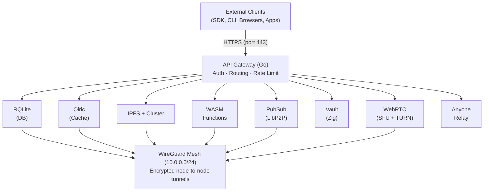
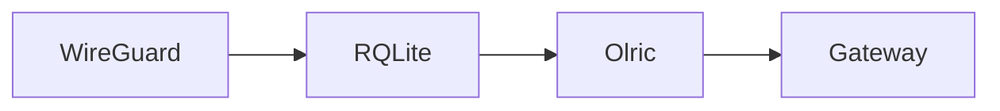

# Architecture

This document provides a high-level overview of the Orama Network system architecture. Understanding these components and their interactions is essential before contributing to the codebase.

## System Overview

## Core Components

### API Gateway

The gateway is the single entry point for all external traffic. Written in Go, it handles:

- **Wallet-based authentication** — Cryptographic signature verification (EVM via RootWallet, Solana via Phantom)
- **JWT lifecycle** — Token issuance, refresh, and revocation
- **API key management** — Per-namespace API keys stored in credentials
- **Request routing** — Dispatches to the appropriate backend service
- **Rate limiting** — Per-wallet and per-endpoint limits
- **Middleware stack** — Logger, CORS, Auth, Authorization, Rate Limiting, Error Handling
- **Health monitoring** — Exposes health endpoints for each service

### RQLite (Distributed Database)

RQLite provides distributed SQL storage using SQLite + Raft consensus:

- **Raft consensus** — Strong consistency with automatic leader election
- **Voter/non-voter nodes** — Voters participate in consensus; non-voters replicate data
- **Quorum requirement** — Majority of voters must be available for writes
- **Leader forwarding** — All writes go through the leader, reads can go to any node
- **ORM layer** — Fluent query builder, generic repository pattern, transaction support

### Olric (Distributed Cache)

Olric is an in-memory distributed cache and data structure store:

- **Consistent hashing** — Data is partitioned across nodes
- **DMap** — Distributed maps with TTL support
- **Pub/Sub** — Internal event propagation between cache nodes
- **Peer discovery** — Nodes discover each other over the WireGuard mesh

### LibP2P PubSub

Real-time messaging uses LibP2P's gossipsub protocol:

- **Gossip-based propagation** — Messages spread through the mesh efficiently
- **Topic-based routing** — Messages are delivered to all subscribers of a topic
- **Decentralized** — No central broker; any node can publish or subscribe

### IPFS Storage

File storage uses IPFS with IPFS Cluster for content-addressed, decentralized storage:

- **Content addressing** — Files identified by CID (content hash)
- **Deduplication** — Identical files stored once
- **Pinning** — IPFS Cluster ensures files remain available across the network

### WASM Runtime

Serverless functions execute in a wazero WebAssembly sandbox:

- **Go + TinyGo** — Functions written in Go, compiled to WASI via TinyGo
- **Sandboxed execution** — Strong isolation between functions
- **Host functions** — Access to cache, database, storage, HTTP, PubSub from within WASM
- **Fast cold starts** — WASM modules initialize in milliseconds

### Orama Vault

Zero-knowledge secret storage with a Zig guardian binary:

- **Shamir's Secret Sharing** — Secrets split into shares distributed across guardian nodes
- **Threshold reconstruction** — Adaptive threshold based on guardian count
- **Zero-knowledge** — No single node ever has the full secret
- **Guardian service** — Zig binary on port 7500 (HTTP) and 7501 (TCP peer protocol)

### WebRTC (SFU + TURN)

Real-time video, voice, and data channels:

- **SFU** — Selective Forwarding Unit on all nodes (signaling ports 30000-30099, media ports 20000-29999, WireGuard only)
- **TURN** — Relay server on 2 of 3 nodes (public ports 3478/5349, relay ports 49152-65535)
- **Forced relay** — All client traffic goes through TURN (`iceTransportPolicy: "relay"`)
- **Per-namespace** — Opt-in via `orama namespace enable webrtc`

### Anyone Protocol

Privacy relay integration on every node:

- **Client mode** — SOCKS5 proxy for anonymized outbound requests (`/v1/proxy/anon`)
- **Relay mode** — Participates in the Anyone relay network for rewards
- **Dual rewards** — Node operators earn both $ORAMA and $ANYONE tokens

## Network Layer

### WireGuard Mesh

All inter-node communication uses a full-mesh WireGuard topology:

- Each node has a private IP on the `10.0.0.0/24` subnet
- All internal service ports are only accessible over the mesh
- Public internet exposure is limited to SSH, HTTPS, and WireGuard UDP

### Service Ports

| Service | Port | Network |
|---------|------|---------|
| Gateway | 6001 | Public (via Caddy on 443) |
| RQLite | 5001 | WireGuard only |
| Olric | 3320 | WireGuard only |
| IPFS | 4501 | WireGuard only |
| IPFS Cluster | 9094 | WireGuard only |
| SFU Signaling | 30000-30099 | WireGuard only |
| SFU Media | 20000-29999 | WireGuard only |
| TURN | 3478, 5349 | Public |
| Anyone | 9050 | Public |

### Service Dependency Chain

Services on each node must start in a specific order due to hard dependencies:

The Gateway depends on Olric being fully initialized. Olric depends on RQLite for coordination. RQLite depends on WireGuard for inter-node communication.

## Binaries

`core/cmd/` contains entry points for these binaries. `make build` compiles:

| Binary | Entry Point | Purpose |
|--------|-------------|---------|
| `orama` | `cmd/orama/` | CLI tool (deploy, manage, monitor). Cluster health is `orama inspect`. |
| `pubsub` | `cmd/pubsub/` | Namespace gossipsub HTTP API (`make build` writes `bin/pubsub`) |
| `gateway` | `cmd/gateway/` | API gateway — one binary for `@index` and `@<tenant>` |
| `orama-node` | `cmd/node/` | Supervisor: starts systemd units; does not embed the gateway or rqlited |
| `sfu` | `cmd/sfu/` | WebRTC Selective Forwarding Unit |
| `turn` | `cmd/turn/` | TURN relay server |
| `identity` | `cmd/identity/` | P2P identity key generator |
| `orama-sni-router` | `cmd/sni-router/` | SNI-based TLS router |

## Security Architecture

### Service Authentication

All internal services require authentication:

- **RQLite** — HTTP basic auth on all queries and writes
- **Olric** — Memberlist gossip encrypted with a shared 32-byte key
- **IPFS Cluster** — TrustedPeers restricted to known peer IDs
- **Vault** — Session token required for push/pull operations
- **WebSockets** — Origin header validated against the node's domain

### Token & Key Storage

- **Refresh tokens** stored as SHA-256 hashes
- **API keys** stored as HMAC-SHA256 hashes (server-side secret)
- **TURN secrets** encrypted at rest with AES-256-GCM
- **Build archives** cryptographically signed with rootwallet

### Process Isolation

All services run as a dedicated `orama` user (not root) with systemd hardening (`ProtectSystem=strict`, `NoNewPrivileges=yes`, etc.). On OramaOS, services get additional Linux namespace and seccomp sandboxing.

## OramaOS

For mainnet, devnet, and testnet, nodes run **OramaOS** — a custom minimal Linux image built with Buildroot:

- **No SSH, no shell** — operators cannot access the filesystem or read data
- **LUKS full-disk encryption** — key split via Shamir's Secret Sharing across peers
- **Read-only rootfs** — SquashFS with dm-verity integrity verification
- **A/B partition updates** — signed images applied atomically with automatic rollback
- **Service sandboxing** — Linux namespaces + seccomp per service
- **Single root process** — the orama-agent manages boot, WireGuard, services, and updates

Nodes join via `orama node enroll` (not `orama node install`). The operator reads an 80-bit registration code off the node's console and gives it to the CLI with an invite token; the gateway pushes cluster config sealed under that code.

Sandbox clusters remain on Ubuntu for development convenience.

## Ecosystem Components

| Component | Language | Purpose |
|-----------|----------|---------|
| Orama Network | Go | Core infrastructure (gateway, node, CLI, SFU, TURN) |
| OramaOS | Go + Buildroot | Locked-down node OS with agent |
| Orama Vault | Zig | Zero-knowledge secret storage guardian |
| Network TS SDK | TypeScript | Client SDK for all services |
| RootWallet | TypeScript | Hybrid hardware/software wallet (EVM) |
